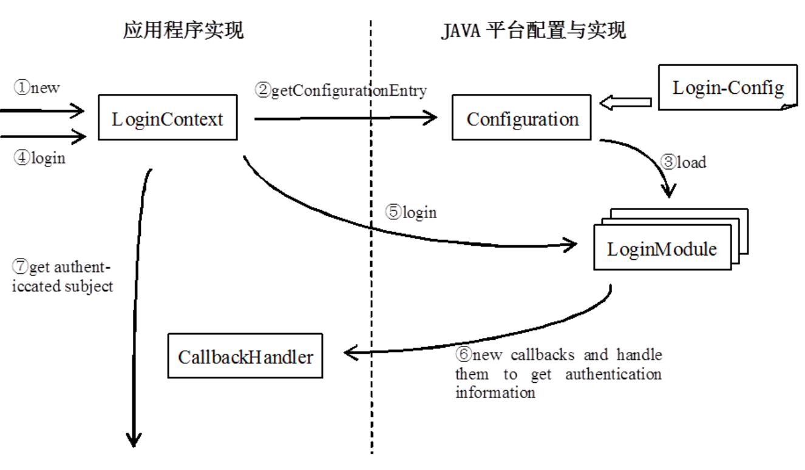

# 0. 企业级信息系统体系架构概述

## Evolution

1. 单体式

   tomcat(网络应用) + FS(数据文件) + database(结构化数据)

   运行在同一个OS（一个机器）上

   - pro：快速

     组件之间调用

   - con：访问风险

     ip资源限制，端口分配，数据库非法访问

2. 三件套

   TFD采用三个物理节点，T暴露在公网上，FD在内网通讯

   - 隔离：内外网提高安全性

   - 性能：==根据服务侧重规划计算资源==

     T要求CPU，D要求内存，F要求IO和磁盘

   - 企业级：==数据量和访问量达到一定规模==

     单机计算资源提升难以满足的规模

3. 三件套+分布式缓存

   三件套的通讯协议 HTTP RMI etc，均弱于本地调用

   - 性能提升：分布式缓存
     - 本地缓存：不够
     - 分布式缓存：==缓存分割受应用控制和管理==
       - 不同于DB自带的cache
     - 数据库：退化为数据备份，减少IO

4. N-replica(应用服务)+2件套+分布式缓存

   - CPU的性能瓶颈，建立服务器集群
   - 需要==负载均衡器==对服务器压力均衡
   - 目标：服务器负载性对均衡
     - 绝对均衡？不可能，比如http-session的驻留性

5. 主从数据库

   - 数据库的==事务机制==对性能的影响

   - 数据库的==数据一致性==无法实现p2p的备份

     横向扩展的失效

   - 主从备份数据库集群

     - 写操作都在主数据库执行
     - 从服务器备份更新和选举

   - ==不扩大容量==

6. 静态资源CDN

   - 调度request到地理最近的节点

   - ==域名和ip的一对多映射==

   - 代理proxy

     - 正向：==把client对server黑盒==

       不同client经过代理后对server无差别 C->P->S

     - 反向：把同域名不同ip server对不同用户黑盒

7. 分布式文件系统

   - hadoop: ==扩大容量，提高读取效率，分片存储==

8. 分布式数据库

   - 横向分割，纵向分割，==提高容量==

9. 统一数据访问模块 DAO

   - ==屏蔽复杂系统割裂的数据存储方式和结构==

10. 引入非关系型数据库（无结构的文本）

    - 比文件系统
      - 支持搜索
    - 全局搜索引擎
      - 所有存储结构的所有数据
      - 优化搜索过程 （反向索引）

11. 引入消息队列服务器

    - 异步通信，提高吞吐量和RT （respond  time）
    - 高负载提高可用性

- 总结： 量变（访问量，数据量）引发质变（系统结构）
  - 数据量变：FS, DB持久化的数据管理方式；
  - 访问量变：瞬时数据，内存的管理方式。

# 一. 服务状态

## 1. 状态

- HTTP协议：无状态，通过session-cookie在server维护状态
  - 问题：
    - session太多，消耗内存资源
    - 粘滞性导致负载均衡难度
    - 服务组件实例的个数
  - 解决
    - timeout：回收session
    - 显式地注销销毁session
    - 控制节约session的大小

## 2. 控制组件实例创建

- 组件的scope注解
  - singleton：默认值，==整个ioc容器中只有唯一对象==
  - prototype：有多少个请求就创建多少个实例
  - session：同HTTP session对象的请求使用同一个实例
- singleton  stateless
  - ==无状态表示不为每个用户单独维护状态==
  - 省内存
- prototype stateful
  - 与每个请求关联实例
  - DDoS攻击
    - server配置实例池，LRU flush后销毁重建
    - 反复置换导致时空置换，时间消耗
  - 有状态服务的精确数量控制
- ==依赖调用的实例数量==
  - IOC注入行为是一次性的
    - 顶层少，底层多：调用少量底层
  - 利用==webApplicationContext注入==，瞬时的
    - 顶层少，底层多：调用大量底层
- 状态变量适合在远离IO的层级 service（stateful service & stateless service）

# 二. 远程方法调用

## 1. 远程通讯

- 不同进程之间的通讯，可以是同一机器或者不同机器。
- 用虚拟地址访问变量或者对象，无法访问另一个进程的虚存空间
- HTTP协议：
  - 传递HTML，JS，CSS，JSON
  - 即纯文本扁平内容的基本类型
  - 无法实现对象的引用，影响虚存

## 2. 远程方法调用


- 传递参数含对象，返回对象引用，而后可以本地调用

- client和server基本==都是应用程序==， HTTP则是==终端用户==

- proxy:

  1. 序列化参数对象 — C
  2. 反序列化字节丢为方法调用 —S
  3. 序列化调用结果 — S
  4. 反序列化调用结果 — C

- RMI是RPC的JAVA特化

  - C:  interface xx extends ==Remote==
    - Remote 为编译标记接口，自动生成stub
  - S:  extends ==UnicastRemoteObject==
    - JVM长期驻留的对象
  - stub的获取 — JNDI服务器
    - RMI注册表
      - k：对象名称
      - v:   对象引用地址
  - Server：==JNDI对象绑定==
    1. 创建实现类
    2. 持有注册表引用: namingContext = new InitialContext(url, factoryClass)
       - 传参 —D
       - map传给构造器
       - classpath的jndi.properties
    3. 绑定对象到RMI: namingContext.bind
  - Client: 
    1. 获取JNDI注册表引用
    2. 根据URL获取stub对象
    3. 直接调用stub对象

  

- stub：客户端proxy

  - ==实现远程对象接口==
  - client调用stub与调用一个对象无异
  - 1- Marshall：->
    - ==远程对象的id==
    - ==调用的对象方法描述==
    - ==参数==
    - 组装上三者到网络字节流，发送到server
  - 4-Unmarshall：解析结果字节流

- receiver：server’s proxy

  - 2-Unmarshall：
    - 定位对象
    - 调用方法
    - 传参数
  - 3-Marshall:
    - 调用结果构建字节流

- JAVA的Marshall：==必须实现serializable标记接口==

  - 序列化和反序列化约束：
    - 类的定义必须完全一致 ==exactly the same==
    - 类必须实现serializable接口

- RMI传递对象：副本传递，serializable

  

- 非驻留动态激活server: 实现类 extends Activatable

# 三. Java安全体系

## 1. Java类加载器

- JVM启动规范

  1. Bootstrap Class Loader
     - JVM之外的类加载器，由C编写
     - 加载rt.jar（JRE JDK自带的jar包）
     - 加载Extension Class Loader
  2. Extension Class Loader
     - 加载jre/lib/ext目录下的类
     - 加载System Class Loader
  3. System Class Loader / Application  Class Loader
     - CLASSPATH里寻找类加载
     - 对每个应用==独立创建Plugin Class Loader==
  4. Plugin Class Loader
     - 加载具体编写的应用类

  

- 加载顺序：自身查找，根节点的前序遍历，==不访问兄弟节点==

  - ==同级别加载器是隔离的==：命名空间

  - 意义：应用之间不会相互干扰

    

  - 不用线程的类加载器不同

- .class文件：字节码；导致反编译源码泄露问题

  - 自实现类加载器，实现加密存储，解密加载
  - extends ClassLoader
    - override ==findClass==
      1. 调用==loadClassBytes==加载类到字节数组，同时对字节数组解密并返回
      2. 调用==defineClass==初始化字节流为对象
    - loadClassBytes
      - 找到.class文件
      - 解密字节数组
    - defineClass
      - 检查变量初始化和定义
      - 方法调用匹配
      - …(编译器检查)
      - 防止篡改字节码 -noverify跳过检查
  - 加密器：对已由的.class文件按照字节流方式读取并加密存储

- 加密的类加载器反编译，加密方法泄露问题

## 2. Java安全管理器和权限

- 安全管理器：System.getSecurityManager()

  - 代码权限检测

  - 读取.policy文件: 定义代码权限集合

    - e.g. 

      ``` policy
      java.io.FilePermission "/tmp/*", "read,write";
      ```

- Policy

  将代码定义为domains，每个domain是permission的集合

  - 主语：代码块的指定
    1. 按照位置
    2. 按照用户认证特征 principal
    3. 代码签名
  - 谓语：permission授权
  - 宾语：权限类
    - 权限名
    - target
    - action

- 自定义权限类

  - 定义target和action
  - 重写equals（Object为参数）和hashcode方法，==按内容比较而非地址==
  - ==重写implies方法，权限包含关系==


## 3. Principal 用户认证

- Principal：

  - Jaas.config: 配置组合不同的认证方式

    - 组合具体的检查模块

    - ==stackable可插拔的配置==

    - 每个模块都有属性

      required，sufficient，requisite，optional

    - 认证成功：所有required和requisite成功，没有requisite和required话，至少一个sufficient或optional认证成功

  - context = LoginContext(config中配置名)

  - context.login() 执行认证过程

    1. 创建LoginContext时，server通过jaas.config体检加载认证模块 （1-2-3）
    2. 调用context.login(), 依次执行配置下的认证模块（4-5）
    3. server返回callback Handle，由应用完成（6-7）

    

    - ==经过认证模块后可以获得Principal==

      Subject sub = context.getSubject()

      执行特权工作时，利用sub检查对应Principal

- 根据Principal设置权限的policy文件

  - grand principal {principal类名} {principal实例特征}
  - grand principal SimplePrincipal “role=admin” {...}
    - “role=admin”来自于Principal.getName()

## 4. 代码签名

- 消息摘要

  - SHA256(file) -> 20Byte指纹
  - 原始文件小的变动导致指纹变动巨大
  - 不同文件相同指纹的概率很小

- 非对称加密： 签名，加密通讯

- 代码签名与policy

  grant signedby “someone” {...}

## 5. Single Sign-on

- 减少认证次数，解耦认证模块

- 实现

  - keberos；OTP token etc.

- Keberos

  1. client输入账密

  2. client发送用户id给认证中心AS （未加密）

  3. AS接收id，查抄对应密码，密码hash后得到秘钥

  4. AS向client发送两个消息

     1. MessageA：Client/TGS Session key

        通过用户密码加密的AS秘钥

     2. MessageB：Ticket-Granting-Ticket

        通过Service公钥机密的AS秘钥

  5. client通过用户输入的密码通过同样的hash算法解密MA

     if输入密码正确，Client得到AS发布的秘钥

  6. MB是同样的秘钥被Service公钥加密，客户端转发给Service

  7. Service收到client转发的MB，添加具体访问服务，作为MC

     if消息缪没有篡改，Service解密成功，得到AS发布的秘钥

  8. Client和Service都获得了AS秘钥，互相认可通讯

  9. Client将用户id和时间戳用AS秘钥加密，发送给Service作为MD

  10. …递归直到client访问到最终服务节点

  11. 最终Service利用AS解开MD后，将id和时间戳返回client（反钓鱼）

- 问题：

  - 单点故障
  - 授时误差
  - 细节标准化问题

## 6. 安全性总结

- 用户认证，用户授权
- 不可否认性
  - 系统详细的log
  - 服务调用记录
- 机密性
  - 数据内容加密
  - 数据传输加密
  - 对称秘钥和费对称秘钥混合使用
- 完整性
  - 传输过程中没有损失
  - 校验方法：checksum etc
- 确任性（防止钓鱼网站）
  - 公钥私钥对 HTTPS
- 可用性
  - 增加冗余，提高并发服务数量
  - DDoS，与安全性相对
- 审计
  - 日志审计，用户审计
  - 攻击发生后讨论攻击行为
- 三方面：
  - 认证授权
  - 消息数据链路加密，校验
  - 减少暴露接口和反问
  - 入侵检测和发现
  - 恢复：快照，备份，审计

 

# 四. 异步通信

 ## 1. 消息

- 异构系统组件之间的交互和集成
  - 开放接口
  - 接口和通讯渠道太复杂
  - 一个完整业务，不可接受的响应时间
  - 业务中的宕机，容错性缺失
- 系统集成问题：异构系统通信复杂性
  - 中介者模式：纯文本消息通讯
- 异步通讯问题：响应时间和容错
  - 消除单一故障节点
  - 减少响应时间
  - ==cons：错误消息解析的不及时（弱类型），无结果，无异常==
- 消息的p2p节点
  - 消息服务器：中间键
  - 消息客户端：p2p的通信节点

## 2. JMS API

- 非阻塞（消息队列），可靠性（消息不丢失）
- 负载的时间均衡
- JMS消息结构
  - header：固定的（dest，id，time，etc.）
  - prop：自定义k-v
  - body：text/map/bytes/stream

## 3. JMS编程模型

1. 找到数据源 JNDI
2. 建立连接
3. 发送模式 queue：p2p；topic：pub/sub 发布/订阅模式

## 4. Kafka

- 连接过程
  1. 从JNDI获取消息中间件连接工程ConnectionFactory
  2. 获取连接
  3. 开启session
  4. 在JNDI中寻找topic/queue
  5. 创建生产者/消费者
  6. 创建消息
  7. 发送/接收消息
- 对比RMI
  - ==解耦合==
    - RMI是耦合的，CS实现相同的类接口
    - 通过文本消息通讯，与实现无关，没有api绑定
  - ==编程模型复杂 7steps==

# 五. WebSocket


- Http: request-response
- ws: 双全工：server主动推向客户端
  - TCP只上
  - server publish endpoint URI
  - client 根据URI连接
  - 握手&数据连接：对称协议
    - 握手
      1. 客户端发送key
      2. 服务器返回accept key
      3. 客户端解accept key建立连接

# 六. 事务管理

## 1. JTA事务管理

- JNDIUserTransaction 事务管理类
- 事务：begin->…->commit
- 事务不只是数据库支持
  - 消息中间键服务器，prop按组接收
  - 群发群收的事务
  - 邮件服务器
- 事务发生在资源管理器上
- 事务的支持
  - 利用内存缓存
  - 提交时写出
  - 失败清除缓存

## 2. 事务边界

- ACID

  - A：边界定义
  - I: 隔离性

- @Transactional

  TX1 {… / TX2{}/...}

  - TX2 NotSupported：

    不支持事务，挂起TX1，在非事务状态执行TX2, TX2完成后恢复事务状态执行TX1

    TX2事务属性无关紧要，是否成功与TX1提交无关系

  - TX2 Supports：

    如果TX1是事务状态，则TX2也是事务的一部分；否则不是

  - TX2 Required （默认的）：

    TX2一定要在事务下执行，无论TX1是否是事务，若TX1是事务则TX2加入TX1

  - TX2 RequiredNew

    TX2一定要在新建的事务下执行，无论TX1是否是事务，TX2不加入（独立的两个TX）

  - TX2 Mandatory

    TX1若为事务则加入，否则抛异常

  - TX2 Never

    TX1非事务状态则执行，否则抛异常

## 3. 事务中自定义变量控制

- afterBegin：oldVal = val

- afterCompletion(committed):

  if (not committed):

  ​	val = oldVal

- 避免长事务

- 长事务用事后补偿而不用锁

## 4. 事务隔离性


- ==脏读：事务读到了别的事务未提交的变量== （READ_UNCOMMITTED）

  解决：事务的缓存上上锁 （READ_COMMITTED）

- ==不可重复度：事务两次读取数据读到不同的值（被别的事务改写）==

  解决：事务读取的变量上锁 （REPEATABLE_READ）

- ==幻读：同一个事务中两次筛选结果不同（变量上锁了，但是满足筛选条件的变量变少或者变多了）==

  解决：整个表上锁 (serializable)

- 锁

  - 读锁：

    未放锁时别的事务读取还是初始值，别的事务不能修改

    变量值变化时，读旧值的事务不能提交

  - 写锁：

    事务完成前，其他事务可以读取未提交变量，但是不能修改

  - 独占锁

    事务完成前，其他事务不能读和修改

  - snapshots

    其他事务读取快照

## 5. 分布式事务

- 设计两个资源管理器的操作
  - 两阶段提交协议
  - 阶段1：准备问询
  - 阶段2：做出决策

# 七. 多线程与并发编程

## 1. 进程和线程

- 进程有独立的地址空间

- 所有线程共享进程资源

- Java的Thread抽象

  - thread.run()

  - 每一个线程是一个异步执行的任务

  - 实现方法

    1. implements Runnable

    2. extends Thread

       复写run方法

  - 问题：多继承问题

    implements Runnable extends ...

- 线程挂起（休眠后）的interrupt唤醒不是确信的

  - 需要try catch捕获interrupt异常
  - 利用Thread.interrupted主动判断是否被中断
  - 利用other.join将当前线程挂机，执行other线程

## 2. Synchronization

- 线程对内存资源的竞争：确保happens-before的可见性

  - 死锁

    内部申请一把已经获得的锁L，但是L只在sync完成后释放。

    可重入的锁可以避免死锁ReentrantLock()

  - 活锁

    进程之间同时，时时响应，但是无法获得资源，无法执行。

    2-phase lock中两个进程不断准备获得锁，发生准备冲突，然后取消准备，导致二者都无法获得锁

  - starvation

    线程对资源的访问需要长期等待（由于sync对线程的调度缺陷），导致无法完成任务

  - 解决：防卫式阻塞block

    1. while spin：CPU空转
    2. 调用wait方法spin，挂起CPU，当条件满足notifyAll()

- synchronize关键字

  - 修饰方法
  - 两个sycn方法一定是串行的，没有overlap
  - synchronized(this) {...}实现对象内部锁的细粒度同步
  - synchronized(Object lock) {...}实现自定义的锁

- sync实现

  - sync刚发必须获得一把intrinsic 或者 monitor锁才能执行
  - intrinsic/monitor lock是全局大锁，被线程获取
  - static sycn方法采用类的大锁
  - volatile修饰变量的操作都是原子的，多线程安全，实现内存一致性

- 高级并行程序

  - 自定义锁：

    - 自定义对象锁
    - 不依赖对象：Lock类 ReentrantLock()

  - 线程池Executor

    - 分离线程和线程创建管理工作

    - e.g. 数据库连接池尺寸设置

      - 根据用户并发数量？No

      - 根据host的CPU核心数量 1:1

        线程池太大：context switch开销

        线程池太小：请求阻塞

    - 超线程性能下降

  - 线程安全的集合类型

  - 原子变量

    - get/set之间是事物的
    - AtomicInteger.increment()/decrement()/value()
      - 缺点：更大内存占用，粒度偏粗

  - 随机数量线程

# 八. 分布式缓存

- 原生组件的缓存 Hibernate/Spring JPA

  都在Tomcat中

  - 被JVM内存限制
  - 封装导致无法细粒度地编程控制数据缓存

## 1. Memory Cache

- 访问只在缓存进行，DB作为数据备份
- K-V存储
- 第一次读取从DB并缓存在MemCache中，其后都从MemCache读取
- 写数据：
  1. 同时写MC和DB，作为一个TX — WB
  2. MC删除数据，写穿到DB — WT better way
- MC对内存的利用率更高，对不同client使用的内存缓存分割更均衡
  - 存储对象分组不同尺寸 Class Chunks
  - 每个对象存放能放下的最小Chunk
- 分布式部署MC
  - 节点直接独立存在，没有控制节点
  - 由client自身算法（hash）寻址缓存节点
  - 缺陷：节点容错处理由client负责
  - 节点结构改变：一致性哈希算法 CHORD
    - 节点负责连续哈希空间 [自身值,下一个节点值)
    - 增加删除节点时只修改两个节点的数据

## 2. Redis

- K-V结构，v可以包含数据结果
- ==可以将数据持久化到硬盘==
  - redis在本地：本地硬盘更快
  - redis独立节点：redis网段优势
  - redis本地恢复比从DB初始化更快

## 3. 集群部署

- 应用服务器集群 — 提高

  - 可用性（吞吐量，能有response 400 500屏蔽）
  - 可靠性（replica，完整可用服务完成 200）
  - 客服务性：质量一致的连续的服务水准
  - 可扩展性：性能与硬件资源线性增长（理想）

- 集群的用户接口唯一：域名

  - ip到域名的多对一映射
  - 负载均衡策略的任务调度 — 反向代理
  - 集群的冗余，没有SPOF
  - 故障率相乘，趋于零

- 负载均衡

  - 策略：锦标赛，贪心，随机

    - 问题：会话粘滞性 — session维护会话状态
    - 无法保证同客户端的请求在同机器

  - 解决：

    1. 广播寻找session，拷贝
    2. 放弃处理任务，提交有session的节点
    3. 用户ip哈希调度
    4. 无状态服务，客户端存储加密状态

  - 服务节点宕机

    - 请求级别恢复
    - 会话状态级别恢复 （更高级）

  - 幂等的HTTP请求

    - 尽量多幂等：
      - 前：可以用重发恢复
      - 中：事务断点回滚
      - 后：（JMS）缓存结果重发 

  - Nginx-HTTP服务器负载均衡

    - 挂载本地静态资源（文件路径和URL的映射）location
    - 代理其他服务器 proxy_pass

  - 负载均衡策略

    - Default锦标赛 / Round-Robin: 轮询所有节点

      请求负载等价则节点负载等价

      Nginx设置weight区分负载

    - 贪心least-connected：转发到连接数，负载最轻的节点，请求负载差异较大

    - 客户端IP哈希：适应于使用session的粘滞会话；

# 九. 全文搜索

- 海量数据，遍历低效
- 建立特定的索引结构

## 1. Lucene

- 不使用关系型数据库？
  
  - 无法避免表的扫描
  
- 建立反向索引
  - 任何文本作为数据源 （异构的）
    - 实现parser可以自定义文本结构
  - 建立高效的交叉引用查询表作为索引
  - 索引可以提供关键词位置
  
- 反向索引
  - 域->value->freq
  - 反向：关键词指向文档，得到文档和具体位置
  - 不支持复杂查询：通配符 短语 etc
  - 正向：文档指向关键词
  
- 四种域
  - keyword
    - 不被语法分析，直接出现在索引中 e.g. 文件名
  - unindexed
    - 不分析，不索引，但是存储，查询其他信息时附带的（作者信息）
  - unstored
    - 分析参与索引，原文不保存完整内容（避免索引太长），正文
  - text
    - 分析抽取内容，建立关键词索并存储原文内容，不能太长 e.g. 摘要
  
- 标记删除，UNdelete恢复

- setBoost：搜索优先级

- 大量内存操作，optimize刷新

- query项目定义搜索，包含Term(k-v)

- 返回Hits对象

- TFIDF算法排序

  频繁词不重要：本文出现次数/所有文章出现次数 （反向）

## 2. ElasticSearch

- 分布式异构数据存储和索引
- 接近实时的读写，节点的统一处理
- shard分区 and replica副本
  - shard水平切割index
  - shard可以是并行的
  - replica提高容错和并行（读操作）
- 分布存储
  - k-v结构，v应该是非结构文本

# 十. Web Service

- web协议：stamp http ftp etc

- 利用web协议的服务

  - 跨网络能力强，服务规模大
  - service独立于实现
    - 传输内容为文本
    - 并非是程序对象
    - 异构系统互相调用

- 服务利用web访问，没有对编程语言的限制

  - 互操作性

    跨硬件，平台，语言

## 1. SOAP：简单对象访问协议

- 定义文本消息
- message { head - body { CS约定的内容 } }
- HTTP中body为message
- CS约定: WSDL文件
  - 定义消息 req和resp
  - portType：operation接口名 input output名字
  - binding：接口位置和访问返回方式（RPC）
  - service：endpoint服务名字和协议URL 
- 不足：WSDL冗余和在CS的两次翻译生成proxy，非常好使
  - 和消息格式耦合
  - 和编码机制绑定
  - 解析和组装程序
  - WSDL额外描述
  - WSDL额外编译proxy

## 2. RESTful

- REpresentational State Transfer
  - MVC风格：
    - 表示有client完成
    - server只驱动数据
    - state客户端维护，无状态会话
    - transfer：客户端状态转移
  - 纯数据消息传递
    - 没有数据组装的开销
    - 没有数据格式描述WSDL
    - 文本消息不需要proxy转换
  - 数据具有标识符，为资源URL
    - GET - read
    - POST - create
    - PUT - update
    - DELETE
- Pros
  - 跨平台，异构系统交互
  - 字描述 WSDL
  - 模块化
- Cons：
  - 效率低（解析）
  - 自身安全性不保证
- 适应：远距离跨防火墙的异构系统集成；B2B集成（维护性）；软件重用
- 不适用: 单机系统，局域网同构系统

## 3. SOA 

- 复用现有资源：面对异构和需求变化 — 实现组件解耦

  - JMS消息
  - 纯文本消息

- 平台中都是服务（独立与实现的纯文本）

- 接住==消息服务中间件==实现服务的

  - 松耦合
  - C/S Location透明
  - 独立于不同web协议，异步通信，协议转换

   ==服务总线实现了SOA三个特性==

- 服务：现有的代码封装，面向用户和业务的概念

  - component面向编码，没有与service的数量关系

- SOA概念栈

  

- 微服务

  - 微服务可以组装为SOA架构

# 十一. 分布式并行框架

## 1. Hadoop

- 集群

  - 冗余
  - 负载均衡

- 并行处理

  - 任务分割和合并

- 思想：集合commodity机器为一个强大的集群

- YARN：作业调度

- MapReduce思想

  

  1. input file进行分割
  2. MAP阶段：将input file不同部分映射给worker节点
  3. worker：处理输入，产生结果的k-v对，汇报给Master完成
  4. Master重新给worker分配任务 （无空闲worker原则，执行时间最长job复做原则）
  5. worker写入中间结果到特定空间位置
  6. REDUCE阶段：worker按空间合并中间结果，输出最终文件

- Hadoop+MR可以屏蔽复杂性，代码专注于业务逻辑

- MR是基于HDFS的

  - Scalling Out
  - 输入文件切割成chunk，chunk大小等同于HDFS的block大小
  - 每个worker一次只处理一个chunk

- Hadoop  JobTracker

  - 分配worker的任务并跟踪处理进度
  - 通过心跳监听重新分配任务
  - 管理当前的worker资源，管理job的处理信息

- YARN：分离worker资源和job处理跟踪分离

  - ResourceManager和ApplicationManagers
  - RM是全局唯一的
  - AM是每个节点上的
  - 资源管理和任务跟踪解耦

- 并行框架思想：==批处理==

## 2. Storm And Spark

- Storm：无穷==流式==数据并行处理框架（Twitter，车流监控，etc.）

  宏观上为流式处理，微观上仍利用一个timewindow的累积量批处理

  - MR的Job是定长的分割
  - 适合实时分析，在线ML，持续计算，分布式RPC等任务
  - 性能高和可扩展，容错性

- 过程：计算模型：topology（job）有向无环图

  - 源Spouts；汇Bolts

  1. Spout持续的数据源
     - 数据流为tuple序列：k-v
  2. Bolt处理模块：处理具体数据
  3. 利用集群部署Spout实例和Bolt实例
  4. NimBus跟踪硬件状态和任务状态
  5. zookeeper集群管理资源

- Spark

  - Hadoop的数据操作都基于文件系统，硬盘IO太慢

  - Spark：==利用内存操作==，性能更快 100x

  - Scala编写：函数式编程--函数参数变量不发生改变

    ==很好利用内存空间==，不会导致内存越界污染

    赋值即创建新的内存空间

  - Spark组件

    - Spark Core：内存批处理
    - Spark SQL：执行SQL
    - Spark Streaming：流式数据
    - MLlib：机器学习库
    - GraphX：图数据库

  - 支持与Hadoop集成，利用HDFS

  - 与MR结构相似

    - 弹性分布式数据集RDD： Scala不可变对象
    - RDD被分为多个分区
    - 转换Transfer RDD：操作RDD获取新的RDD。一系列API
    - Action：将RDD进行总结，产生非RDD结果。一系列API
    - Lazy Calculate：数据访问时才进行加载

  - spark标准流

    - 外部数据创建输入RDD
    - RDD变换产生新的RDD
    - RDD总结返回用户

  - Shuffle

    - 输入的分割，处理，空间重组
    - MAP任务为N；Reduce任务为K
      - shuffle分块文件: N*K
    - shuffle分块文件越多，性能越好

- Spark数据分区

  1. 单一RDD 无分区（宽依赖）：全连接合并，低效

     父RDD每个分区只被多个子RDD分区使用

     宽依赖结果应该被cache

  2. 哈希分区（窄依赖）：更高效

     父RDD分区只被一个子RDD分区使用

- SparkSQL

  - 行存储：利于OLTP
  - 列存储：利于OLAP *

# 十二. 分布式文件系统

## 1. HDFS

- 尺寸非常大的单个文件
- 支持流式的文件访问
- 通过commodity机器完成强大集群
- 不适合
  - 低延迟的数据访问
    - 源数据节点namenode读取metadata定位，读取费事
    - 系统冗余导致写操作费事
  - 大量访问小文件：反复访问namenode，metadata消耗内存
  - 频繁并发写，随机文件修改：副本同步，串行修改namenode，链表结构不支持中间插入、删除
- block，读写最小单位
  - namenode存储所有文件目录的datanode — metadata
  - datanode按照block存储
  - datanode发送心跳给namenode，宕机时替换副本
- 运行在操作系统原生的文件系统上

# 十三. Hbase和Hive

- 关系型数据库难以扩展到分布式
  - 表的拆分方式
  - 表的关联方式
  - 索引的简历

## 1. HBase

- k：主键列
- 列式存储
- v：其他列，其他列可以组成列族
- 列族和列都可以动态增加或减少
- ==行与行的schema可以比较灵活==

- 优点：==唯一的线性表==，列是堆积的
  - 很适合做==水平划分==，没有join和关联
  - 很适合根据行建索引
  - 配合锁，可以做事务管理
  - 列式存储很适合scan和OLAP

## 2. Hive

- 一般数据库，数据加载强制约束 schema on write

  可以索引和压缩，提高query性能

- hive：没有schema校验，query时校验

  初始加载很快

- table在hdfs基础上存储

- partition：逻辑分区；bucket：物理分区

# 十四. 云计算

## 1. Edge Computing

- 优势：
  - 可以降低通信带宽，因为不是所有的数据都需要发送到服务端
  - 适合于移动时代，移动主机在移动的同时，连接的网络基站也会不断更换，网络连接会不稳定，在连接不稳定的时候利用边缘/终端计算能力进行计算，可以弥补连接不稳定带来的延时问题

## 2.应用场景

- Video Analysis

  云计算不适合实时的视频处理应用，因为实时视频处理会带来不可忽视的数据传输时延，并且可能带来隐私问题

- 而边缘计算可以帮助完成需求。比如需要从一个摄像头中分析是否有某个人出现，云端可以发送请求给边缘端，边缘端利用本地计算资源，完成请求后，只需要将结果返回给云端即可。

- Smart Home 智能家居

- Cloud-terminal fusion computing 云端融合计算模型

## 3. 为什么云端融合越来越流行？

- 首先，越来越多的设备拥有越来越强的计算能力，收集、车载计算机、游戏盒子等等
- 其次，网络的发展使得万物互联成为了可能。比如5G对基站的密集程度提出了新的要求，也对万物互联创造了可能性
- 由于设备越来越多，如果计算仍然放在云，那会给云/数据中心带来过大的压力，并且浪费了端设备的计算能力。

## 4. 边缘计算的挑战

- Programmability

- Naming —— id，命名，像IP这样的边缘定位Identifier

- Data Abstraction 

- Service Management

- Privacy and Security

  - 如何保证隐私和安全
  - 收集到的数据，究竟归谁拥有
  - 数据暴露在各个边缘，没有有效的工具保证所有边缘的客户端都不泄露数据

- 如何优化

  - Latency

    数据散布在边缘，云端需要等待所有边缘回答完毕

  - Bandwidth

    边缘端暂时存储数据，并且在带宽占用低的时段和云端通信，就可以降低带宽压力

  - Energy

    边缘端的电池是一种宝贵的资源

    计算和传输数据的电量消耗是不一样的，需要仔细考虑如何利用好边缘的有限energy

  - Cost

    在边缘端计算，必然需要边缘端有一定的计算能力和资源；而在云端做计算，一样需要云的计算能力，而这个成本如何平衡也是一个需要考量的metric 

# 十五. 图数据库

## 1. Neo4J

- 节点：实体数据，lable和attr
- 有向边：关系和关系属性
- 支持CRUD、OLTP
- 优于关系型数据库
  - 分析类问题：关系型太多join次数
  - 图数据库：==关系作为数据实体存储==， 避免join
    - 通过边直接导航到关联实体数据，没有查找
    - 关联属性可以独立于数据实体，存储于边上
- 查询：cypher
  - 定义图 (who: lable)-[:RELATION]->(who: lable)
  - 查询 match…where…return
- 定义：实体作为节点，结构作为边
  - 有向边
  - 双向对等关系：无向边
  - 边的权重，以及其他属性
- 运行模式
  - 集群运行，Load Balence
  - embedded模式运行（与应用同一个进程）

## 2. Neo4J存储模式

- 节点存储N - 15Byte
  - N[0]:  标记位，是否使用
  - N[1:5]: 指向第一个边的id
  - N[5:9]: 指向第一个节点属性
  - N[9:14]: lable名字
  - N[14]: extra
- 边储存E - 34 Byte
  - E[0]:  标记位，是否使用
  - E[1:5]: 起点
  - E[5:9]: 终点
  - E[9:13]: 关系类型
  - E[13:17]: 起点的下一条关联边
  - E[17:21]: 起点的上一条关联边
  - E[21:25]: 终点的下一条关联边
  - E[25:29]: 终点的上一条关联边
  - E[29:33]: 边上的第一个属性
  - E[33]: firstInChainMarker
- 边的双向链表--效率

## 3. RocksDB

- 日志型数据库

  - 时序热度分布：越近越热访问
  - 只追加，不修改

- MEMTable 导入 immutable Memtable

  - 读取集中在内存中

-  immutable Memtable分块分级导入硬盘 compaction

  - 硬盘分级整理数据块，使得没有重叠数据
  - 越老的数据约下沉

- 对比mongodb

  - mongodb保持等大chunk，chunkServer chunk数较小

    所有数据访问概率均等

  - 新数据访问概率大 — RocksDB

# 十六. 数据获取和清洗

## 1. 数据科学

- 计算机科学
- 数学与统计学
- 专业领域

- 问题驱动
- 应用
  - 可视化
  - 推断
  - 信息挖掘

## 2. Python出具处理

- NumPy

  - 快速
  - 多维数组
  - 向量计算
  - numpy.array([[…], [...]])

- Pandas

  - Series

    - 自定义索引的数组

    - 查询返回集合

      s[[“idx1”, “idx2"]]

    - pd.Series(data, index=selfIndex)

  - DataFrame

    - 有序的列集合

    - 每一列就是一个Series

    - df = pd.DataFrame(data, index=[])

      data是py的字典类，每个item代表一列

    - 按列查询：df[‘colName’]

    - 按行查询: df[0:2] / df.iloc[[0,5]]

    - 条件筛选

      df[真值矩阵]

      真值矩阵：含有df的谓词

    - 操作

      - Unique

      - Grouping

        df.groupby(

        ​	[‘colName’],

        ​	as_index=False

        ).mean()

      - merging：按列合并 nature join

        pd.merge(dfa,dfb, on=‘col’)

      - 删除drop

        行：索引列属性值，删除所在行，dropna()

        列: drop(‘col’, axis=1)

- 维度扩展

  - e.g. 真值矩阵

    np2DArray > 0.4 

    真值矩阵取值：np2DArray[(np2DArray > 0.4)]

    => 一位真值数组

## 3. 网络爬虫

1. 指定URLs = []
2. html页面分析 response.css(‘div.quote’)选定组件组
3. .extract()获取具体信息

- 问题
  - DDOS查封ip
  - 网页重构
  - ajax异步更新页面

# 十七. 机器学习

## 1. 简单的机器学习方法

- 人工智能 > 机器学习 > 深度学习
- 监督：输入数据有标签
  - 回归，标签是连续的（数值）
  - 分类，标签是离散的
- 无监督：输入数据无标签

- 回归问题，最小二乘法。一元线性 -> 多元非线性 

  残差：预测与真实的差值平方均值

- 分类问题：决策树，递归分割，按最具可预测特征分割

  分类指标：分类结果中杂质（信息熵）减少，信息增益增大

  停止：叶子节点不含杂质

- 聚类问题：按特征分类（无监督），Cluster内的节点距离尽量小，Cluster之间的距离尽量大

  k-means：k是预先指定的类数；距离：集合距离或其他

  差异性矩阵：两点之间的距离

  过程

  1. 指定k个不同质心：random
  2. 所有数据计算到k个质心的距离
  3. 将每条数据划归到距离最近的质心
  4. 得到k个分割，重新计算每个Cluster质心
  5. 迭代a-d，直到质心重合或者移动小于阈值

## 2. 人工神经网络

- 单个神经元：二分类（更精确）

  输入：前一层*weight + 偏置量

  激活函数：整合输入到输出

  - Sigmoid：
    - (0, 1) 
    - 中心对称 
    - 处处可微 
    - 很好导
    - 运算复杂
  - ReLU：
    - 修正线性
    - 线性的话则多层等价于一层
    - leaky：负值有小的斜率
  - 双曲正切
    - 计算量大 麦克劳林

- 神经网络：多分类

  - 输出：one-hot编码

    Softmax: 增加one-hot的集中趋势

  - 中间：隐藏层-数量和规模

    全连接网络：所有神经元全部输入到下一层

  - 前馈神经网络：

    - 不断向前传播

    - 连接结构不变

    - 只能修改学习权重值

    - 层数太深：过拟合

      训练集效果很好，测试集效果很差

  - 输入批处理：不改变计算公式，自动扩展为矩阵

- 修正： 反向传播

  - 反向修正权重

  - 做出预测 计算损失loss 更新权重

  - 损失loss和权重函数==梯度下降==方向修正

    - 每层反向求偏导数
    - softmax和sigmoid使得偏导计算简单

  - 更新权重：w’ = w-a*偏导

    a：学习速率，大小的权衡

  - 问题：

    - 局部性可能导致收敛到局部最优点
    - 梯度消失：sigmod导数总小于0.25，导致前面的层梯度变得很小

- 神经网络训练

  - 计算权重的导数

  - 更新权重

  - 更新频率

    - 所有数据处理完的平均误差修正

      修正方向正确，效率低

    - 每个样本计算完就调整

      速度快，知情更少，方向不准确

  - 小批量更新

  - 一个代对应所有数据计算一遍，和批量不对应

  - 每一代后需要shuffle

  - 比例缩放输入 线性非线性

  - Dropout：每次训练在每层随机移除百分比神经元，防止过拟合

## 3. 卷积神经网络

- 动机：

  - 全连接中，输入的分量彼此没有特定位置关系

    图片像素分量，参数太多

  - 图像识别等情况，考虑数据分量的拓扑结构

    - 平移不变性
    - 局部相似性
    - 具有边缘和形状
    - 尺度作坊不变性

  - 局部特征到整体特征

    - 卷积核：小范围处理过程矩阵
    - 一次卷积核处理完后得到局部特征

  - 卷积核尺寸

    - 卷积核扩大 3x3 - 5x5 必须是奇数维得到中心结果
    - padding，周围的像素不计算，保证不缩小
    - stride：步幅，每次卷积移动的像素

  - 深度：通道数 RGB x3 or CMYK x4

  - 池化：将一块映射为单个像素压缩图像尺寸

    最大值，平均值，池化是去特征的

  - e.g.

    - LeNet-5

    - AlexNet 图像分类

    - VGC 两个3x3等效于大尺寸5x5卷积

      减少计算量

    - Inception 拼接不同尺寸卷积核

  - NLP：一维卷积，一维池化


