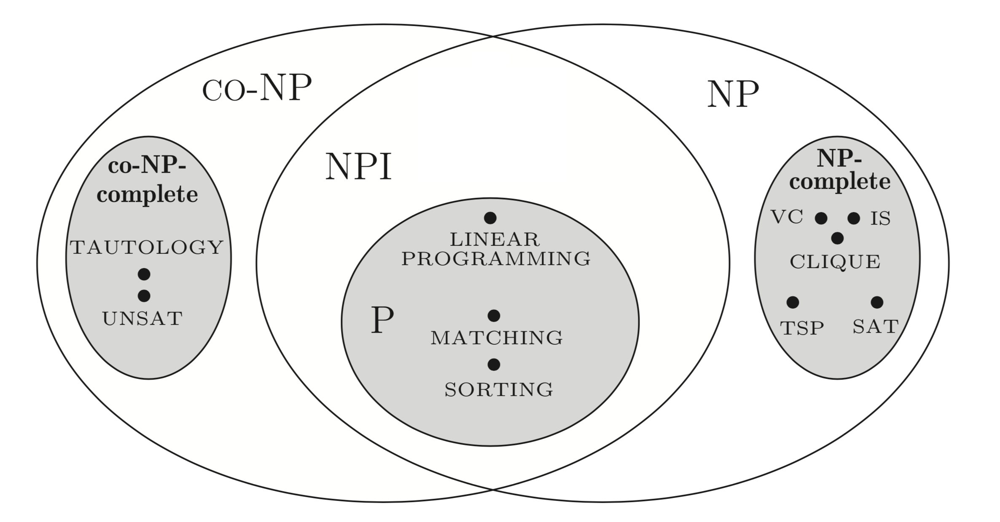

# CHP10 P-NP-NPc

- Decision problem（判定问题）: ret YES or NOPE
- Optimization problem（优化问题）: the minimization or maximum in a list of element
- D&O could be modified reciprocally

## 〇 The Class P

- ### *Def* Deterministic Algorithm

  > - Algorithm A can sovle proble Π. 
  > - Presented with an instance of the problem Π, A has **only** **one choice in each step** throughout its execution.
  > - A is run again and again on the same Π, **output never change**.
  > - **A is a Deterministic Algorithm**

- ### *Def* **Class of Decision Problems P** (polynomial)

  > - The solution of problems in the class of P (YES/NOPE) can be  obtained using a **Deterministic Algorithm** 
  > - The algorithm runs in **polynomial number of steps**.

- ### *e.g.*

  - [SortTable, UnionFind, ShortestPath]

  - 2-COLORING problem: 

    > - ALG: 2-COLORING
    >
    > - INPUT:  An undirected graph G
    >
    > - OUTPUT: Can G be colored with 2 colors.
    >
    >   if G is **bipartite** （二分图）
    >   ​	if G **doesn't contain cycles of odd length**
    >   ​		return true
    >   ​        else return false
    >   ​        end if
    >
    >   else return false
    >   end if

  - 2-SAT problem:

    > - Transform CNF into Implication
    >
    > $$
    > (a || b) = (!a → b ) and (!b → a)
    > $$
    >
    > - Generate directed graph
    > - If none of GI ’s strongly connected components contain both a literal and its negation, then the instance I must be satisfiable. 

- ### *Def* Complementation Problem

  > An problem opposites to the given deterministic one. 

- ### *Def* Closed Under Complementation

  > - A given class of problems *C*.
  > - For any problem Π **∈** *C*, Π's complementation problem Π' ∈ *C* too.
  > - The class *C* is closed under complementation. 

- ### *Theorem*

  > **The Class P is closed under complementation**

## 〇 The Class NP

- ### *Def* Class NP (informalized)

  > - A given class of problem made of Π.
  > - A given deterministic algorithm *A*.
  > - *A* check the correctness of a claimed solution of and instance of Π in polynomial time.
  > - Π is belong to the NP class.

- ### *Def* Nondeterministic Algorithm

  > On input x, NDA (*Nondeterministic Algorithm*) contains two phases:
  >
  > - (a) The guessing phase
  >
  >   - Generate an arbitrary string y.
  >
  >   - Generation requires x's polynomial steps.
  >
  > - (b) The varification phase.
  >
  >   - Check solution string *y* is in the proper format. If isn't, halt with answer nope.
  >   - Check solution is true for instance x, if so, halt and answer YES.
  >   - Check  requires x's polynomial steps.

- ### *Def* NDA's Acception

  > - *A* is a NDA to problem Π
  > - When there **exists** an guess that make *A* answer YES, *A* accepts an instance I of Π.
  > - **Possibly**, on some execution of *A*, a YES answer will be given, *A* accepts an instance I of Π.
  > - // One time NOPE answer doesn't, mean unacception  for the existence of accepted guess not being falsified.

- ### *Def* Class NP (less informalized)

  > NP consists of thoes **decision problems** for which there **exists a NDA** that runs in polynomial time.

- ### *Prove* NP

  > - Method I (follows by informal def)
  >   1. Given an instance ***I*** of Π problem. 
  >   2. Given an claimed solution ***s*** to ***I***. 
  >   3. An **deterministic algorithm** can be contructed to **test** ***s*** is true in **polynomial time**.
  > - Method II (follows by less informal def)
  >   1. Given an instance ***I*** of Π problem. 
  >   2. An **NDA** can be contructed and runs in **polynomial time**.

- ### *Cmp* P & NP

  > - Class NP **⊆** Class P
  > - Problems in class P demands for a **polynomial time  deterministic algorithm to decide or solve**.
  > - Problems in class NP demands for a { **polynomial time  deterministic algorithm to check or verify**} || { **polynomial time NDA**} 

## 〇 The Class NP-complete

- ### *Def* Reduction 

  > - Given two decision problems Π and Π'.
  > - A deterinistic algorithm *A* can be constructed.
  > - When presented an instance I of Π, *A* **transforms** it into an instance I' of Π'.
  > - Answer to I is YES **if and only if** answer to I' is YES
  > - *A* is **polynomial time** algorithm. 

$$
(Π_{output})\propto_{poly}(Π'_{input})
$$

- ### *Def* NP-hard

  > - For **any** problem Π' in class **NP**.
  > - Problem Π' can  be reduced to Π, e.t.(Π'∝Π).
  > - Π is belong to the class NP-hard.

- ### *Def* NP-complete

  > - Given a problem Π.
  >
  > - Π is in the class NP.
  > - For any problem Π' in NP, Π' can  be reduced to Π, e.t.(Π'∝Π).

- ### *Prop* NP-complete

  > - A given problem Π belong to the NPc class.
  > - If there exists a polynomial time deterministic algorithm to decide or solve Π. Then every problem in the NP class can be decided or solved by a polynomial time deterministic algorithm. (NP = P)

- ### *Prove* NPc 

  > - A given problem Π belong to the NP class.
  > - Exist a NPc problem Π' can reduce to Π.
  > - Then Π is NPc.

- ### *Cmp* NP-hard & NP-complete

  > - The NP-complete class is included in the NP class.
  > - The NP-hard class may not be in NP.

- ### *e.g.*

  - ***The satisfiability problem***

    > A CNF is satisfiable if **a truth assignment** to its variables that **makes it true**.

    - ***Theorem***

      > SAT is NPc.

    > Any problem in NP can be reduced to a boolean formula ***f***.

    - ***Theorem***

      > Reducibility ralation is transitive.
      > $$
      > if (Π\propto_{poly}Π') \&\& (Π'\propto_{poly}Π'')
      > $$
      >
      > $$
      > then(Π\propto_{poly}Π'')
      > $$
      >

    - ***Corollary***

      > Π and Π' are NP, if Π can be reduce to Π', and Π is NPc, then Π' is NPc.

  - ***Vertex cover, independent set and clique problems***

    - CLIQUE

      > - Given an undirected graph G=(V, E) and a positive integer k.
      > - Decide G contains a ***clique*** of size k or not.  
      >   *(a **clique** is a complete subgraph of G on k vertexes)*

    - VERTEX_COVER

      > - Given an undirected graph G=(V, E) and a positive integer k.
      > - Decide the existence of a subset C ⊆ V of size k such that each edge in E is incident to a least one vertex in C.

    - INDEPENDENT_SET

      > - Given an undirected graph G=(V, E) and a positive integer k.
      > - Decide the existence of a subset S ⊆ V of k vertexes such that for each pair of vertexes *u, w* ∈ S, but the egde of *u, w*, e.t. (u,w) ∉E.

  - ***Proof***  Clique, Vertex_cover and Independent_set are NPC

    > - SAT can be reduced to CLIQUE
    >
    >   > - Given an instance of CNF with *m* clauses and *n* boolean variables x1,x2,...xn. 
    >   >
    >   >   > $$
    >   >   > f = C_1\land C_2 \land C_3 \cdots \land C_m
    >   >   > $$
    >   >   >
    >   >
    >   > - Construct a graph G=(V, E)
    >   >
    >   >   > $$
    >   >   > E = \{(x_i, x_j)\ |\  x_i\ and\ x_j \ are\ in\ twp\ different\ clauses\ and\ x_i≠\bar{x}_j \}
    >   >   > $$
    >   >   >
    >   >   > $$
    >   >   > V\ is\ the\ set\ of\ all\ appeared\ 2n\ literals\ 
    >   >   > $$
    >   >   >
    >   >   > *(n vars and their negations sum 2n)*
    >   >   >
    >   >   > The construction is polynomial time.
    >   >
    >   > - ***Lemma*** f is satisfiable IAOI G has clique of size m (the number of clauses)
    >   >
    >   >   > ***Proof***:
    >   >   >
    >   >   > CLIQUE in G represents truth assignment in clique has no contradiction.
    >   >   >
    >   >   > CLIQUE of size m represents m vars (not include var and its negation) can be assigned with no contradiction. 
    >
    > - CLIQUE, VERTEX_COVER and INDEPENDENT_SET can be reduced reciprocally
    >
    >   > - INDEPENDENT_SET reduce to CLIQUE
    >   >
    >   >   > - Gc is the complete graph of G, Gm=(V, Ec);
    >   >   > - E_{\bar} = Ec - E;
    >   >   > - G_{\bar} = (V, E-{\bar})
    >   >   > - The indepentdent_set of vertex ***S*** in ***G*** is exactly ***CLIQUE*** in ***G_{\bar}*** 
    >   >
    >   > - VERTEX_COVER reduce to INDEPENDENT_SET
    >   >
    >   >   > - The indepentdent_set of vertex ***S*** in ***G***(V, E).
    >   >   > - The set of vertex ***C*** = ***V-S***.
    >   >   > - ***C*** is a VERTEX_COVER of G.

  - ***More NPc Problems***

    > - 3-SAT
    > - 3-COLORING
    > - etc.

## 〇 The Class co-NP

- ### *Def* co-NP

  > Problems whose ***complements*** are in **NP**.
  >
  > Conjecture: co-NP ≠ NP.

- ### *Def* co-NP complete

  > Problem Π is complete for the class co-NP if:
  >
  > - Π is in co-NP
  > - For every problem Π' in co-NP, Π' can be reduced to Π.

- ### *Lemma*

  > If ***A*** reduce **Π'** to **Π**, (Π and Π' is in the class NP)
  >
  > Then ***A*** can also reduce **co-Π'** to **co-Π**. 

- ### *Theorem* 

  > A problem Π is NP-complete IAOI its complement co-Π is complete for the 
  >
  > class co-NP.
  >
  > (The symmetry of complete problem)

- ### ***Corollary***

  > Statements bellow are equivalent:
  >
  > - NP = co-NP
  > - co-NP is closed under complementation
  > - NP is closed under complementation

  > Statements bellow are equivalent:
  >
  > - NPc = co-NPc (stronger)
  > - co-NPc is closed under complementation => co-NP closed
  > - NPc is closed under complementation => NP closed

  > If NP = P, then co-NP = NP (P closed)

- ### *Theorem* 

  > Decide a DNF is tautology (TAUTOLOGY) is ccomplete for the class co-NP.
  >
  > - TAUTOLOGY is in P IAOI co-NP = P
  > - TAUTOLOGY is in P IAOI co-NP = NP

## 〇 The Class NPI

- ### *Theorem* 

  > If Π and co-Π are both NPc, then coN-P = NP

- ### *Def* NPI 

  > If Π is in the class NP, Π's complement co-Π is in NP too
  >
  > Then Π is in the class NPI

- ### *e.g.*

  > - Prime Number (P class)
  > - Composite (P class)

## 〇 Relationships

