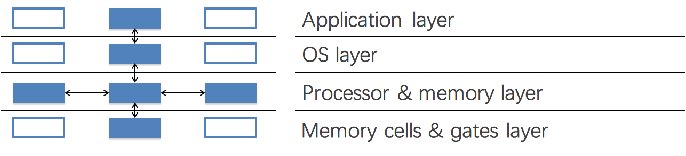

# CHP1 Introduction

## Prologue

### System

>  Interacting set of components with a specified behavior at the interface with its environment

### Complexity of Computer Systems

#### Hard to define; but has some symptoms:

- Large number of components
- Large number of connections
- Irregular
- No short description
- Many people required to design/maintain

#### Technology rarely the limit

- Indeed tech opportunity is the problem
- Limit is usually designers' understanding

## System Complexity

### Emergent properties (suprise)

#### Features

- No evident in the individual components of a system
- But show up when combining those components 
- Might also be called surprises
- An unalterable fact of life: some things turn up only when a system is built

### Propagation of effects (butterfly effort)

> What looks at first to be a small disruption or a local change can have ==effects that reach from one  end of a system to the other==.

### Incommensurate scaling (proof of no-giant)

#### As a system increases in size or speed, not all parts of it follow the same scaling rules

So things stop working

#### The mathematical description 

Different parts of the system exhibit different orders of growth

### Trade-offs (waterbed effect)

#### General models

- Limited amount of goodness
- Maximize the goodness
- Avoid wasting
- Allocate where helps most

#### Waterbed effect

- Pushing down on a problem at one point 
- Causes another problem to pop up somewhere else 

#### Binary classification

- We wish to classify a set of things into two categories 
  - Based on presence or absence of some property
- But we lack a direct measure of that property
- So we identify some indirect measure instead
  - Known as a *proxy*
- Occasionally this scheme misclassifies something 
- By adjusting parameters of the proxy 
- The designer may be able to:
  - reduce one class of mistakes
  - but only at the cost of increasing some other class of mistakes

## Coping with complexity

> M.A.L.H

### Modularity

#### Analyze or design the system as a collection of interacting subsystems

- Subsystems called *modules*
- "Divide-and-conquer" technique 

#### Modularity is the simplest, most important tool for reducing complexity

- Consider interactions among the components within a module without simultaneously thinking about the components that are inside other modules

### Abstraction

#### Software is particularly subject to this problem

- The modular ==boundaries== provided by the separately compiled subprograms are actually somewhat soft
- Is easily penetrated by errors in:
  - using pointer;
  - filling buffer;
  - calculating array index;
  - etc.

#### Failure containment

- When a module does not meet its abstract interface specifications
- Limiting the impact of faults
  - Well-designed and properly ==enforced modular abstractions== 
  - Control propagation of effects
- Modules are the ==units of fault containment==

### Layering

- Goal: ==Reduce module interconnections== even more
- How to do it? Bottom-Up
  - Build a set of mechanisms first (a lower layer)
  - Use them to create a different complete set of mechanisms (an upper layer)
- General rule -- A module in one layer only interacts with:
  - its peers in the same layer, and
  - modules in the next lower layer / next higher layer

### Hierarchy

#### Hierarchy: another module organization

- Start with a small ==group== of modules
- ==Assemble== them into a stable, self-contained subsystem with well defined interface
- Assemble a group of subsystems to a larger subsystem

#### Constrains interactions

- Permit ==interaction== only among the components of a ==subsystem==
- Reduces the number of potential interactions among modules from square-law to linear

