# Chp2 File System

## iNode based File System
### File

#### A file has two key properties

- It is ==durable== & has a ==name==
- It is a high-level version of the memory abstraction

#### System layer implements files using modules from hardware layer

- Divide-and-conquer strategy
- Makes use of several ==hidden layers of machine-oriented== names (addresses), one on another, to implement files
- Maps user-friendly names to these files

<center>
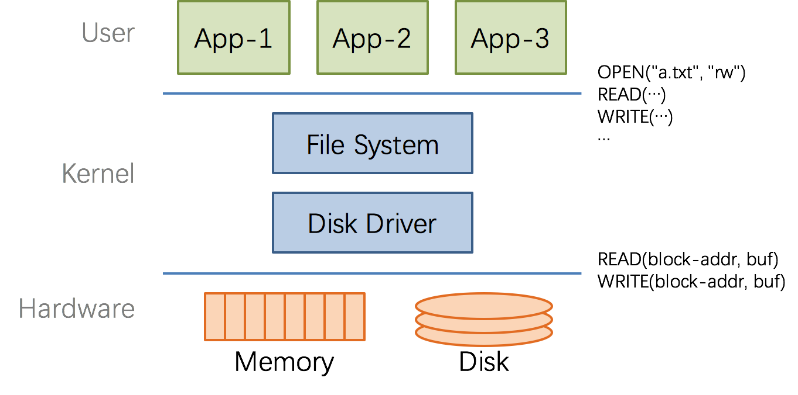
<br>
<span style="font-size: 14px; color: #999; border-bottom: 1px solid #d9d9d9">
  The Big Picture
</span>
</center>

## 7 software layers

<center>
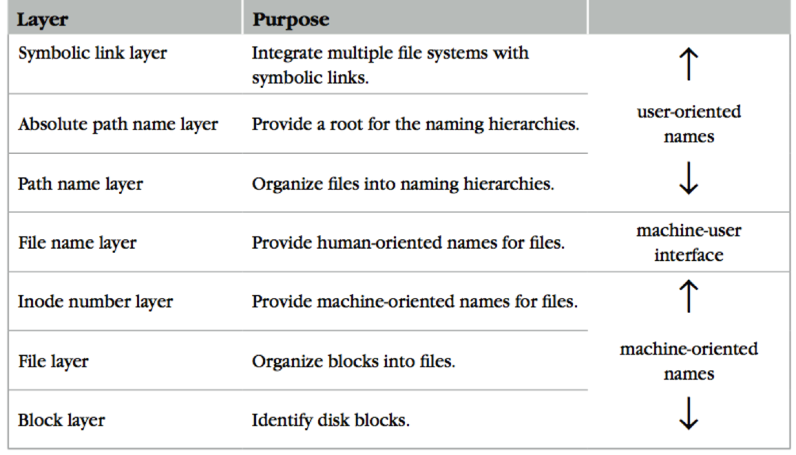
<br>
<span style="font-size: 14px; color: #999; border-bottom: 1px solid #d9d9d9">
  The Naming Layers of the UNIX FS (version 6)
</span>
</center>

### L1 Block Layer

#### Mapping: **block number** -> **block data** 

```pseudocode
procedure BLOCK_NUMBER_TO_BLOCK(int b) returns block
	return device[b]
```

- How to know the size of block?
- How to know which block is free?
- These metadata will also be stored on the same disk
  - **Super block**🤡

#### Super Block🤡

- One superblock per file system
  - Kernel reads superblock when mount the FS
- Superblock contains
  - Size of the blocks
  - Number of free blocks
  - A list of free blocks
  - Index to next free block
  - Lock field for free block and free inode lists
  - Flag to indicate modification of superblock
  - Size of the inode list
  - Number of free inodes
  - A list of free inodes
  - Index to next free inode
- Block size: a trade-off
  - Neither too small or too big

### L2 File Layer

- File requirements
  - Store items that are larger than one block
  - May grow or shrink over time
  - A file is a linear array of bytes of arbitrary length
  - Record which blocks belong to each file
- inode (index node)
  - A container for metadata about the file 

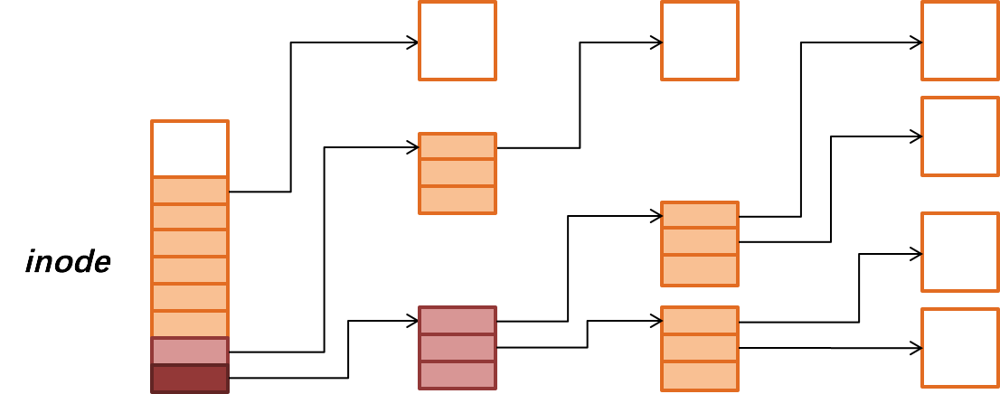

- Given an *inode*, can map a **block** **index number** (of a file)  -> **block number** (of a disk)
  - Index number: e.g., the **3****rd** block of a file is number **78**

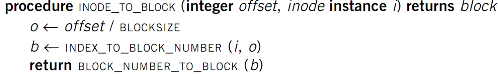

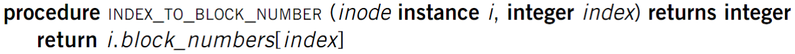

## L3 inode Number Layer

- Mapping: **inode number** -> **inode**

  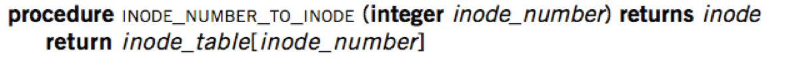

- *inode** **table**: at a fixed location on storage

- inode number is the *index* of inode table

- Track which inode number are in use, e.g. free list, a field in inode

  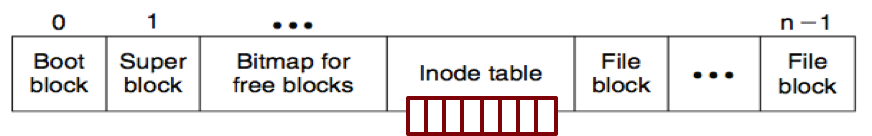

  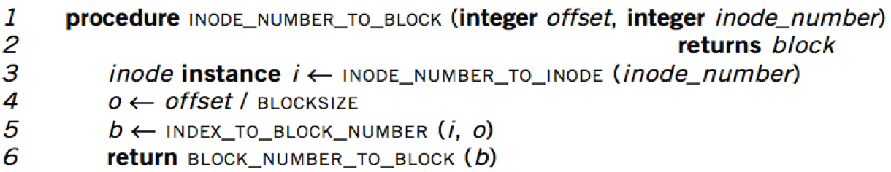

- inode number is enough to operate a file

- Needs more user-friendly name\

  - Numbers are convenient names only for computer

- Numbers change on different storage device

## L4 Filename Layer

- File name

  - Hide metadata of file management
  - Files and I/O devices

- Mapping

  - Mapping table is saved in directory
  - Default context: current working directory
    - Context reference is also an *inode* *number*
    - The inode number of current directory is also a file

  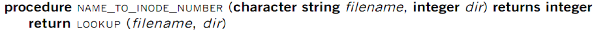

- Max length of a file name is 14 bytes in UNIX version 6

#### Look up in a Directory

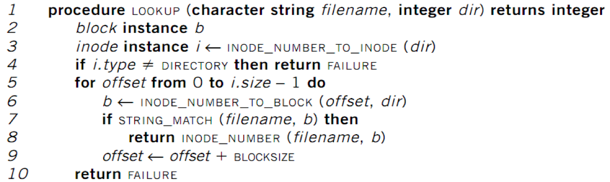

- Name compare method: STRING_MATCH
- LOOKUP("program", dir) will return 10
- Next Problem: what if too many files?

## L5 Path Name Layer

- Hierarchy of directories and files

  - Structured naming: E.g. "projects/paper”

    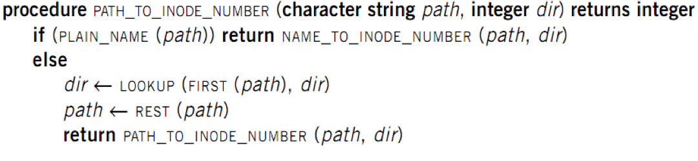

  - PLAIN_NAME() returns true if no ‘/’ in the path

- Context: the working directory

### Links

- **LINK**: *shortcut* for long names
  - LINK("Mail/inbox/new-assignment", "assignment")
  - Turns strict hierarchy into a directed graph
    - Users cannot create links to directories -> acyclic graph
  - Different names, same inode number
- **UNLINK**
  - Remove the binding of filename to inode number
  - If UNLINK last binding, put inode/blocks to free-list
    - A reference counter is needed

### Directed Acyclic Graph

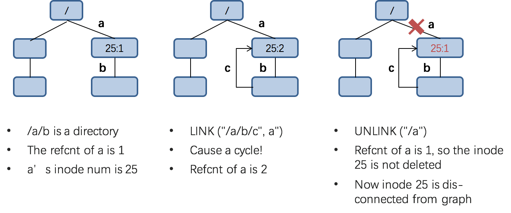

### Renaming

####  Schema 1

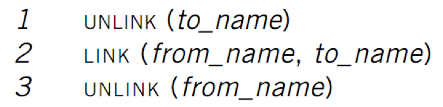

- Text edit usually save editing file in a tmp file
  - Edit in .a.txt.swp, then rename .a.txt.swp to a.txt
- What if the computer fails between 1 & 2?
  - *to_name* will be lost, which surprises the user
  - Need atomic action in chap-9

#### Schema 2

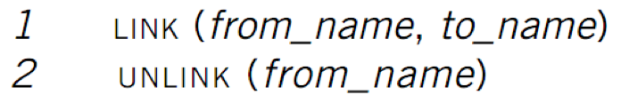

- Weaker specification without atomic actions

  1. Changes the inode number in for *to_name* to the inode number of *from_name*

  2. Removes the directory entry for *from_name*

- If fails between 1 & 2

  - Must increase reference count of *from_name*’s inode on recovery

- If *to_name* already exist

  - It will always exist even if machine fails between 1 & 2

## L6 Absolute Path Name Layer

- **HOME** directory
  - Every user’s default working directory
  - Problem: no sharing of HOME files between users
- Context: the **root** directory
  - A universal context for all users
  - Well-known name: ‘/’
  - Both ‘/.’ and ‘/..’ are linked to ‘/’

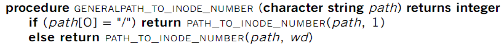

## L7 Symbolic Link Layer

#### **MOUNT**

- Record the device and the root inode number of the file system in memory
- Record in the in-memory version of the inode for "/dev/fd1" its parent’s inode
- **UNMOUNT** undoes the mount

#### Change to the file name layer

- If **LOOKUP** runs into an inode on which a file system is mount, it uses the root inode of that file system for the lookup

#### Name files on other disks

- Inode is different on other disks
- Supports to attach new disks to the name space

#### Two options

- Make inodes unique across all disks (❌)
- Create synonyms for the files on the other disks

#### Soft link (symbolic link)

- **SYMLINK**
- Add another type of inode 

## FAT (File Allocation Table) File System

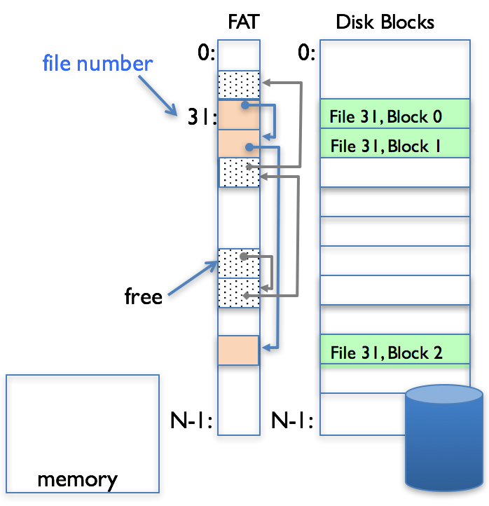

### Properties

- File is collection of disk blocks
- FAT is linked list 1-1 with blocks
- File Number is index of root of block list for the file
- File offset (o = < B, x > )
- Follow list to get block #
- Unused blocks ó FAT free list
- Ex: file_write(31, < 3, y >)
  - Grab blocks from free list
  - Linking them into file

###  Directory 

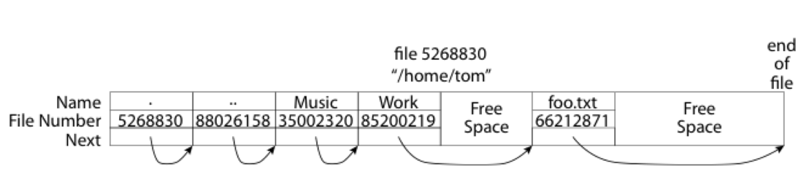

- Essentially a file containing
  - <file_name: file_number> mappings
- Free space for new entries
- In FAT: ==file attributes are kept in directory== (!!!)
- Each directory is a linked list of entries
- Q: Where to find root directory ( "/" )? A: device[STATIC_POS]

