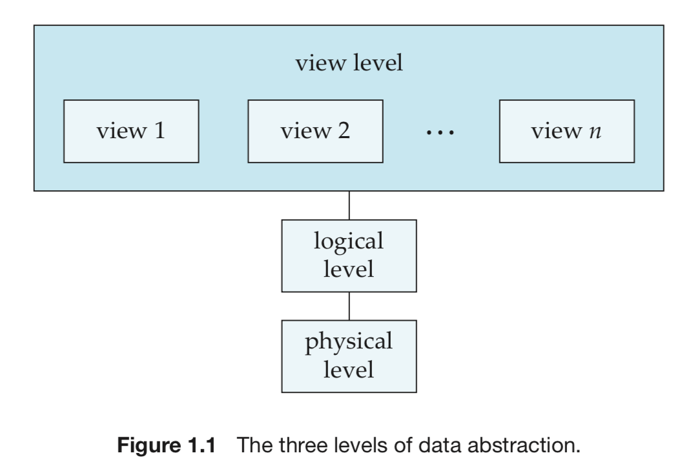
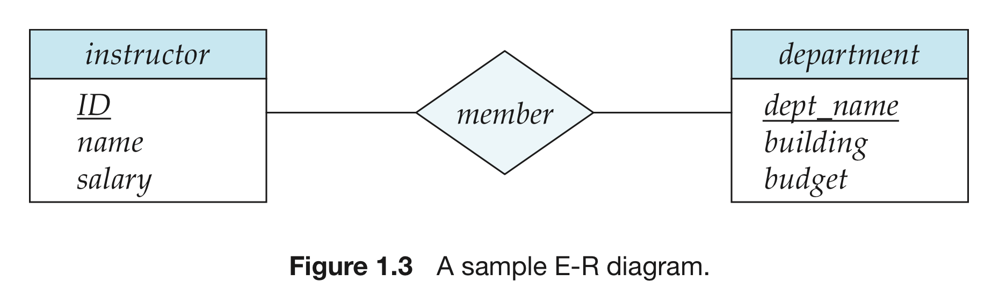
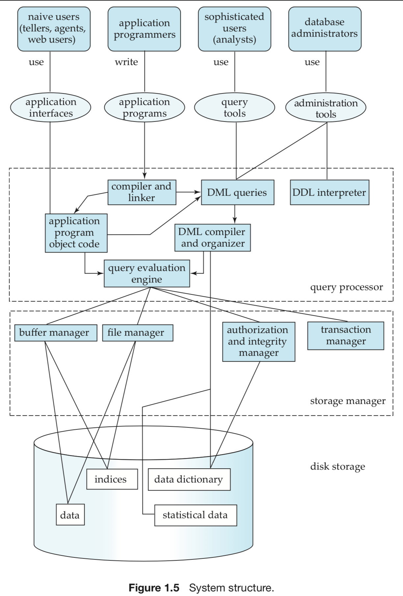

# Chp1 Intro

- DBSM: DataBase-Management System
  - Data set: relational (DataBase)
  - Program: visit data
  - Goal: conviniently, effectively store and fetch data from DB 

- Manage: a huge mount of data
  - Define structure of data when stored
  - Provide methods to operate data
- Safety assurence
  - System crush
  - Visitor hierarchy
  - Multiple users' exceptions
- Applications: widely

## Goal

Over come file-processing system's problems:

Programs fetche or add data to files cording to requests. 

- Data redundancy and inconsistency
- Difficulty in accessing data
- Data isolation
- Intergity problem
- Atomicity problem (a set of undividabe operation)
- Concurrent-access anomaly
- Security problem

## Data graph

> An abstract graph hides the details of store and maintain data.  Reduce complexity in:

- Physical level:  lowest level, the structure of really stored data.(B+ tree, R-B tree etc.)

  > compare to memory block

- Logical level: independent to the physical level, describe sorts of data and the relation between data.

  > compare to object in programming language

- View level: highest level, face to user, describe a part of data in DB.

  > compare to compiled application



## Schema and Instance

- Instance: sometime, all data stored in the DB

  > compare to an assigned obj with certain value.

- Schema: the overall design

  > compare to declaration of obj.

  - physical schema: describe in physical level
  - logical schema: describe design in logical level
  - subschema: descibe diffirent view of DB

## Data model

- Relational model

  Describe data and relationship between data through tables, based on recording. Tables contain the recording of a certain type, and define atrributes (column). 

- Entity-relationship model

  Entity is a destingushied  thing or object, entities and relationships between them can reflect real world.

- Object-based data model

  E-R model + pakage + method + obj_mark

- Semistructured data model

  Data item in the same type may have diffirent attributes. Described by XML(eXtensible Markup Language)

## DB Language

> data-definition language (DDL) & data-minipulation language (DML)
>
> Not seperated.

- DML: query and operate the data orgnazied by data model.

  - Search
  - Insert
  - Delete
  - Modify
  - procedural DML: what data? how to aquire?
  - declarative (nonprocedural) DML: what data? 

  - DML ≈ query language

- DDL: define schema and other data features

  - Consistency constraint: check when update

    - domain constraint:

      the all possible values of an attr (int, string, yyyy-mm-dd)

      basic form of integrity onstraint  

    - referential integrity

      the values in a given attr set appears in another 

    - assertion

      any condition that the DB must always satisfy.

      domain constaint and referential integrity are special forms of assertion

    - authorization

      read authorization; insert authorization, update authorization, delete authorization

    - data dictionary

      Output of DDL is stored in data dictionary where metadata stays. data dictionary is a special table that can only be visited by DBMS. DBMS will firstly refer to it when query and update.

##  Relational Database

> based on  relational model, use tables to express data and relationships between data

- Table

  - Relational model (record-based model):

    Frame of DB is recorded in some certain forms

  - Each table contain the record of a certain type (teacher, department), Each type has stable attrs (column)

  - Redundant info (in bad schema)

- DML

  - SQL (nonprocedural): always return a single table

    e.g1 (single table query info):

    ```sql
    select instructor.name
    from instructor
    where instructor.dept_name = 'Histroy';
    ```

    e.g.2 (multiple tables query info):

    ```sql
    select instructor.ID, department.dept_name
    from instructor, department
    where instructor.dept_name = department.dept_name
    and department.budget > 95000;
    ```

- DDL

  - Dedine table, intergity constraint, assertion...

  - e.g.

    ```sql
    create table department
    (
    	dept_name char(20),
        building  char(15),
        budget numeric(12,2)
    );
    
    ```

  - update data dictionary (including metadata, like schema)

- Access form application program

  > Through host language ( Java, C++) to access and execute DML

  - APIs:

    send DML and DDL to DB, then fetch ressult (JDBC & ODBC)

  - Expand host language syntax, embadding DML recalling.

## Database Design

> Schema design

- Design process

  1. use data model as concept frame
  2. attrs and organize attrs in tables

- E-R model

  - basic object: entity

  - relationships between entities

  - E-R diagram: Unified Modeling Languag (UML)

    

    - Entities set: rectangular box
    - Relationship: diamond

  - Mapping cardinality:

    the numberof entities to which another entity can be associated wvia a relationship set.

- Normalization

  - Normal form (function dependency)

## Data store and query

- Storage managet

  > Translate DML to sys instructions

  - Authorization and integrity manager
  - Transaction manager: keep integrity when sys failures, proceed without conflicting
  - File manager:  allocate storage
  - Buffer manager
  - Data files
  - Data dictionary
  - Indices: includes pointer to some special data (Hashing)

- Query processor

  - DDL interpreter

    explain DDL and store the definition in the data dictionary as metadata

  - DML compiler

    translate DML into an executable scheme containing low-level instruction

  - Query evaluation engine: execute low-level ins product by DML compiler

## Transaction manage

- Logic unit: a series of undividable operations
- recovery manager: failure recovery 
- concurrency-control manager: keep consistency

## Database architecture

