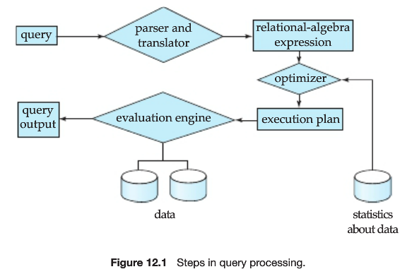

# Chp12 Query Processing

> Query Processing: 从DB中提取数据的一些列活动
>
> 1. 将高级 query ==翻译==为内在文件系统的物理层上使用的表达式
> 2. 为==优化==查询进行各种转换
> 3. 实际==执行==查询

## 1. Overview

基本步骤:

1. Parsing and translation

   内部表示建立在关系代数的基础上

   检查查询语法, 构造语法分析树, 翻译为关系代数表达式

   定义view的关系代数表达式和所有对view的引用

2. Optimization

   

3. Evaluation

