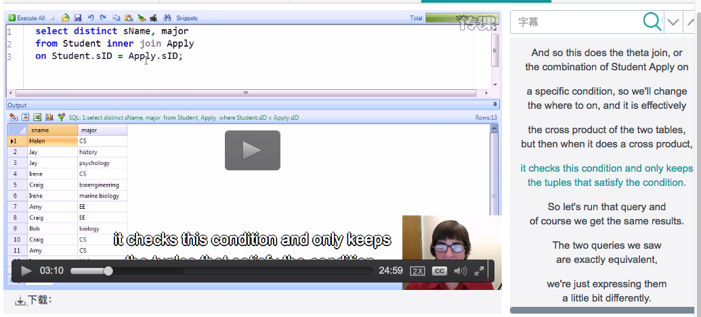

# Chp3 SQL

> **FOR RELATIONAL DATABASE**
>
> based on relational algebra
>
> Structured Query Language

## DDL

```sql
create
drop
```


## DML

```sql
select
insert
delete
update
```

- Basic SELECT Statement

  ```sql
  Select A1, A2, ..., An # clause No.3
  From R1, R2, ..., Rm  # clause No.1
  Where condition # clause No.2
  ```

  - From: the relation that should be queried over;
  - Condition: conbine the relations and to filter the ralations;
  - Select: what (attr) to return;

  Equivalent to: 
  $$
  Π_{A_1, A_2,...A_n}(σ_{condition}(R_1×R_2×...×R_m))
  $$
  From => ×

  Where => σ

  Select => Π

  - distinct: make result from bag to set
  - order by (desc, acse)
  - like '%', '_':  
    - "%" free string match
    - "_" not null match
  - \*  (star): all attrs
  - arithmetic calculation
  - as (rename select clause)

- Table variables (from clause, space + rename)

  - in the from clause
  - make queries more readable 
  - rename relations used in from clause 
  - **rename for 2 instance of the same relation **

- Set operators

  - Union : connect two (result) relations

  - Intersect: Self Join to substitute

  - Except (minus): unsubstitute

    ### sub-queries in "where"

    

  - sub-query: nested select statement

    ```sql
    SELECT sID, sName
    FROM Student
    WHERE sID in (     # "in" is a set operator
    	SELECT sID 
        FROM Apply
        WHERE major = "CS"
    );
    ```

  - sub-query substituted by Joining 

    ```sql
    SELECT DISTINCT Student.sID, sName
    FROM Student, Apply
    WHERE Student.sID = Applt.sID and major = "CS";
    ```

  - except substituted by sub-query

    ```sql
    SELECT sID, sName
    FROM Student
    WHERE sID in (
    	SELECT sID
        FROM Apply
        WHERE major = "CS"
    ) and sID not in (
    	SELECT sID
        FROM Apply
        WHERE major = "EE"
    )
    ```

  - EXIST to sub-query to test empty

    ```sql
    SELECT cName, state
    FROM College C1
    WHERE exists (
    	SELECT * 
        FROM College C2
        WHERE C2.state = C1.state
        and C1.cName <> C2.cName
    ) 
    ```

  - sub-query substitute MAX

    ```sql
    SELECT cName 
    FROM College C1
    WHERE not exists (
    	SELECT * from College C2
        WHERE C2.enrollment > C1.enrollment
    )
    ###or
    SELECT S1.Sname, S1.GPA
    FROM Student S1,Student S2
    WHERE S1.GPA > all(S2.GPA)
    ```


### sub-queries in the FROM and SELECT

- in FROM

  ```sql
  SELECT *
  FROM (
  	select sID, sName, GPA, GPA*(sizeHS/1000.0) as scGPA
    from Student
  	) new_Student
  WHERE abs(new_Student.scGPA-GPA) > 1.0;	
  ```

- in SELECT

  ```sql
  SELECT cName, state, 
  	(
      select distinct GPA
      from Apply, Student
      where College.cname = Apply.cname
      	and Apply.sID = Student.sID
      	and GPA >= all
      		(
            select GPA 
            from Student, Apply
            where Student.sID = Apply.sID
            	and Apply.cName = College.cName
  	      )
    ) as GPA
  FROM College;  
  ```

- Sub-queries in SELECT must return **one value** (single column)

  because the the value is used to fill in just one row of the result.

### Join operator

- FROM clause: tables separated by commas: 

  **Cross Product**

- Explicit Join

  - Inner join on a condition => theta join in RA, **default** for "JOIN"

  - Natural join => NJ on RA (**eliminates duplicated columns**)

  - Inner join using (attrs) => NJ and list attrs equated

  - Outer join

    - left outer join
    - right outer join 
    - full outer join

    不满足theta的row曾广attrs设置为null

  JOIN都是可替代的

  

- Differentiate Condition in On or WHERE

  - "SQL processor should execute them all in the most efficient way"

  - JOIN: a hint to the processor 

  - Put all in the ON condition: 

    Follow the condition as the join process and applies to the combination of tuples.

  - Put all in the where:   

    Apply to separate attrs

  - 多重JOIN结合顺序性能无关 (processor will find the best execution scheme)

- Join Using: (inner) join … using(/attr/) is better than natural join

  显式地指明聚合属性, natural join隐式查找同名同域属性 

  不允许using 和on 的同时使用

- Outer Join

  - 不能聚合的tuple (danggling tuple)在using的attr(nature为同名attr)上找不到匹配另一个relation的tuple, 故在增广attr里设置为null

  - 利用普通语句替代:

    ```sql
    select /attrs/
    from RA, RB...                  -- cross product
    where /using RA.attr = RB.attr/ -- inner join using
     
    union  --union with dangglings in RA
    
    select /attrs in RA, null null.../ 
    -- null to repalce attr in RB
    from RB
    where /using RA.attr/ not in 
    	(
      	select /using RA.attr/
        from RB
      )
    
    ```

  - 没有结合律 (Associativity), 使用考虑顺序

  - 左右outer  join没有交换律 (Commutativity)

