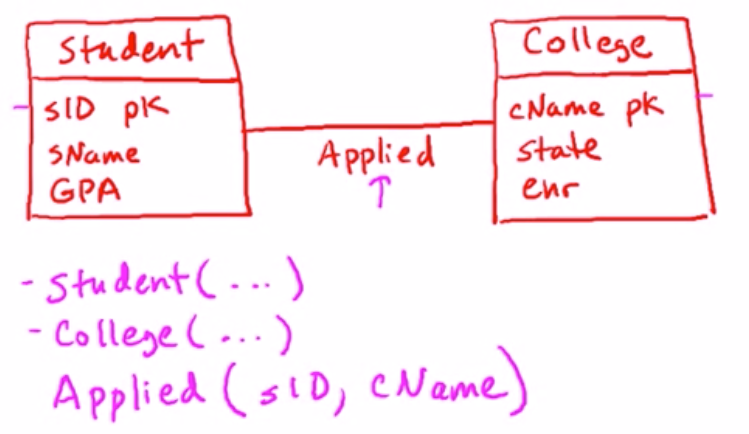

# Chp7

# E-R model

## UML Data modeling

> - Data modeling:
>
>   how to represent data for application
>
> - Database design model
>
>   - Not implemented by system
>   - Tanslated into model of DBMS
>
> ```high-level data model -> translator -> relations -> RDBMS```

### High-Level Database Design Models

- Entity-Relation Model (E/R)
- Unified Modeling Language (UML)
- Graphical
- Relations translatable

### UML Data Modeling

1. Classes

   - Name
   - Attributes: primary key (adj)
   - Methods: dropped in data-relation model

2. Association

   - Relations between objects of two classes

   - Multiplicity of Associations (关系基数)

     default 1..1; no restriction: 0..*; m to n: m..n

   - Types of Relationships

   > - One2One
   >
   >   不约束每个class都参与
   >
   >   但参与的class必然是一一对应的 (婚姻关系)
   >
   >   (wife) 0..1 <---> 0..1 (husband) 为零代表丧偶
   >
   > - Many2One
   >
   >   某一方联系的上限为1 (学生只能属于一个学校或者辍学0)
   >
   >   另一方没有限制(学校拥有无限制个学生)
   >
   >   \(Student) *  <----> 0..1 (University)   
   >
   > - Many2Many
   >
   >   没有基数限制的联系 (老师与学生)
   >
   >   \*<---->*
   >
   > - Complete
   >
   >   完全参与关系, 没有0关系
   >
   >   complete one 2 one: 1..1 <---> 1..1
   >
   >   complete many 2 one: 1..* <---> 1..1
   >
   >   complete many 2 many: 1..* <---> 1..*

3. Association Classes

   - Association with attributes on relationships

   - Eliminating in 0..1 or 1..1 multiplicity

     用含有唯一另一方的类的外键和附加属性表示

   - Self-Association

     Association between a class and itself

     同类型实例之间的关系 (同学之间的朋友关系)

4. Subclasses

   某个类的衍生类. 集成基类的属性, 可以增加属性

   Superclass = Generalization

   Subclass = Specialization

   Complete subclass relationship: 每个基类的实例都有至少属于子类; 相反的称为incomplete or partial (局部的)

   Disjoint subclass relationship: 每个实例都只能作为唯一一个子类的实例; 如果一个实例可以同时作为多个子类对象的实例, 则为overlapping

5. Composition & Aggregation

   Composition: 一个类的实例从属于另一个类, 则这两个类是Composition; 从属类对被聚合类是1..1的

   Aggregation: 可以独立的从属关系, 从属类对聚合类是0..1的

# UML to Relations

## High-Level Database Design Model

- User-friendly (graphical) specification language
- Translated into model of DBMS

## Unified Modeling language (UML)

> (data modeling subset)

### 5 Concepts

- Classes; Associations; Association classes; Subclasses; Comp&Aggre

### Designs can be translated to relations automatically

- Into a provision where every "reguler" class with a pk

1. UML Classes to Relations

   每个Class转换为Relation; pk attribute作为主键

   > e.g.
   >
   > Class Student:pk=sID -> Student(<u>sID</u>, sName, …)

2. UML Association to Relations

   * 转换为拥有双边keys的relation

   > e.g.
   >
   > 

   * Association 的Key: Depends on multiplcity
     * default: 双边的key聚集
     * 0..1 (/1) & *: 拥有0..1(/1)关系对侧的Class的key作为Association的key

   * Association 退化: Depends on multiplicity

     * 1(/0..1) & *: 为\*一侧的Class添加外键为对侧

       此时的key在依然是原pk

3. UML Association Class to Relations

   - 为Association的relation添加Attributes
   - 被联系的两个实例之间至多有一个关系类
   - 被联系的类必须是regular class (有pk), AssociationClass不必, 它被加入Association
   - 退化规则和主键规则同Association
   - Self-Association的转化: 相同规则

4. Subclass

   - 三种转换风格

     1. 子类包含基类的key和自身的specialized attrs

        子类的key依然是基类key

     2. 子类包含基类所有attrs

        子类的key依然是基类key, 子类包含全部信息,   基类实例只在于基类, 不可以是子类

        适用于Disjointed complete subclasses (全覆盖的不想交子类)

     3. 创建mega relation包含所有基类attrs和子类attrs

        key是原基类的key

        适用于 Heavily Overlapping Subclasses (相交很多的子类)

5. Aggregation and Composition

   mega类正常转换, 子类包含mega key (mega类1..1的Association退化规则), 子类也是irregular class, 独立无key

# DSC Chp7

数据库设计: 基于E-R数据模型, 表示实体和关联,转化为关系数据库的设计和约束集合

## 设计

- 直接决定关系, 属性和约束
- 高层数据模型转化 
  - 概念框架定义数据需求和结构
- 概念设计: E-R model,定义实体, 实体属性, 联系, 联系约束.
- 数据模型转换为数据库
  - 逻辑设计: 概念模型映射到数据库schemas
  - 物理设计: 指明物理特征, 文件组织结构, 索引结构

- 设计表示事务, 利用实体表明可以明确识别的个体
- 实体关联
- 缺陷:
  - 冗余: 含有重复信息, 副本的更新问题 ambiguous
  - 不完整: 缺少实体

## E-R model

定义代表数据库全局逻辑结构的企业模式

### 实体集


