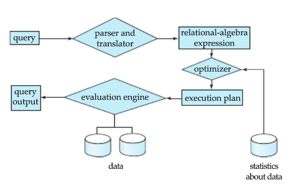

# MySQL Optimization

## 1. Query Cache

The query cache is shared among sessions, so a result set generated by one client can be sent in response to the same query issued by another client.

### 1. check

```sql
show variables like '%query_cache%' ;
+------------------------------+---------+
| Variable_name                | Value   |
+------------------------------+---------+
| have_query_cache             | YES     |
| query_cache_limit            | 1048576 |
| query_cache_min_res_unit     | 4096    |
| query_cache_size             | 1048576 |
| query_cache_strip_comments   | OFF     |
| query_cache_type             | OFF     |
| query_cache_wlock_invalidate | OFF     |
+------------------------------+---------+
set global query_cache_type = 1;
```

### 2. effect




update后失效


根据用户sql的字符串哈希

### 3. test 

零和buffer：可放下则buf，否则不用

size (freq) - time - routine

变量： 跟新更新频率/总时间

- routine1 菜品查询业务：

  连续查三家的x条菜品limit 100，再更新一家的food，循环常数次，记录时间y

### 4. scheme

time locality

根据时间局部性确定

## key_buffer_size  bulk_insert_buffer_size 

in MYISAM

Multiple sessions can access the cache concurrently.

### check

```sql
show variables like "%key_buffer%";
```

key_buffer_size这个参数是用来设置索引块（index blocks）缓存的大小，它被所有线程共享，严格说是它决定了数据库索引处理的速度，尤其是索引读的速度。那我们怎么才能知道key_buffer_size的设置是否合理呢，一般可以检查状态值Key_read_requests和Key_reads，比例key_reads / key_read_requests应该尽可能的低，比如1:100，1:1000 ，1:10000。其值可以用以i下命令查得：

mysql> show status like 'key_read%';

### effect

key_buffer_size 参数用来设置用于缓存 MyISAM存储引擎中索引文件的内存区域大小。如果我们有足够的内存，这个缓存区域最好是能够存放下我们所有的 MyISAM 引擎表的所有索引，以尽可能提高性能。

bulk_insert_buffer_size — clustering and grouping of writes  (INSERT and LOAD)

利用disk的结构特性，减少寻道时间

和key_buffer_size一样，这个参数同样也仅作用于使用 MyISAM存储引擎，用来缓存批量插入数据的时候临时缓存写入数据。当我们使用如下几种数据写入语句的时候，会使用这个内存区域来缓存批量结构的数据以帮助批量写入数据文件：

```sql
insert … select …
insert … values (…) ,(…),(…)…
load data infile… into… (非空表)
```

### test

变量：size （bulk and key）和时间

routine1读：

建立index（用户， order）查不同用户的订单1000次，记录时间

### scheme

## innodb_buffer_pool

缓存innodb表的索引，数据，插入数据时的缓冲。为Innodb加速优化首要参数

类似于 MyISAM 存储引擎的 key_buffer_size 参数，当然，可能更像是 [Oracle](http://www.2cto.com/database/Oracle/) 的 db_cache_size.当我们操作一个 InnoDB 表的时候，返回的所有数据或者去数据过程中用到的任何一个索引块，都会在这个内存区域中走一遭。

### LRU Algorithm

The buffer pool is managed as a list using a variation of the least recently used (LRU) algorithm. When room is needed to add a new page to the buffer pool, the least recently used page is evicted and a new page is added to the middle of the list. This midpoint insertion strategy treats the list as two sublists:

- At the head, a sublist of new (“young”) pages that were accessed recently
- At the tail, a sublist of old pages that were accessed less recently


### check

理想情况下，buffer pool size应该设置的尽可能大，这样就可以减少进程的额外分页，当buffer pool size设置的足够大的时候，整个数据库就相当于存储再内存当中，当读取一次数据到buffer pool size以后，后续的读操作就不用在进行磁盘读。

```sql
SET GLOBAL innodb_buffer_pool_size=402,653,184; 16,777,216
SHOW STATUS WHERE Variable_name like '%buffer_pool%';
```

### effect — hit rate and size

``Innodb_buffer_pool_read_requests - Innodb_buffer_pool_reads） / Innodb_buffer_pool_read_requests * 100%``

### test

变量：size-时间

routine1：

查某家商家的菜limit100， 循环1000次，更新商家菜单；

routine2：

统计所有商店的订单数；

(记录最小和最大的)

### innodb_additional_mem_pool_size

innodb_additional_mem_pool_size 设置了InnoDB存储引擎用来存放数据字典信息以及一些内部数据结构的内存空间大小，所以当我们一个MySQL Instance中的数据库对象非常多的时候，是需要适当调整该参数的大小以确保所有数据都能存放在内存中提高访问效率的。


## 其他

