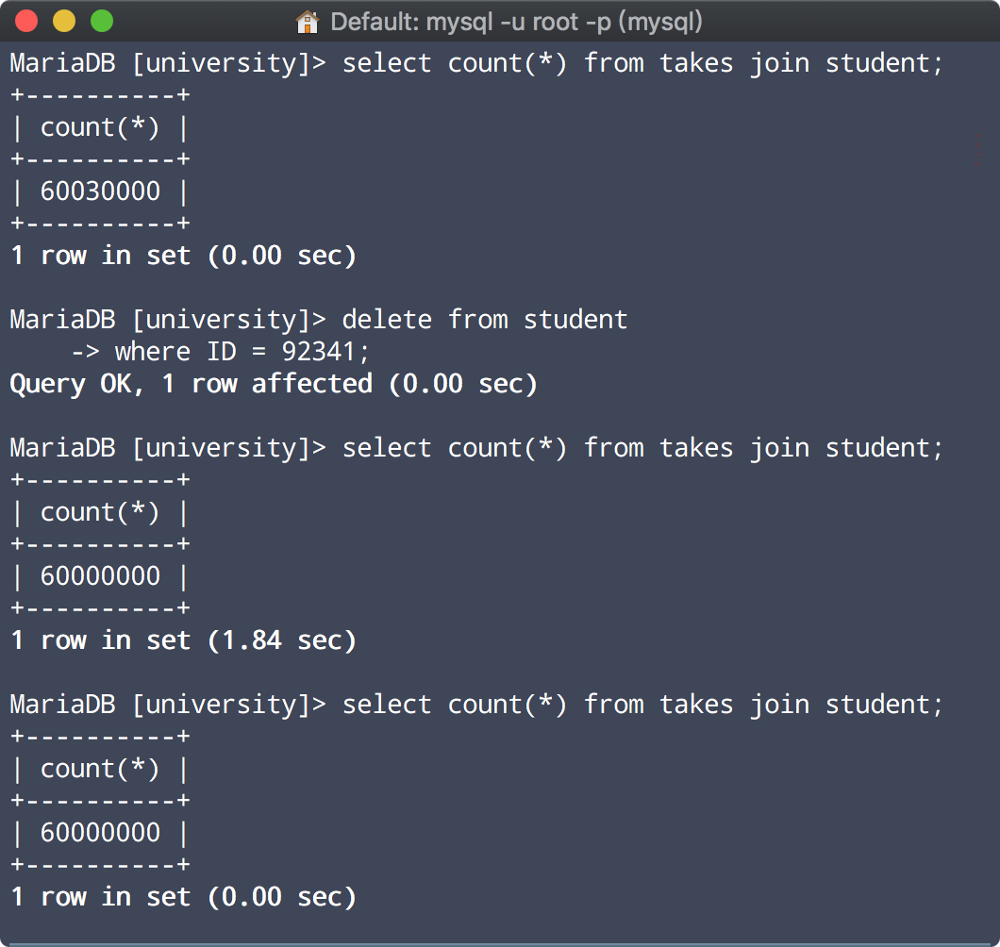
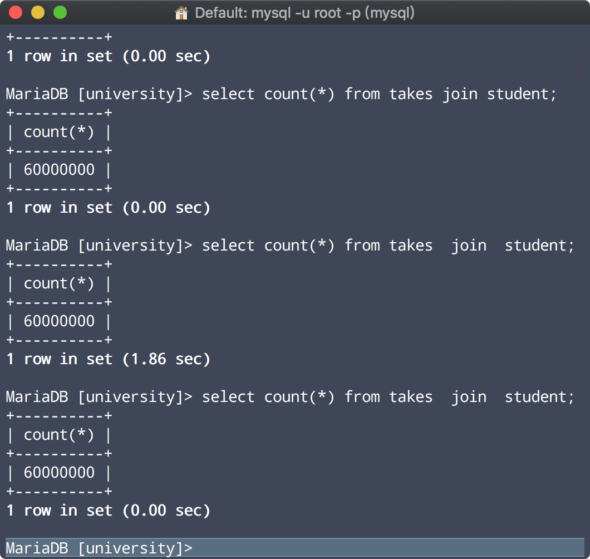

# MySQL Optimization

## 1. Query Cache

### 1. check

```sql
show variables like '%query_cache%' ;
+------------------------------+---------+
| Variable_name                | Value   |
+------------------------------+---------+
| have_query_cache             | YES     |
| query_cache_limit            | 1048576 |
| query_cache_min_res_unit     | 4096    |
| query_cache_size             | 1048576 |
| query_cache_strip_comments   | OFF     |
| query_cache_type             | ON      |
| query_cache_wlock_invalidate | OFF     |
+------------------------------+---------+
```

### 2. effect



update后失效



根据用户sql的字符串哈希

### 3. test


### 4. scheme

