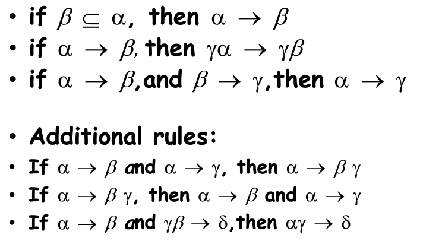

# Chp8 **Relational Database Design**

## 1FN

atomic attr: 

根据使用情况

- 如果对Attr进行拆分, 解析并使用 — 违反1FN

  ID = CS0012, CS + 0012 

- 对Attr进行整体使用, 不非凡

  ID = SE123, 不可拆分

## FD: function dependency

- A -> B => f(A) = B

- A, B之前有函数映射关系: 

  没给定一个A. R中都能找到唯一一个B与之出现在同一个tuple

- 任意属性 FD SuperKey (SuperKey在Relation中只出现一次)

## Closure

一个Relation中所有FD集合

通过已知FD求Closure: Armstrong’s Axiom

## BCNF: Boyee-Codd 

对于Closure中的所有FD: 

- FD是平凡的
- FD自变attrs是超码

自变量attrs不是超码则对其分解 如A -> B

- R1 = A ∪ B
- R2 = R - (B - A)

分解直到满足BCNF

## 保持依赖

原有的依赖能够在同一个R中体现

### e.g. 

R(A, B, C) 有 A -> B, BC -> A

BC是candidate key. A不是超码 A->B不符合

分解为:

- R1 = (A, B)
- R2 = (A, C)

原有依赖: BC->A 没有体现, 不是依赖保持的

## 3NF

为了解决BCNF不能保持依赖的问题, 对BC放宽了

对于Closure中的所有FD: 

- FD是平凡的
- FD自变量attrs是超码
- **因变量attrs与自变量attrs的差集包含于一个候选码中**

