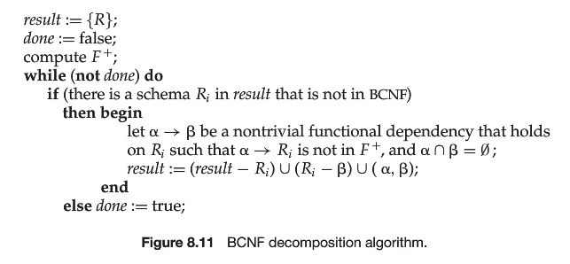
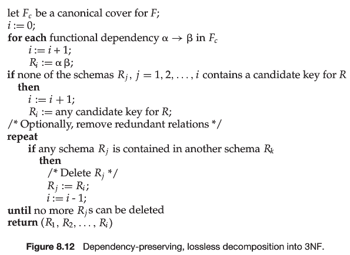

# Chp8 **Relational Database Design**

## 1FN

atomic attr: 

根据使用情况

- 如果对Attr进行拆分, 解析并使用 — 违反1FN

  ID = CS0012, CS + 0012 

- 对Attr进行整体使用, 不非凡

  ID = SE123, 不可拆分

## 2NF


## FD: function dependency

- A -> B => f(A) = B

- A, B之前有函数映射关系: 

  没给定一个A. R中都能找到唯一一个B与之出现在同一个tuple

- 任意属性 FD SuperKey (SuperKey在Relation中只出现一次)

## Closure

### 函数依赖的闭包

一个Relation中所有FD集合

通过已知FD求Closure: Armstrong’s Axiom


### 属性集的闭包

计算被给定属性集确定的属性集合

- 在函数依赖闭包中找到左侧为给定属性集的, 右侧集合为其闭包

- 设属性集A在给定函数依赖集F上的闭包为A^+^: Ap

  ```pseudocode
  Ap := A
  repeat
  	for each m -> n in F do
  	begin
  		if m in Ap then 
  			Ap := Ap ∪ n
  		end if
  	end
  until const Ap  
  ```

### 正则覆盖

更新DB后, 需要检测FD是否依然满足

FD过大则检测开销过大, 需要构造一个更小的简化集, 与原集有相同闭包

满足简化集则一定满足原集

- 无关属性: 去除后不改变FD的闭包.

  设原集F有FD: α -> β

  - A∈α && F蕴含了 (F - {α -> β}) ∪ {(α-A) -> β} 

    **(α-A) -> β 可以通过F得到**

  - A∈β && (F - {α -> β}) ∪ {α ->(β-A)} 蕴含了F

    **(F - {α -> β}) ∪ {α ->(β-A)} (F去掉A) 得到α -> A**

  则A是无关属性

- 正则覆盖: F~c~与F相互蕴含所有FD

  - Fc不含有任何无关属性
  - 左边属性集唯一出现

  ```pseudocode
  Fc = F
  repeat
  	运用合并率
  	找到无关属性, 删除之
  	去除相同FD
  until const Fc
  ```

### 无损分解

R~1~, R~2~替代R没有信息损失, 则分解是无损的

**π~R1~(R) natual join π~R2~(R) = R**

必须是相等, 结构不同不可, 规模不同也不可

R1, R2, R为属性集, 无损分解 <=

- R1 ∩ R2 -> R1 ∈ F^+^ ||
- R1 ∩ R2 -> R2 ∈ F^+^
- R1 ∩ R2 是R1或R2的超码

## BCNF: Boyee-Codd 

对于Closure中的所有FD: 

- FD是平凡的 ||
- FD自变attrs是超码

自变量attrs不是超码则对其分解 如A -> B

- R1 = A ∪ B
- R2 = R - (B - A)

分解直到满足BCNF

## 保持依赖

- 限定:  闭包中, 只关于某个分解的属性的FDs.
- 保持依赖: 限定并集的闭包等于原闭包

对F中的一个FD: A -> B, 验证保持性:

```pseudocode
result := A
repeat
	for each Ri
		t = (result ∩ Ri).closure ∩ Ri
		result = result ∪ t;
	end for
until const result
```

如果result包含B的所偶属性 => A-> B 保持

原有的依赖能够在同一个R中体现

### e.g. 

R(A, B, C) 有 A -> B, BC -> A

BC是candidate key. A不是超码 A->B不符合

分解为:

- R1 = (A, B)
- R2 = (A, C)

原有依赖: BC->A 没有体现, 不是依赖保持的

## 3NF

为了解决BCNF不能保持依赖的问题, 对BC放宽了

对于Closure中的所有FD: 

- FD是平凡的 ||
- FD自变量attrs是超码 ||
- **因变量attrs与自变量attrs的差集包含于一个候选码中**

放宽的条件保证了每一个schema都可以有保持依赖的3NF分解

### e.g. 

R(A, B, C) 有 A -> B, BC -> A

BC是candidate key. A不是超码 A->B不符合

B - A = B; B ∈ BC => 满足3NF

=> R(A, B, C) 是满足3NF的

## 分解算法

### BCNF分解



### 3NF分解



## MVD

要求某种形式的其他元组存在, 也叫元组存在依赖

A ->-> B 成立

iff

对R中任意两个元组t~1~, t~2~

若t~1~[A] = t~2~[A] 

则R中存在t~3~, t~4~

有

t~1~[A] = t~2~[A] = t~3~[A] =t~4~[A]

t~1~[B] = t~3~[B] 

t~2~[R-B] = t~3~[R-B] 

t~2~[B]=t~4~[B]

t~2~[R-B]=t~4~[R-B]

- A, B之间的联系独立于A和R-B之间联系
- 在A一定时, B与R-A-B独立意味着二者之前存在全组合

|      |  A   |  B   | R-A-B |
| :--: | :--: | :--: | :---: |
| t~1~ |  a   |  b   |   d   |
| t~2~ |  a   |  c   |   e   |
| t~3~ |  a   |  b   |   e   |
| t~4~ |  a   |  c   |   d   |

- 平凡多值依赖: B包含于A || B∪A=R (R-B-A包含于A)
- A->B => A->->B
- A->->B => A->->R-A-B

## 4NF

闭包中所有的MVD, A->->B

- A->->B是平凡的
- A是R的超码

=> Agree on 4NF

4NF是BCNF加强


