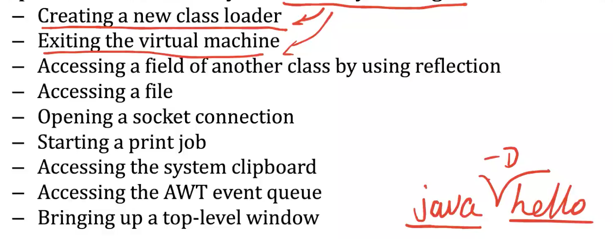
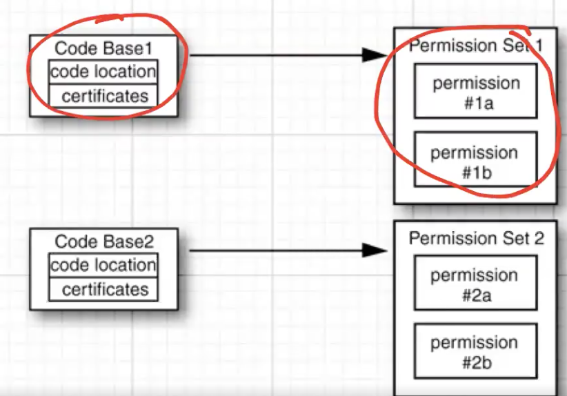
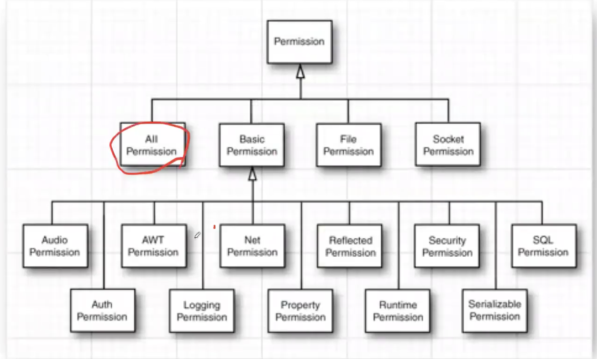

# Java Security

## 0. Naive Password

| username | password | encrypt(pw) |
| -------- | -------- | ----------- |
|          |          |             |

- 将token和用户名存储在**DB**中
- token认证后向客户端cookie追加认证信息（user/admin）
- 同时服务端session记录认证信息
- spring-security封装了认证服务

## 1. Class Loaders

- 服从JVM规范
- 结构
  - Bootstrap Class Loader by C/C++: 原始类, 不需要JVM, 加载其他所有
    - 加载root.jar
  - 加载 Extension class-loader
    - 加载jre/lib/ext
  - 加载System(Application) class loader
    - CLASSPATH
  - 加载Plugin class loader
    - 加载plugin.jar
- 加载过程: 自身寻找, 向父级递归, 向classpath扫描
  - 利用名字空间隔离

## 2. Bytecode Verification

- 原因: Java反编译工具导致源码泄漏

- 处理: 加密字节码

- 方法1: 

  overwrite class loader类, 复写写出字节流函数和读入字节流函数, 添加字节偏移量

  问题: class loader类无法被加密, 源码泄漏后偏移量秘钥泄漏

- class loader对目标类的字节码进行检查: 同JVM编译器检查

  - 目的: 防止篡改字节码
  - ```java -noverify xxx``` 可以跳过校验

- 方法2:

  Security Manager and Permissions

## 3. Security Manager and Permissions

### Security Manager

- 作用

  

- 机制:

  - 读取``xxx.policy``文件

  - policy文件规定代码段具有的权限集合

    

    - e.g. java.io.filepermission “/tmp/*”, “read, write”;
    - 1. 按代码位置指定 (code base)
      2. 按用户认证特征指定 (principal)
      3. 按代码签名指定 (signed by)

  - History

    - JDK1.0: 本地代码全部权限; 远程代码沙盒运行
    - JDK1.0: 受信的代码全部权限
    - JDK1.3: 按照domain划分权限 (domain三种划分方式)

  - Java权限类

    

  ```java
  grand codeBase {
    permission "auth" "tar" "permission"
  }
  ```

## 4. User Authentication

History:

- Java SE 1.4: JAAS