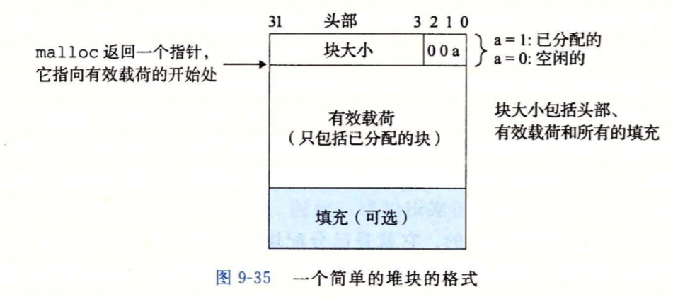

# CHP9 Visual Memory


## 〇Dynamic Memory Allocator

> 分配程序运行中需要的额外内存
>
> Allocator 维护内存中的特定区域，heap，heap紧接着.bss区域，向高地址生长
>
> 对于每个进程，内核维护变量brk指向堆顶
>
> Allocator 将堆视为不同大小的块（BLOCK）集合来维护
>
> - > Block: 连续的内存片（chunk），拥有已分配和空闲两个状态
>   >
>   > ​	已分配：显示地保留，提供给应用程序使用
>   >
>   > ​	空闲：    用来被分配福
>   >
>   > ​	状态通过释放和分配转换
>   >
>   > ​	释放可以由应用程序显式执行，也可Allocator隐式执行
>
> - > 分配的基本风格：
>   >
>   > 显式的分配块（程序调用），区别释放方式
>   >
>   > - 显式Allocator: 要求应用程序自行显式地释放已分配的块
>   >
>   >   比如C代码程序中的`malloc`程序包显式分配block，`free`函数释放一个block；C++中对应new和delete操作符
>   >
>   > - 隐式Allocator: Allocator内部检查已分配的block是否可以被释放，也叫`garbage collector`， Lisp，ML，Java等高级语言通过垃圾收集释放内存

- ### `malloc`  and  `free` 

  > ```c
  > #include <stdlib.h>
  > void *malloc(size_t size);
  > ```

  malloc返回一个类型不定的指针，指向大小至少为size bytes的内存block，这个块中的任何数据对象可能会做类型对齐，32位返回为8倍数地址，64位返回16倍数地址

  malloc遇到问题，如size过大，就返回NULL，并设置errno；成功返回时不会初始化返回的内存，`calloc`可以返回清空的内存，`realloc`可以改变一个已分配的block的大大小

  Allocator（包括malloc）使用mmap，munmap来显示分配和释放内存

  `sbrk()`函数：

  > ```c
  > #include <unistd.h> //unix内核暴露给C的库
  > void *sbrk(intptr_t incr);
  > ```

  sbrk函数由系统提供，通过移动堆指针brk incr大小来实现对堆的扩展和收缩；成功则返回old brk，否则返回-1，将erron设置为ENOMEM；通过调用`sbrk(0)`得到当前堆指针的值；incr < 0 则可以缩减堆

  > ```c
  > #include <stdlib.h>
  > void free(void *ptr);
  > ```

  `free()`函数释放已分配的block

  参数ptr必须是由Allocator分配返回的块指针(分配块的起始位置)，否则free将发生危险的未定义行为，并且没有返回值

  - Why Dynamic Allocate

    应用程序运行中才会得到某些数据结构大小 

- ### Allocator的要求和目标

  Allocator工作的约束

  > - 处理任意请求序列
  >
  >   应用可以有任意的M&F请求序列，Allocator不可假设请求序列
  >
  > - 立即响应请求
  >
  >   不允许执行请求时，出于性能优化地缓存或者乱序重拍
  >
  > - 只使用heap
  >
  >   出于扩展性
  >
  > - block的对齐要求
  >
  >   出于数据类型兼容
  >
  > - 不修改已分配的block
  >
  >   不允许修改和移动已分配block，不允许压缩分配

  Allocator的工作目标：最大化吞吐率（时间效率）和最大化内存使用率（空间效率）

  时间效率和空间效率是相互制约的

  > - 最大化吞吐率：
  >
  >   吞吐率定义为单位时间完成的请求数量，可以减小单个请求的平均执行时间；规定合理性能为分配请求是O(n)的（n是空闲block数量），释放的时间是O(1)的
  >
  > - 最大化内存利用率:
  >
  >   对于一串请求序列，如果一个应用程序请求p字节的块，那么已分配块的有效荷载payload为p，在请求序列执行完后，聚集有效荷载（aggregate payload）为Pk，是当前分配块的payload之和，Hk表示当前堆的大小（单调不减）
  >
  >   Peak utilization 堆的前k个请求的峰值利用率定义为:
  >   $$
  >   U_k=\frac{max_{i≤k}\{P_i\}}{H_k}
  >   $$
  >   内存利用率目标使得U_{n-1}最大化

- ### Fragmentation

  堆中存在free的块但是不能用来被没满足分配时导致碎片化，碎片化降低堆的利用率；碎片分为内部碎片和外部碎片

  - 内部碎片是分配的块的大小和他们payload之间的间隙

    内部碎片的数量只取决于以前请求的模式和Allocator的实现方式

  - 外部碎片是当空闲内存合计可以满足分配需求，但没有单独的块可以满足需求，需要生长heap来满足时，堆中分散的剩余空闲内存

    外部碎片还取决于未来的请求模式，难以量化，不可预测，Allocator常采用启发式策略维持小数量大体积的内存空间，而非反之

- ### Realization

  Problems

  > 空闲block组织：如何记录
  >
  > 放置：如何选择合适的空闲位置分配
  >
  > 分割：将新分配的block放置后，如何处理剩余的部分
  >
  > 合并：如何处理刚刚被释放的block

  - Implicit Free List

    

    - Allocator需要数据结构取定边界和状态，这些信息嵌入block本身

    - Block结构

      - 头部header meta-data：

        存放块大小的4bytes(单字)空间；约束块双字（8b）对齐后，header后三位都为0；最低位复写0/1表示是否已分配

      - 有效荷载payload

        应用程序使用

      - 填充padding
