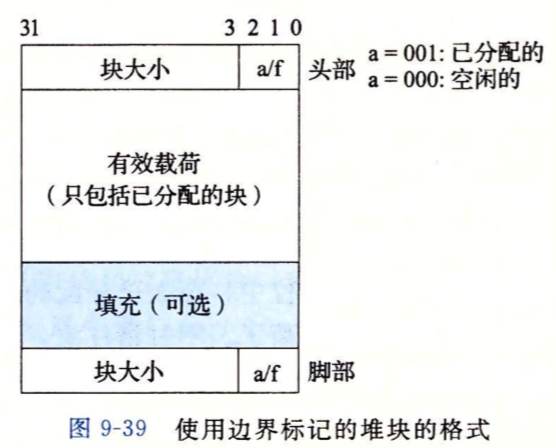
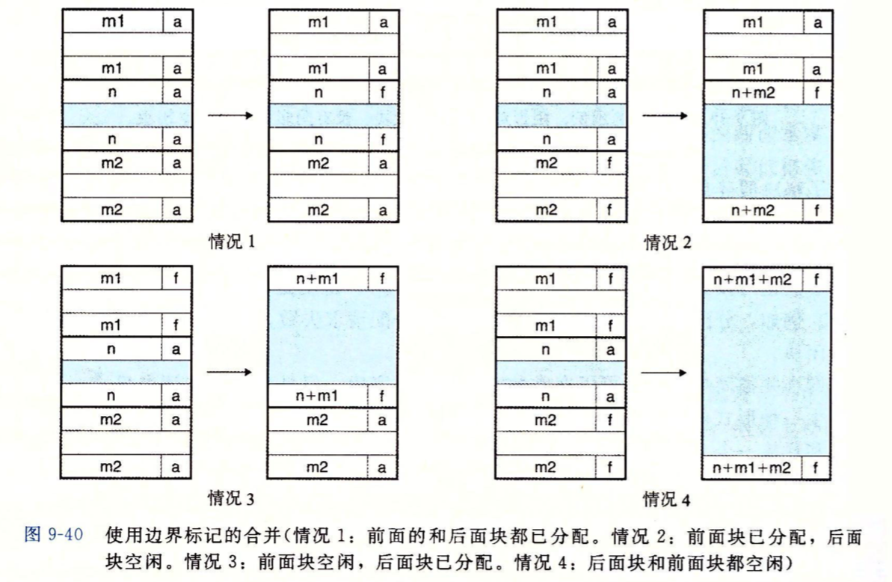
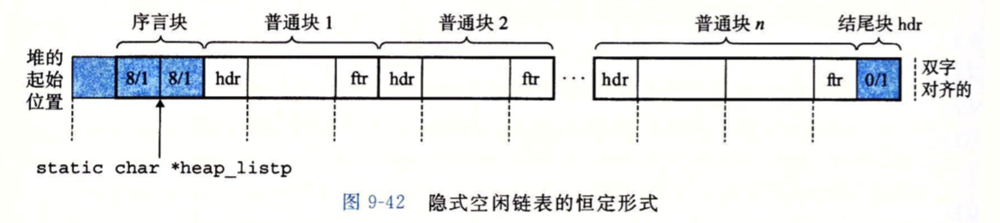
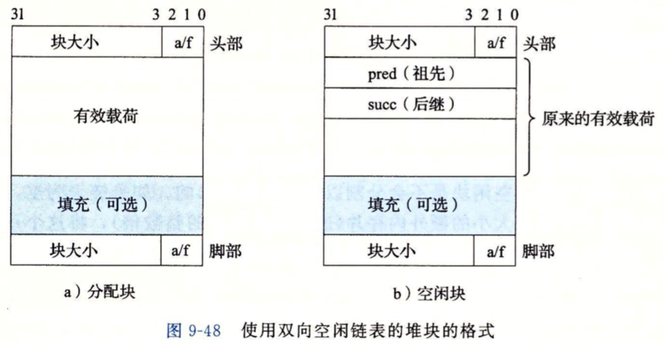

# CHP9 Visual Memory


## 〇Dynamic Memory Allocator

> 分配程序运行中需要的额外内存
>
> Allocator 维护内存中的特定区域，heap，heap紧接着.bss区域，向高地址生长
>
> 对于每个进程，内核维护变量brk指向堆顶
>
> Allocator 将堆视为不同大小的块（BLOCK）集合来维护
>
> - > Block: 连续的内存片（chunk），拥有已分配和空闲两个状态
>   >
>   > ​	已分配：显示地保留，提供给应用程序使用
>   >
>   > ​	空闲：    用来被分配福
>   >
>   > ​	状态通过释放和分配转换
>   >
>   > ​	释放可以由应用程序显式执行，也可Allocator隐式执行
>
> - > 分配的基本风格：
>   >
>   > 显式的分配块（程序调用），区别释放方式
>   >
>   > - 显式Allocator: 要求应用程序自行显式地释放已分配的块
>   >
>   >   比如C代码程序中的`malloc`程序包显式分配block，`free`函数释放一个block；C++中对应new和delete操作符
>   >
>   > - 隐式Allocator: Allocator内部检查已分配的block是否可以被释放，也叫`garbage collector`， Lisp，ML，Java等高级语言通过垃圾收集释放内存

- ### `malloc`  and  `free` 

  > ```c
  > #include <stdlib.h>
  > void *malloc(size_t size);
  > ```

  malloc返回一个类型不定的指针，指向大小至少为size bytes的内存block，这个块中的任何数据对象可能会做类型对齐，32位返回为8倍数地址，64位返回16倍数地址

  malloc遇到问题，如size过大，就返回NULL，并设置errno；成功返回时不会初始化返回的内存，`calloc`可以返回清空的内存，`realloc`可以改变一个已分配的block的大大小

  Allocator（包括malloc）使用mmap，munmap来显示分配和释放内存

  `sbrk()`函数：

  > ```c
  > #include <unistd.h> //unix内核暴露给C的库
  > void *sbrk(intptr_t incr);
  > ```

  sbrk函数由系统提供，通过移动堆指针brk incr大小来实现对堆的扩展和收缩；成功则返回old brk，否则返回-1，将erron设置为ENOMEM；通过调用`sbrk(0)`得到当前堆指针的值；incr < 0 则可以缩减堆

  > ```c
  > #include <stdlib.h>
  > void free(void *ptr);
  > ```

  `free()`函数释放已分配的block

  参数ptr必须是由Allocator分配返回的块指针(分配块的起始位置)，否则free将发生危险的未定义行为，并且没有返回值

  - Why Dynamic Allocate

    应用程序运行中才会得到某些数据结构大小 

- ### Allocator的要求和目标

  Allocator工作的约束

  > - 处理任意请求序列
  >
  >   应用可以有任意的M&F请求序列，Allocator不可假设请求序列
  >
  > - 立即响应请求
  >
  >   不允许执行请求时，出于性能优化地缓存或者乱序重拍
  >
  > - 只使用heap
  >
  >   出于扩展性
  >
  > - block的对齐要求
  >
  >   出于数据类型兼容
  >
  > - 不修改已分配的block
  >
  >   不允许修改和移动已分配block，不允许压缩分配

  Allocator的工作目标：最大化吞吐率（时间效率）和最大化内存使用率（空间效率）

  时间效率和空间效率是相互制约的

  > - 最大化吞吐率：
  >
  >   吞吐率定义为单位时间完成的请求数量，可以减小单个请求的平均执行时间；规定合理性能为分配请求是O(n)的（n是空闲block数量），释放的时间是O(1)的
  >
  > - 最大化内存利用率:
  >
  >   对于一串请求序列，如果一个应用程序请求p字节的块，那么已分配块的有效荷载payload为p，在请求序列执行完后，聚集有效荷载（aggregate payload）为Pk，是当前分配块的payload之和，Hk表示当前堆的大小（单调不减）
  >
  >   Peak utilization 堆的前k个请求的峰值利用率定义为:
  >   $$
  >   U_k=\frac{max_{i≤k}\{P_i\}}{H_k}
  >   $$
  >   内存利用率目标使得U_{n-1}最大化

- ### Fragmentation

  堆中存在free的块但是不能用来被没满足分配时导致碎片化，碎片化降低堆的利用率；碎片分为内部碎片和外部碎片

  - 内部碎片是分配的块的大小和他们payload之间的间隙

    内部碎片的数量只取决于以前请求的模式和Allocator的实现方式

  - 外部碎片是当空闲内存合计可以满足分配需求，但没有单独的块可以满足需求，需要生长heap来满足时，堆中分散的剩余空闲内存

    外部碎片还取决于未来的请求模式，难以量化，不可预测，Allocator常采用启发式策略维持小数量大体积的内存空间，而非反之

- ### Realization

  Problems

  > 空闲block组织：如何记录
  >
  > 放置：如何选择合适的空闲位置分配
  >
  > 分割：将新分配的block放置后，如何处理剩余的部分
  >
  > 合并：如何处理刚刚被释放的block

  - Implicit Free List

    

    - Allocator需要数据结构取定边界和状态，这些信息嵌入block本身

    > ```c
    > /* 记录Block */
    > ```

    - Block结构

      - 头部header meta-data：

        存放块大小的4bytes(单字)空间；约束块双字（8b）对齐后，header后三位都为0；最低位复写0/1表示是否已分配

      - 有效荷载payload

        应用程序使用

      - 填充padding

        分配策略，对抗外部碎片，满足对齐

    - 堆结构：连续的（已分配/空闲）块组成的链式序列，称为隐式空闲链表

      空闲信息蕴含在header内部，Allocator需要通过遍历heap中所有的block从而遍历free block

      特殊标记的链表结束块为一个标记大小为0的已分配的header

      系统对齐要求和Allocator的格式对最小Block大小有要求

    > ```c
    > /* 放置已分配的block */
    > ```

    搜索到一个足够大的空闲block分配，放置策略有：

    - FF (First Fit) 首次适配：

      从头开始搜索链表，选择第一个可放入的freeBlock分配

      大块空心空间留在尾部，头部碎片化严重，增加了大块搜索时间

    - NF (Next Fit) 下次适配：

      从上次查询结束处做FF

      利用率不如FF

    - BF (Best Fit)  最佳适配：

      检查每个freeBlock，选择大小最接近的分配

      需要对堆进行完全搜索

    > ```c
    > /* 分割freeBlock */
    > ```

    当分配器找到freeBlock后分配的方式

    选用整个空闲空间会趋于内部碎片化

    匹配相差太大时采用分割，分配的部分独立，剩下的部分作为新的空闲块

    > ```c
    > /* 获取额外的heap */
    > ```

    在链表尾部物理相邻的内存创建新的空闲block加入链表，若heap不够扩展，则调用sbrk向系统申请；Allocator将新内存视为大的freeBlock加入链表

    > ```c
    > /* 合并freeBlock */
    > ```

    分配一个块后可能与其他空闲块相邻，多个空闲块相邻称为假碎片，需要进行合并（coalescing）；Allocator可以立即合并/推迟合并

    - 立即合并：

      每次释放后都会合并

      可能会产生合并后立即分割的抖动

    - 推迟合并：

      一段时间后合并所有的相邻空闲块

    > ``` c
    > /* 边界标记的Block 以及合并 */
    > ```

    释放当前块后，检查当前块的头部指针指向的下一个块时候空闲，若是则将其大小加入到当前块上，在O(1)时间内完成

    合并之前的空闲块需要全链表搜索并记住前面的块的位置，时间是O(n)的

    

    Boundary tag技术思想类似于双向链表，允许在O(1)的时间向前合并

    在每个block结尾处添加一个footer，Allocator检查footer，判断前一个block的大小和状态，footer距离下一个block的header相邻

    释放的所有情况：

    - 前后都是已分配的：

      当前块变为空闲，无法合并

    - 前块是已分配的，后块空闲

      用当前和后块的大小和来更新当前的header和后块的footer

    - 前块空闲，后块是已分配的 

      用前块和当前的大小和来更新前块的header和当前的footer

    - 前后都是空闲的

      用三者之和的大小更新前块的header和后块的footer

    

    当应用请求许多小块时，每个块的header和footer造成显著的空间开销

    分配时footer是可以复写的，将前者是否空闲的状态放入当前块中

    空闲块的footer必须持有大小信息，是必要的

  - 一个简单分配器代码

    基于IFL（Implicit Free List），采取IBC（Immediate Boundary Coalesce）合并策略，最大块为2^32 bytes = 4GB，64位干净的Allocator实现

    1. 通用Allocator设计

       ```c
       #include <memlib.c>
       extern int mem_init(void);
       extern void *mm_malloc(size_t size);
       extern void mm_free(void *ptr);
       ```

       memlib.c 是一个内存系统模型，可以独立于malloc包运行Allocator

       mm_init初始化Allocator，成功则返回0，否则-1

       mm_malloca 和 mm_free与malloc包里函数作用一致

       块使用边界标记格式，双子对齐

       初始化后将第一个字作为padding，紧跟一个prologue block，仅有header和footer，永不释放；之后是普通块

       堆以epilogue block来结束，是一个仅有header的已分配的块，大小为0

       prologue  和 epilogue作为Allocator链表形式上的首尾，消除边界条件

       私有全局变量heap_listp总指向prologue/*

       

       ```c
       /* Private global variables */
       static char *mem_ .heap; /* Points to first byte of heap */
       static char *mem_ ,brk; /* Points to last byte of heap plus 1 */
       static char *mem. _max_ .addr; /* Max legal heap addr plus 1*/
       
       /*
       * mem_ init - Initialize the memory system model
       */
       void mem_ init (void)
       {
       	mem_heap = (char *)Malloc (MAX_ HEAP) ; .
       	mem_brk = (char *)mem_ heap;
       	mem_max_addr = (char *) (mem. ,heap + MAX_ ,HEAP);
       }
       
       /*
       * mem_ ,sbrk - Simple model of the sbrk function. Extends the heap
       *
       by incr bytes and returns the start address of the new area. In
       *
       this model, the heap cannot be shrunk .
       */
       void *mem_sbrk(int incr)
       {
       	char *old_brk = mem_brk;
       	if ( (incr < O) II ((mem_brk + incr) > mem_max_addr))	{
       		errno = ENOMEM;
       		fprintf (stderr, "ERROR: mem_sbrk failed. Ran out of memory");
       		return (void *)-1;
           }
       	mem_brk += incr;
       	return (void *)old_brk;
       }
       ```

    2. 操作IFL的基本常数和宏

       ```c
       /* Basic constants and macros */
       #define WSIZE 4
       /* Word and header/footer size (bytes) */
       #define DSIZE 8
       /* Double word size (bytes) */
       #define CHUNKSIZE (1<<12)
       /* Extend heap by this amount (bytes) */
       #define MAX(x, y) ((x) > (y)? (x) : (y))
       /* Pack a size and allocated bit into a word */
       #define PACK(size, alloc) ((size) I (alloc))
       /* Read and write a word at address p */
       #define GET(p) (*(unsigned int *)(p))
       #define PUT(p, val) (* (unsigned int *)(p) = (val))
       /* Read the size and allocated fields from address p */
       #define GET_ .SIZE(p) (GET(p) & ~0x7)
       #define GET_ .ALLOC(p) (GET(p) & 0x1)
       /* Given block ptr bp, compute address of its header and footer */
       #define HDRP(bp) ((char *)(bp) - WSIZE)
       #define FTRP(bp) ((char *)(bp) + GET, _SIZE(HDRP(bp)) DSIZE)
       /* Given block ptr bp, compute address of next and previous blocks */
       #define NEXT_ .BLKP(bp) ((char *)(bp) + GET_ SIZE(((char *)(bp) - WSIZE)))
       #define PREV_ .BLKP(bp) ((char *)(bp) GET, _SIZE(((char *)(bp) DSIZE)))
       ```

    3. 创建初始空闲链表

       ```c
       
       ```

    4. 释放和合并块

       ```c
       
       ```

    5. 分配块

       ```c
       
       ```

- ### Other Structure

  - Explicit Free List 显式空闲链表

    

    空闲块不需要主，所以数据结构指针可以存放在空闲块的主体之中；包括pred指针和succ指针，减小链表长度 (所有块个数减小到空闲块个数)

    释放时间取决于排序策略

    - LIFO(先进后出，队列规则)，将新释放的块放在逻辑表头(头插法)

      Allocator会先检查最近释放的块，释放在常数时间完成

    - 地址顺序维护链表：

      表中块的地址都小于其后继地址(表中逻辑关系 == 物理关系)；释放时需要限行时间定位合适的前驱地址

      地址排序的FF比LIFO的内存利用率高，接近BF

  - 分离空闲链表 （segregated  storage）

    按照空闲空间所有有可能的大小分成一些等价类(size class)

    ```javascript
    /* 2的幂的划分块 */
    {1} , {2}, {3,4}, {5~8}, ... ,{1025~2048},{2049~infinite}
    ```

    Allocator维护一组空闲链表，处理分配需求时首先搜索大小做匹配的表进行分配

    1. 简单分理储存

       每个类链表中的块大小相等，为类上限；

       分配时查找链表如果链表不空，则分配链表头的全部，不进行分割；如果链表为空，则向系统请求额外的内存，并将内存分成大小相同的空闲块，连接形成新的空闲链表，释放时，Allocator将这个块插入到对应大小的表头。

       分配和释放都可以在常数的时间完成，不切片不合并；由于不切片，导致容易造成内部碎片化；由于不合并，导致外部碎片化

    2. 分离适配

       找到最接近大小后在链表中做FF；分割后将剩余加入合适的链表中

       释放时执行合并，并将结果放入对应的链表中

    3. 伙伴系统

       每个大小类都是2的幂

       分配时对大块进行递归折半，合并时反向合并，直到遇到另一半非空闲

       会导致内部碎片化