# Chapter  3 In The Level of Machine

- 机器代码：字节序列编码低级操作：
  - 处理数据
  - 管理内存
  - 读写储存设备
  - 网络通信
- 编译器根据语言语法，机器指令集，OS惯例生成机器代码。
- GCC -C编译器生成汇编作为机器代码
- 汇编代码与机器代码双射。适应特定机器（不具有移植性）。
- 阅读汇编码是为了理解compiler的优化能力和隐藏低效率；或者打开高级语言封装底层操作的黑箱。
- 编译器在机器代码层面进行过优化。

## 3.1 Historical Perspective 

Chips of intel

| name      |                features                 |
| --------- | :-------------------------------------: |
| 8086      |               1978 16bits               |
| 80286     |                  1982                   |
| i386      | 1985 32bits; flat addr model; fits unix |
| i486      |                  1989                   |
| Pentium   |                  1993                   |
| PentPro   |       1995; add conditional move        |
| Pent/MMX  |      1997; add inst to process int      |
| PentII    |          1997; expanding of P6          |
| PentIII   |              1999; add SSE              |
| Pent4     |               2000; SSE2                |
| Pent4E    |       Hyperthreading; EM64T; IA32       |
| Core2     |                2006; P6                 |
| Corei7Neh |            2008; multi cores            |
| i7S.B.    |              2011;add AVX               |
| i7Haswell |               2013; AVX2                |

## 3.2 Generating

```shell
$ gcc -Og -o p p1.c p2.c
```

- -Og: 优化等级符合原始C代码结构(O1, O2为高级别优化)
- -o p: 指定生成文件

### 3.2.1 机器初级代码

- 抽象模型：ISA和虚拟地址
  - Instruction Set Architecture：指令集构架，定义机器程序的格式和行为。
  - 虚拟内存地址：字节组模型
- x86可见的处理器状态（C不可见）：
  - Program Counter(PC)：x86中使用%rip作为PC。给出下一条指令存放在虚拟内存里的地址(64)。
  - Register(REG)：为16个证书寄存器文件（不包括PC），长度均为64bits，功能为：
    - 储存重要地址（const地址etc）
    - 记录程序状态
    - 保存临时数据（local，args，ret，etc.）
  - 汇编内数据无差别：一致为字节数组处理。数据结构，数据类型，标量类型，指针均视为字节流。
- 虚拟内存存放：
  - 系统信息
  - 程序可执行的机器代码
  - 管理函数（过程）调用和返回的**运行时栈**（Run-time stack）
  - 用户分配内存（malloc）
  - 程序具有有限的虚拟内存访问空间，并由OS管理后翻译对应与物理内存

### 3.2.2 Example

C的源代码 mstore.c 

```c
long mult2(long,long);

void multstore(long x, long y, long *dest){
	long t = mmult(x, y);
    *dest = t;
}
```

编译

```shell
$ gcc -Og -S mstore.c
```

生成的mstore.s为汇编代码，包括

```assembly
multstore:
	pushq %rbx
	movq  %rdx, %rbx
	call  mult2
	movq  %rax, (%rbx)
	popq  %rbx
	ret
```

缩进行对应一条机器指令，双射到二进制文件并且被机器作为字节序列执行。

- 反汇编器objdump的输出格式：

  左侧为机器指令，右侧为汇编语言

  - 指令长度为1-15byte，常用的指令短。
  - 指令设计不冲突，有固定的解析方式（类似哈夫曼编码）
  - 反汇编器还原机器代码到汇编的双射（解析指令）不进行源码还原，不访问源码和汇编代码
  - objdump通常省略大小指示符后缀，大多为q并且可以省略（X86构架中q为默认长度后缀）
  - od输出的左侧列地址与实际不同（linker偏移），call指令填补需要使用的地址
  - 以'.'开头的指令为伪指令，用于指导汇编器和linker，可以忽略

## 3.3 数据格式 

最初的8086十六位机以地址长度为一个字(word)，所以32bits为double word，64bits为quad word（罗马文quad为4倍）C标准中的类型大小和汇编后缀：

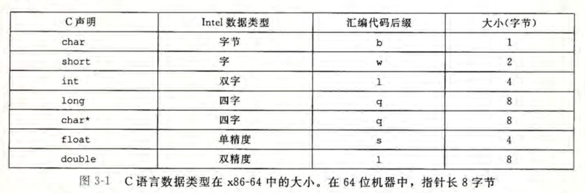

## 3.4 访问信息

CPU有16个长度为64bits的寄存器，储存整数和指针（地址）。如下：

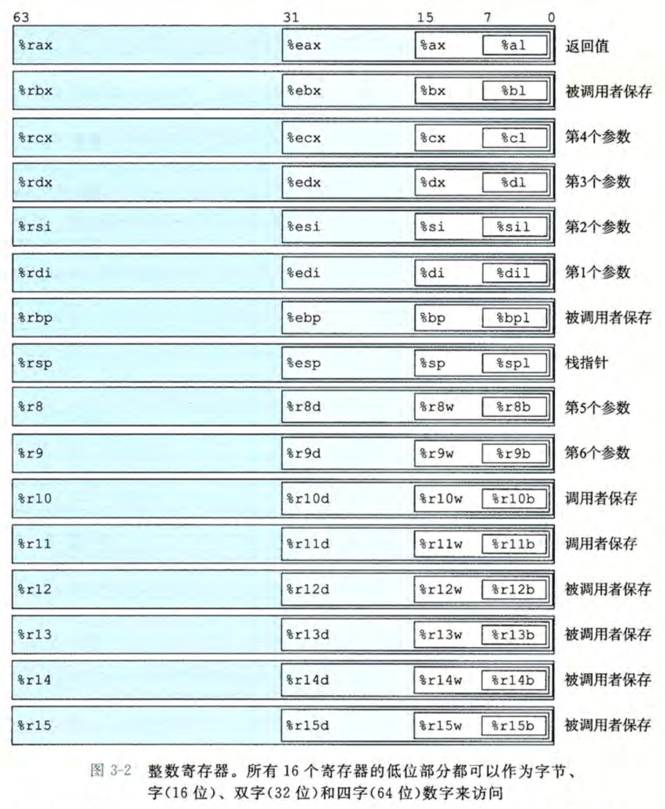

不同大小的操作访问不同reg中的低位数子reg

对于生成结果小于8byte的指令，有如下缩减规则：

- 生成结果为1byte或者2byte时，指令不会改变剩下的字节；
- 结果为4字节时，reg高位4字节设置为0
- 栈指针%rsp固定用来指明run-time stack结束的位置
- 其余15个reg分为caller save和callee save，用法灵活
- 少量指令用到特定的reg
- 存在固定标准控制如何使用regs来管理栈，传参数，得到返回值，储存局部临时数据。

### 3.4.1 操作数指示符

大多数操作指令有一个或者多个操作数，表征源数据或存放结果地址。

源数据可以来自于：

- 某个常数——立即数 immediate(${num})
- 某个寄存器——寄存器内读数
- 某个内存中——内存解引用

获取操作数又分为以下格式：

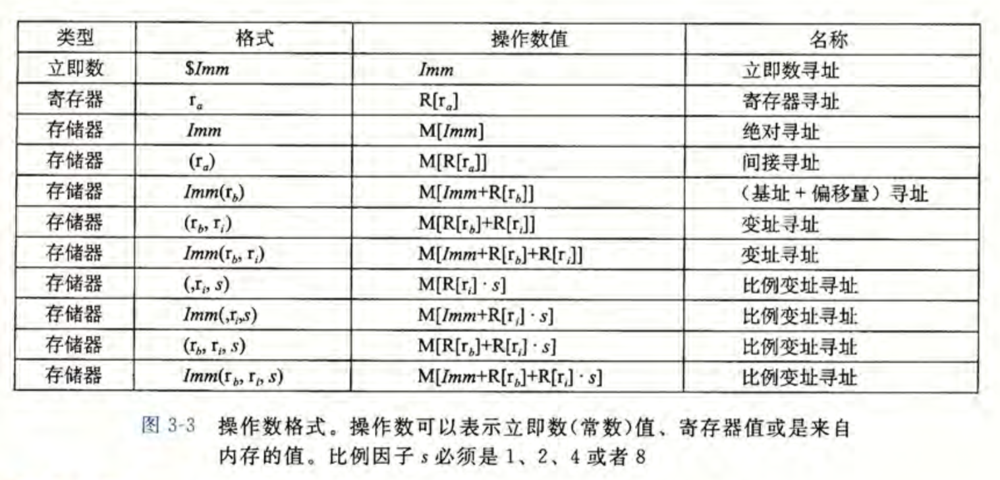

### 3.4.2 数据传送指令

即将数据从一个位置复制到另一个位置的指令。源和目的的类型，执行的转换，转送副作用对应到不同的传送指令。把对不同操作数大小的同一功能指令划分为一个指令类。

MOV类指令执行把数据从源(Source)复制到目的地(Destination)分为四条：movb, movw, movl, movq；格式为： MOV      S, D 

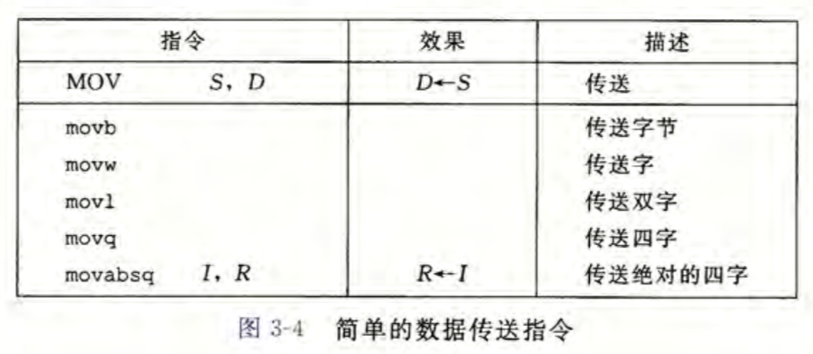

- 源：一个储存在内存或者寄存器中的立即数

- 目的：指定一个位置，寄存器或者内存地址

- x86限制S与D不能同为内存位置，内存地址的复制操作需要两条指令和一个中转reg

- > S或D中若出现reg，其大小必须与指令后缀表述一致

- 除movl外，mov指令只更新指定长度内的数据

- movl的D为32位reg时，该reg对应的64位reg高4位设置为0

D和S的五种可执行组合：

- movl   $0x11223344, %eax       #imm to reg
- movw %bp, %sp                         #reg to reg
- movb (%rdi, %rcx), %al            #mem to reg
- movb $-17, (%rsp)                     #imm to mem
- movq %rax, -12(%rbp)             #reg to mem

> S为立即数时：
>
> - movq 只能以32位补码数字作为S，传送时自动符号扩展到64位后放入D
> - movabsq 可以用任意编码64位立即数做S，D只能为64位寄存器

小长度S复制到大空间D时可使用扩展传送指令，又分为有无符号扩展，和S与D的具体尺寸，如下：

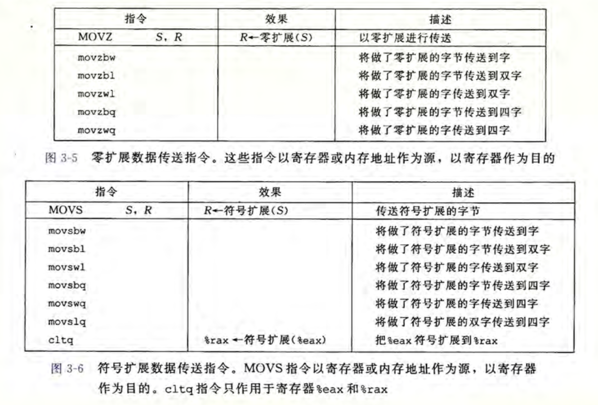

> 注意：零扩展没有 movzlq， 因为movl指令的D为64位时，自动清零高位4字节(32bits)。故movl   S,  D #64bits 可用作movzlq
>
> movzbl清零除寄存器最低byte外的数据

规定S可以为对应大小寄存器和地址，D只能为对应大小的寄存器。cltq指令有固定的R(%eax)和D(%rax)，属于movslq

不指定扩展后缀，直接调用movb/w/q指令，则不会改变除制定低位外寄存/地址其他位。movl清零高32位（reg）。

### 3.4.4 Push and pop

程序栈是内存的一块区域（rwdata），朝着地址减小的方向增长。x86用寄存器%rsp来维护该程序栈在内存的栈顶。

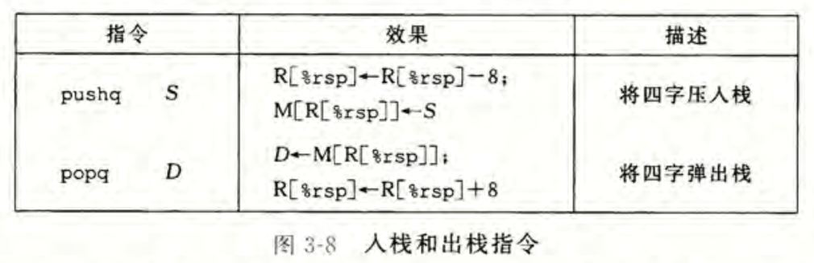

## 3.5 算数和逻辑操作

以下指令除了leaq均可加四种长度后缀。并可分为四组

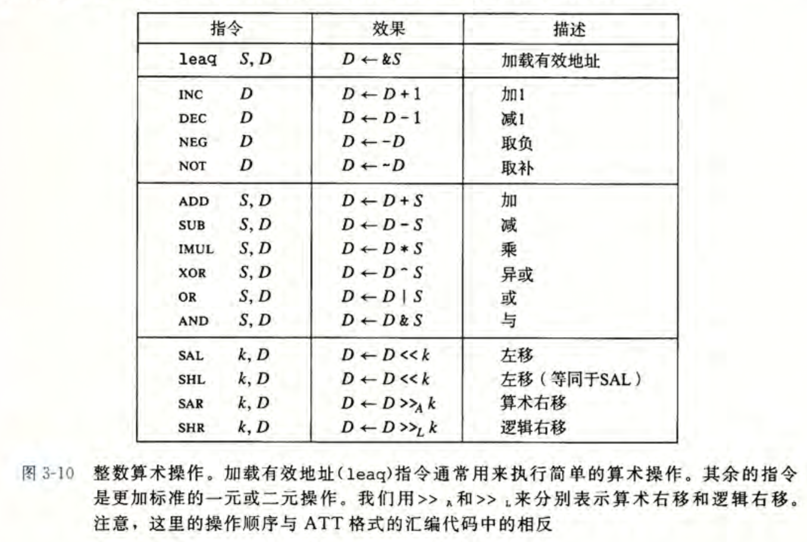

### 3.5.1 加载有效地址 Loading  Effective Address

leaq与movq不同之处在于 

- leaq 对S不进行内存取址访问，而直接访问和计算S所存放的值(省略地址解析操作，直接移动地址)。
- leaq 可以执行加法和有限乘法，编译简单表达式

### 3.5.2 一元二元操作指令

- 一元指令D可以使寄存器，可以是内存地址
- 二元指令S可以是imm，内存地址，寄存器；D可以是内存地址，寄存器；
- D为内存地址是需要先读取后操作再写回(处理器层面)

### 3.5.3 移位操作

> - 位移量k只允许为立即数或者存放在%cl中的单字节。
> - X86在对w bits长的数据进行移位操作时，位移量由%cl内的低m bits决定 m=[logw], 高位忽略。

- D可以为内存地址或者寄存器

由阿贝尔域可知以上操作对任意编码形式成立

### 3.5.5 特殊的算数操作

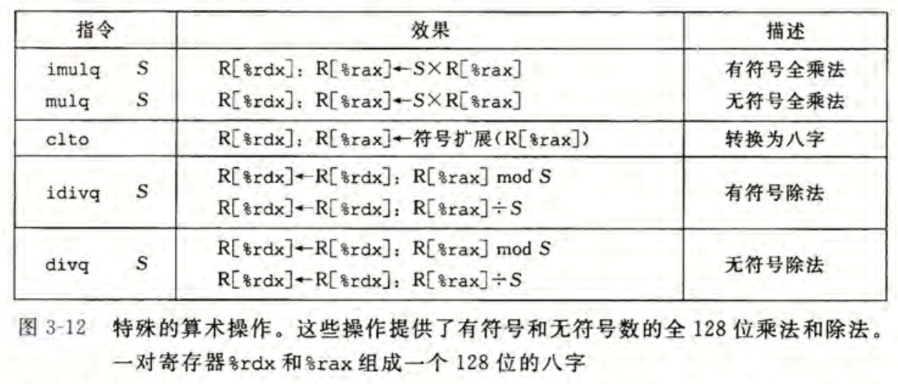

- imulq的两种形式：
  - 二元操作：从64位操作数产生64位乘积到D
    - 乘积截取到64位时，无符号乘法与补码乘法比特流相同
  - 单目操作：给定source作为因数，乘积分别存放在%rdx(高64)和%rax(低64)中
    - mulq做无符号乘法
    - imulq做补码乘法
    - 二者都自动读取%rax作为因数
    - 二者的目的都是%rdx和%rax
- divq和idivq与mulq和imulq为逆运算，且只用于单目。源和目的与mulq相反
  - 被除数为%rdx和%rax的128位数
  - 运算完成后商存储在%rax；余数存储在%rdx

## 3.6 控制

条件语句：有条件的执行；循环语句和分支语句：数据测试结构决定操作顺序

机器代码提供两种底层机制实现条件行为：

- 测试数据值
- 根据测试结果改变控制流
- 根据测试结构改变数据流

### 3.6.1 条件码 CC

CPU除了16个整数寄存器+PC+ALU外，还维护一组单比特条件码CC寄存器；CC描述了最近的算数逻辑操作的属性。可以检测这些CC寄存器来执行条件分支指令。常见的CC有：

- CF：carry flag进位标志，最近的操作使得高位发生了进位，可检查无符号操作的溢出
- ZF：zero flag零标志，最近的操作得到结果为0
- SF：sign flag符号标志，最近的操作得到结果为负
-  OF：overflow flag溢出标志，最近的操作导致补码(正负)溢出

例如最近的指令为：
​         addl      %ebx, %edx     #%rdi中存放int a, %rdx int b
​         movl     %edx, %eax     #%rax存放和t
则CC可有以下计算得出：

- CF   ((unsigned) t < (unsigned) a)  无符号溢出
- ZF   ( t == 0)  
- SF    ( t < 0)
- OF   ( (a<0 == b<0) && ( t<0 != a <0 ) )
  #a b同符号且与t异号

特别地

- leaq操作不会改变条件码，他只进行R的取址操作 &R
- 逻辑操作（and or xor not）时CF和OF会被设置成0
- 位移操作时，CF设置为最后一个被移出的bit，OF设置为0
- inc dec操作不改变CF

cmp和test两类指令不会改变除CC外的任何寄存器

- cmp类是基于S1和S2的差来设置CC的，计算结果同sub指令(被减数在后)
- cmp s1, s2 如果s1 = s2 则ZF置1，SF等确定大小关系
- test类指令同and指令，但不改变除CC外的寄存器
- test常见用法为 testq %rax, %rax后读取CC判断R[%rax]是正负或者零。
- testq %rax, {mask} 对特定bit断定

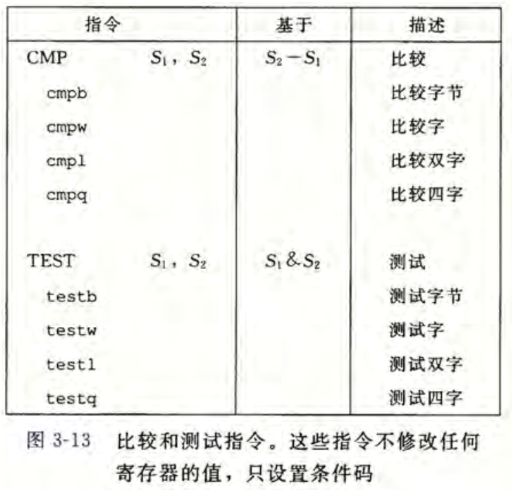

### 3.6.2 访问条件码

CC不会被直接读取，常见的CC使用方式有三种：

1. 组合CC并设置一个字节为0/1 ——set指令集
2. 利用CC跳转程序——jmp指令集
3. 有条件的传送数据——cmov指令集

set指令集的区别在于写入D的CC的组合不同，set的后缀并非是操作数的大小后缀；set指令的D是低位单字节寄存器元素之一，或者是内存中一个byte的位置，将被设置为0/1

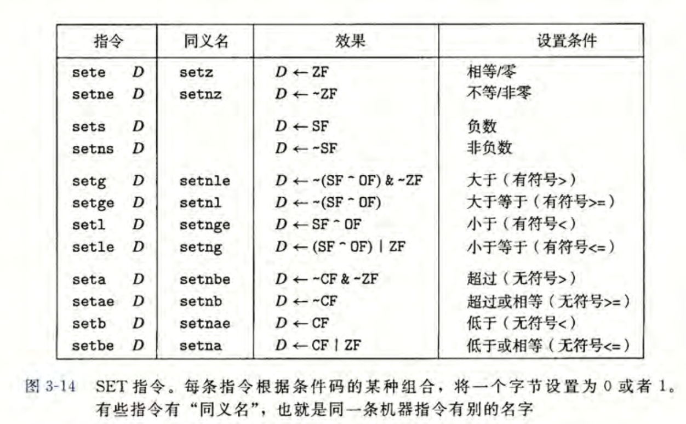

- set 一般紧接着cmp和test指令之后

### 3.6.3 跳转jump指令

jump指令切换当前执行位置到一个指定位置后再顺序执行；jump指令的格式为 jmp  .Label 执行后会直接读取label下的指令

汇编器会确定label下的指令地址，并将以下地址编码到jmp指令中

- 无条件跳转
  - 直接跳转：跳转目标地址直接编码；直接给出标号
  - 间接跳转：跳转目标从reg或者内存寻址读出；格式为*+操作数指示符(jmp *(%rax))
- 有条件跳转：读取CC组合判断后决定顺序执行或是跳转，指令后缀同set指令集；有条件跳转只能是直接跳转，D只能为目标标号

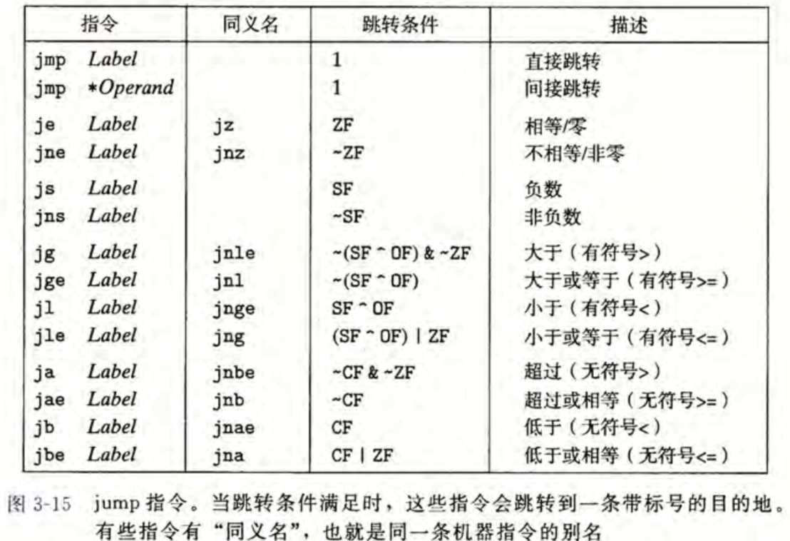

### 3.6.4 jmp指令的编码

直接跳转的目标用符号标号书写。汇编器和linker会产生机器编码使执行跳转至标号下。常用的jmp指令编码为PC-relative. 

- PC-relative将标号下目标指令的地址和jmp下第一条指令的地址取差值，用差值作为编码；差值的偏移量编码为1，2，4个字节
- 或者在编码中写入目标的绝对地址，用4个字节指定目标
- jmp指令的目标地址不限于本条指令之后或是之前(jmp到之前的地址(低位地址)会造成循环)

- 反汇编器所有指令中的数字均以十六进制给出
- PC相对寻址时，PC的值是jmp后紧邻着一条的指令的地址，并非jmp指令本身；
- 早期的PC实现在执行指令前，首先更新PC
- PC-relative跳转编码的方式编码jmp指令简洁(2bytes), 可以原样迁移到内存中的不同位置(偏移量不变)
- jmp指令目标为ret或紧接着ret时，无论是否发生跳转，processor不能识别ret目的，常在同行插入指令rep作为空操作

### 3.6.5 CC控制条件分支

利用jmp来实现C的条件表达式

C中的goto语句类似于汇编中的无条件跳转，goto代码控制流结构与汇编一致

### 3.6.6 利用条件传送来实现条件分支

计算各个条件下的数据，利用cmov指令根据条件传输不同的数据

- 条件传输指令为双目指令，源S可以是寄存器或者内存地址；D为目的寄存器；当CC条件满足时，执行mov指令
- 源和目的长度只能为16位，32位，64位，不支持单字节传送
- 传送长度省略，但SD长度保持一致
- 一般与test和cmp指令组合使用

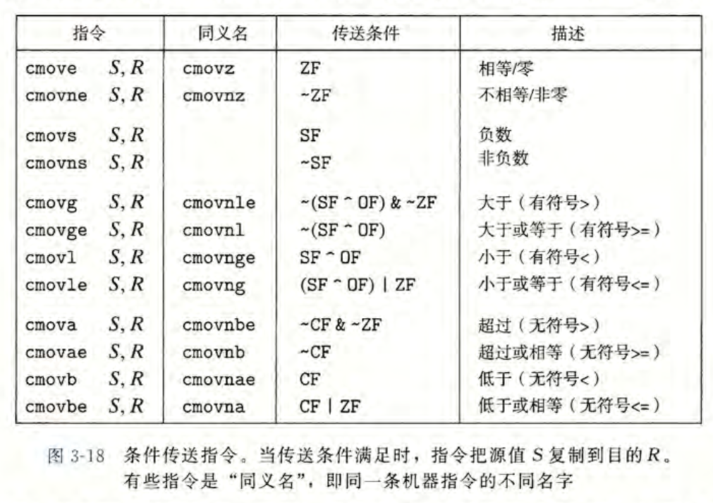

- 小规模下条件传送优于跳转指令，但并非所有条件语句都可以编译为条件传送
- 条件的两个控制流都会被执行，副作用和非法访问可能会发生
- GCC主要使用条件控制专业(跳转指令)

### 3.6.7 循环

C中的循环语句do-while, while, for在汇编中没有对应的指令，汇编中用条件测试test和跳转jmp组合实现循环效果；GCC和其他汇编器产生的循环代码基于两种基本循环模式

1. do while循环：
   翻译为goto语句如下

   ```C
   loop:
   	/*body-statement*/
   	t = test_expr;
   	if(t)
           goto loop;
   ```

   > 逆向工程循环：
   >
   > - 找到程序值和寄存器之间的映射关系
   >   - 还原编译器重组的计算
   >   - 还原省略的变量值
   >   - 识别机器语言新增的变量
   >   - 识别编译器对寄存器的多映射
   > - 初始化寄存器，更新测试寄存器，使用寄存器

2. while 循环

   率先测试循环条件

   1. 翻译方法JTM：在循环前用一个无条件跳转至循环尾测试
   2. guarded-do：首先使用条件分支判断是否跳过循环体，将do-while包围

3. for 循环

   ```C
   for (/*init*/, /*test*/, /*update*/)
       /*body-statement*/
   ```

   ```C
   //init
   while(/*test*/){
       /*body-statement*/
       /*update*/
   }
   ```

   GCC产生的for代码等同于JTM或者guarded-do两种翻译方法

### 3.6.8 switch语句

switch使用jump table这种数据结构完成多重分支

jumpTable是一个数组，内部按序储存了代码段的地址，该段代码执行引索为地址在数组中的引索位置时的动作
$$
swich引索 =>    jumpTable引索    
$$

> swich标签下代码   =>   代码的地址 && label

jT的跳转基于内存引索, 复杂度为O(1)，适用于较多较密集的分支

GCC在分支数量大于4且跨度小时使用jT否则使用嵌套jmp指令（多重if-else）

## 3.7 过程

过程是一个IO的黑箱抽象，需要传入参数，可选的返回值和实现了某个功能，隐藏了某个行为的具体实现，说明了计算的数据和对程序状态产生的改变。机器级别的过程支持包括

1. 传递控制：在进入某个被调用过程时PC需要指向过程代码的起始地址；返回时，PC指向调用者的下一条指令
2. 传递数据：caller向callee提供一个或者多个参数，callee也需要能有返回值
3. 分配和释放内存：callee在运行时可能需要为局部变量分配内存空间用于储存，返回时需要释放这些空间

### 3.7.1 Runtime-Stack

当寄存器不能满足X86在过程里的数据储存需求时，会在内存的特定部分，利用%rsp维护的内存栈里分配空间，这份限定过的内存空间叫做stack frame

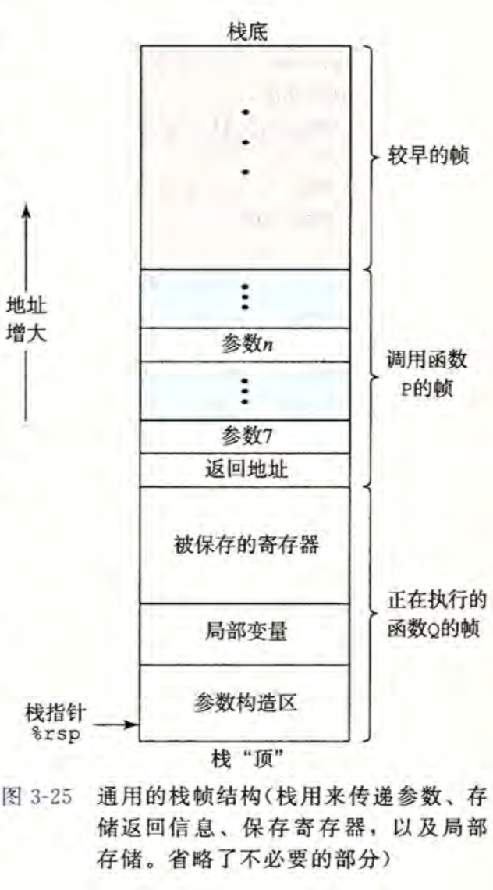

当前执行过程的frame始终在栈顶。

caller调用callee时首先会把(参数和)返回地址(call下一条指令的地址)压栈，当callee执行ret时，返回到caller的这一位置。

caller通过寄存器最多可以向callee传递6个整数值；当callee需要更多参数时，caller将提前在自己的frame里储存这些参数

过程只分配其所需的内存，有的简单函数利用寄存器可以完成的就不会有frame

### 3.7.2 转移控制

控制权在caller和callee之间的交接只需要简单的把PC设置为callee代码的起始位置，返回时回到caller的对应位置，继续执行；

指令 call callee 会把返回地址压栈，同时设置PC为callee代码的首地址；指令ret 会从栈中(或许不是栈顶，视calleeframe有无，有则消栈)拿到返回地址并设置PC

call指令的目标可以直接拿到标号，也可以间接用*+操作数指示符找到特地代码内存位置

call和ret指令没有显示的调用push和pop，但%rsp自动维护了rs；一个过程调用前后栈不变，栈顶指针%rsp不变

### 3.7.3 数据传送

过程之间的参数通过寄存器传递；X86允许caller向callee通过整型寄存器至多传送6个参数，参数按顺序使用特定的寄存器，如下：
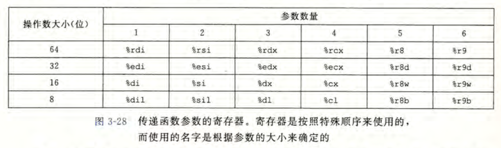
超过6个的参数需要使用rs，从右到左进栈，参数7位于栈顶，align8；最后在call指令时放入返回地址(内存中的参数被放入caller的frame中)；参数任意数据大小都向8的倍数对其(8bytes大空间存放参数)

### 3.7.4 栈上的局部储存

当过程中的局部数据使用到了内存(Run-TIme Satck)里的空间时，包括以下情况：

- SAVING寄存器不够存放所有的local ( 数量和大小不足)
- 对局部变量使用了取值操作
- 局部变量为数组，结构等必须使用到内存的数据类型

局部变量在分配过空间的rs上储存，作为过程frame的一部分( 局部变量区 )


Caller在调用callee前的充分过程：

1. 保存caller-saved寄存器（在frame中）
2. 在frame中保存局部变量
3. 在frame中额外构造参数
4. 将参数转移到寄存器(必要)
5. 在frame顶放入return address (必要 call指令完成) 

- 局部变量存放区不进行align
- 参数构造需要8align
- callee执行完后归还其使用的frame，还原其保存的寄存器

### 3.7.5 寄存器中的局部储存空间

寄存器作为所用过程共享的储存资源，在每个过程进行完成后，必须保证**寄存器拥有原先相同的状态**，使挂起的过程正确执行。x86-64制定了寄存器的统一使用惯例，所有的过程都必须遵循

- Callee-saved reg：
  %rbx, %rbp, %r12~15. 在callee过程内部，首先将这些寄存器压栈后才能使用，返回时前推栈，使寄存器与caller递交时状态一致 (frame中为保存的reg部分)
- Caller-saved reg:
  除了%rsp和callee-saved reg外都是caller-saved reg.所有函数都可以任意修改这些reg. 因为在过程使用这些reg前，原先使用的结果已经被使用者保存

### 3.7.6 递归过程

递归调用会为每一层生成frame；由于寄存器和frame的使用管理，每一层的frame中的局部变量相互独立。

- 在汇编层面，递归过程内部调用自身与调用其他过程没有区别
- 栈的分配-释放规则对应于函数的调用-返回规则
  - 递归过程的加深，就是runtime-stack层层分配frame增长的过程
  - 递归返回就是栈中frame层层释放的过程
- 栈的使用规则确保了每次函数调用都有自己的状态
  - 参数独立
  - 返回值独立
- 互递归使用同样的汇编过程

## 3.8 数组的分配和访问

C数组基于虚拟内存的模型被创建，还包括了指向数组元素的指针和指针运算，在汇编层面这些操作被统一转换为地址计算

### 3.8.1 基本规则

对于数据类型Type 和整型常数Num 有一下声明

```c
Type A[Num]
```

这起始位为Xa，则该声明在内存中分配一个L·Num字节的连续区域，L=sizeof(Type)，另外说明了A是指向数组起始位的指针

x86指令集在数组取值操作上可以运用内存引用指令

```assembly
mov (%rdx,%rcx,$index), %rax
```

其中rdx存放数组首地址，rcx存放类型大小，index是数组下标，为一个立即数，则mov指令可以把A[i]的值复制到rax中

### 3.8.2 指针运算 

以指针类型的大小运算，&*的取值，取地址操作，地址的差值以数据类型的大小为一个步长单位(下表最后一个)


### 3.8.3 嵌套数组

嵌套数组就是存放数组的数组，遵循分配和引用的一般规则

### 3.8.4 定长数组

### 3.8.5 变长数组

## 3.9 异质数据结构

### 3.9.1 Struct

### 3.9.2 Union

### 3.9.3 Alignment

## 3.10 控制和数据相结合

### 3.10.1 指针

C指针到机器代码的映射原则：

- 指针拥有所指对象的类型，在地址取值和指针运算时使用; 类型是C的抽象，寻址时没有类型的区别
- 指针包括一个地址的值，特殊地，NULL(0)表示指针指向nowhere
- 对左值取&运算可以把左值的地址赋给一个指针，常用leaq指令
- *运算表示对特定的内存区域进行读写
- 数组和指针在汇编层面有一质性
- 指针的类型可以是函数，函数指针的值是机器代码首条指令的地址

### 3.10.2 GDB

GDB指令集

### 3.10.3 内存越界引用和缓冲区溢出

C对数组和指针偏移运算不会做任何边界检查，状态信息和局部变量又同时储存在栈上，所以越界数组元素的写操作会破坏栈的信息；所以在更新寄存器和PC置换返还地址时会发生错误

常见的状态破坏有buffer overflow: 当程序需要读取某些未知的输入信息时，会先在内存中开辟定长的Buffer等待填充。如果输入超过buffer，则会导致栈上的信息被破坏。

### 3.10.4 对抗溢出攻击

1. 栈随机化
2. 栈破坏检测
3. 限制可执行的代码区块

### 3.10.5 变长栈帧

- 定长栈帧：编译阶段预先分配内存
- 变长栈帧：可以在栈上任意分配空间
  - 函数中调用了alloca，将在rst上开辟空间
  - 函数中声明了变长数组作为local

实现可变长栈帧的方法：交接帧指针(base pointer)%rbp来管理栈

- 使用rbp作为帧指针前需要先保存(callee-saved)
- 函数执行过程中rbp始终指向开始运行后的栈位置
  - 开始运行指的是完成了保存工作
- local var通过rbp+offset的方式引用
- 消栈时rsp取回rbp位置，继续pop回复保存的reg(包括rbp)
- 寄存器的保存规则保证rbp是否用作帧指针的不同过程可以混用


