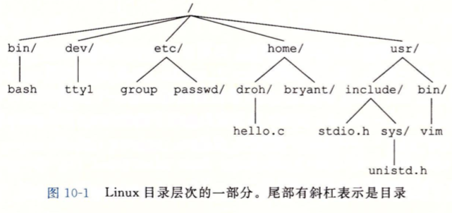
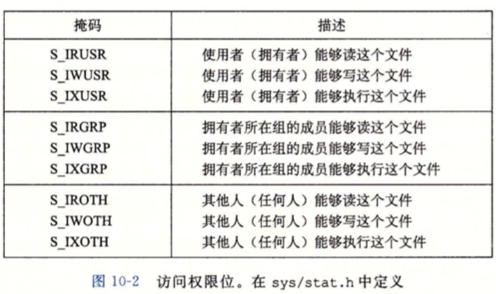
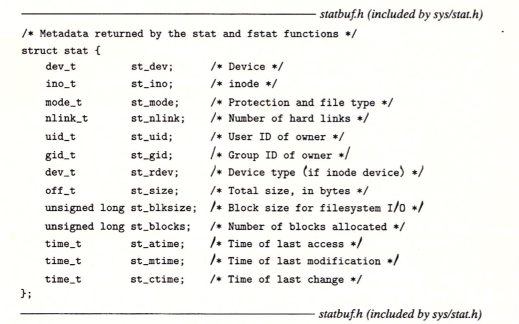
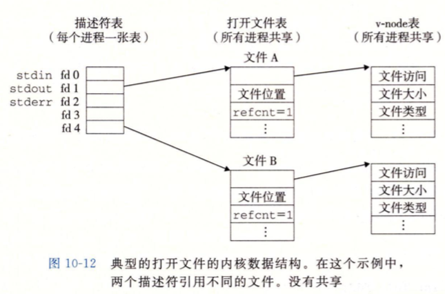
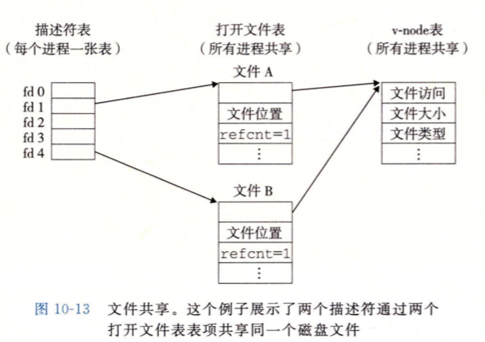
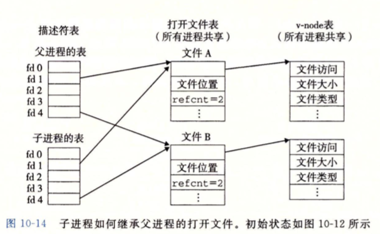
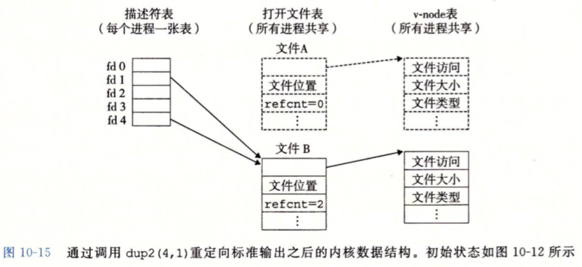

# Chp10. System-Level I/O

> - IO的定义:
>
>   主存和外部设备复制数据的过程
>
>   - Input: IO(外部)设备复制数据到主存的过程  >> mem
>   - Outout: 主存复制数据到IO设备   << mem  

## 1. Unix I/O

- Unix file: m个字节(OS最小数据单位)的序列: B0, B1, … Bm-1

- IO device的file抽象:

  对IO设备的**输入输出**全被Unix抽象为对file的**读写**

- Linux内核的通用低级应用接口: Unix I/O 让所有输入输出方式一致 (Builder构建方法)

  - 打开文件: 应用程序请求内核打开, 宣告需要访问IO设备; 内核返回一个小的非负整数作为 descriptor.

    descriptor是kernel和Application之间的标识, app用descriptor向kernel确认一个file

    - 进程创建时自动打开文件: stdin (0), stdout(1), stderr(2). 由shell打开

  - 改变文件字节流位置: 文件位置k是文件距离头部的字节偏移量, 由内核保存, 初始为0. seek请求内核改变位置

  - 读写文件: 

    - 读: 从文件复制n个字节到内存, 文件位置由k变为k+n, 读至文件尾则触发EOF条件; 被内核抛出app监听. 但文件结尾处没有特殊标识
    - 写操作为从内存复制个字节发哦文件中, 同样更新文件位置

  - 关闭文件: 应用完成访问后通知内核释放处理文件的资源 (管理文件的数据结构), 将descriptor恢复到池中; 任何形式的进程终止也会使得内核关闭文件, 释放内存资源

## 2. Files

Linux文件的类型来指明其在系统中的角色

- regular file: 包含任意的数据.

  应用程序需要区分:

  - text file: 只含有ASCII或者Unicode字符的regular file

    Linux text file是 text lines的序列, 每一行以\n结尾, 0x0a

  - binary file: 所有其他的文件

  内核不进行区分

- directory: 包含一组link的文件, 每个link都将一个filename映射到一个文件. 这个文件可能是目录或者regular file

  每个directory至少包含. 和 .. 两个链接文件代表当前目录和父级目录

- socket (套接字): 用来实现与另一个进程进行跨网络通讯的文件

- named pipe

- symbolic link

- character and block device ...

Linux的文件系统: 

- kernel将所有的文件组织成directory hierarchy

- 根目录为 /

- 每个文件都是根目录直接间接的后代

  

- 每个进程都有current working directory作为context的一部分来确定其在directory hierarchy中的位置. c(urrent)d(irectory)命令可以更改shell的cwd

- pathname表示directory hierarchy的位置. 是一个字符串, 有\和filename组成

  - absolute pathname: 从root开始的路径
  - relative pathname: 从当前dir开始的路径

## 3. Opening and Closing Files

进程通过open函数打开或者创建文件:

```c
#include <sys/types.h>
#include <sys/stat.h>
#include <fcntl.h>
int open(char *filename, int flag, mode_t mode);
```

open把filename转变成一个descriptor并返回, 返回的是当前进程中**没有使用的最小descriptor**, flag指明打开方式

- O_RDOLY: 只读

- O_WRONLY: 只写

- O_RDWR: 可读可写:

  int fd = Open("foo.txt", O_RDONLY, 0);

- flag可以是多个掩码的ORed, 添加额外的写指示

  - O_CREAT: 文件不存在则创建一个截断的空文件
  - O_TRUNC: 文件存在则截断
  - O_APPEND: 写操作前设置文件位置到结尾处

  int fd  = Open('foo.txt', O_WRONLY | O_APPEND, 0);

- mode 参数指定新文件的访问权限, 权限位和符号名如下

  

- 每个进程都有umask, 通过umask函数设置, 当进程通过open和mode创建新文件时, 文件访问权限位mode & (~umask)

  ```c
  #define DEF_MODE S_IRUSR|S_IWUSR|S_IWGRP|S_IRGRP|S_IROTH|S_IWOTH 
  #define DEF_UMASK S_IWGRP|S_IWOTH
  
  umask(DEF_UMASK);
  int fd = Open('foo.txt', O_CREAT|O_TRUNC|O_WRONLY, DEF_MODE);
  /* owner RD WR, others RD */
  ```

- 进程通过close函数关闭文件: 

  ```c
  #include <unistd.h>
  int close(int fd);
  /* return 0 or -1(double close or not opened)*/
  ```

## 4. Reading and Writing Files

```c
#include <unistd.h>
/* return number of bytes if OK, 0 if EOF, -1 if err */
ssize_t read(int fd, void *buf, size_t, n);
/* return number of bytes if OK, -1 if err */
ssize_t write(int fd, void *buf, size_t, n);
```

- read: 从fd代表的文件的当前位置读取n个字节到内存中的buf
- write反之
- lseek可以改变当前文件位置

read或者write可能会返回比n更小的数值, 情况有:

- read到EOF: 第一次读到EOF返回实际读取值, 之后读取返回0
- 从终端(键盘和显示器)读取, read将传送一个text line会有不足
- 读写socket, 较长的内部缓冲约束和网络延迟让read write不足
- 读写磁盘上的文件不足

## 5. Robust Reading and Writing with the RIO Package

Robust IO包会自动处理读写不足的问题, 分为带缓冲和不带缓冲的输入输出函数, 区别在于内存和文件之间是否有应用级的缓冲区, 并且是线程安全的

### 5.1 RIO Unbuffered IO Functions

```c
#include "csapp.h"
ssize_t rio_readn(int fd, void *usrbuf, size_t n);
ssize_t rio_writen(int fd, void *usrbuf, size_t n);
```

返回传送的字节数, EOF0, 出错-1

- rio_readn从当前文件位置传送至多n字节到内存usrbuf, ruo_writen反之
- rio_readn可能会返回不足, rio_writen绝不会
- 可以对一个descriptor交错使用rio_writen和rio_readn
- 被handler终端返回后会重启read或者write

### 5.2 RIO Buffered IO Functions

```c
#include "csapp.h"
void rio_readinitb(rio_t *rp, int fd);

ssize_t rio_readlineb(rio_t *rp, void *usrbuf, size_t maxlen);
ssize_t rio_readnb(rio_t *rp, void *usrbuf, size_t n);
```

函数内部维护一个读取缓冲区, 缓冲区变空则自动read填充

initb函数将descriptor和位于内存rp出的缓存类型rio_t联系起来

 ## 6. Reading File Metadata

```c
#include <unistd.h>
#include <sys/stat.h>
int stat(const char *filename, struct stat *buf) ;
int fstat(int fd, struct stat *buf) ;
```



- st_size: 文件字节数

- st_mode: 编码文件访问许可位(权限位)和文件类型

  Linux在sys/stst.h中定义了宏谓词确定st_mode成员文件类型

  - S_ISREG(m.st_mode) 是regular文件嘛?
  - S_ISDIR(m.st_mode) 是目录文件吗?
  - S_ISSOCK(m.st_mode) 是网络socket嘛?

## 7. Reading Directory Content

```c
#include <sys/types .h>
#include <dirent. h>
DIR *opendir (const char *name);
```

返回指向目录流的指针, 目录流即为目录项目(links)的列表

```c
#include <dirent.h>
struct dirent *readdir(DIR *dirp);
```

每次readdir调用流式读取目录中的项目, 没有项目则返回NULL

```c
struct dirent (
	ino_t d_ino; /* inode number */
	char d_name [256]; /* Filename */
);
```

标准项目结构, d_ino是项目位置

```c
#include <dirent .h>
int closedir(DIR *dirp);
```

关闭目录流, 释放资源

## 8. Sharing Files

内核有三种相关的数据结构来表示打开的文件

- descriptor table: 每个进程独有一个.

  表中的项目是由进程打开的文件descriptor做为引索的, 每个表中的项目指向file table中的一个项目

- file table: 内核所有打开文件的集合, 所有进程共享一个. 

  每个项目包含了文件位置, reference count (被多少descriptor table 项目引用), 一个执行v-node table中项目的指针.

  释放一个descriptor会减少 reference count的计数, 计数为0前, 内核不会删除这个项目

- v-node table: 所有进程共享

  每个项目包含了stat中的大多数信息, 包括st_mode和st_size



多个descriptor可以通过不同的file table项目引用同一个文件 (open同一个filename两次). 这样每个descriptor都有其当前位置, 从不同的位置获取数据



打开文件后fork, 子进程与父进程共享一个file table. descriptor table独立于父进程但完全一致. 结果是父子进程共享相同文件位置, 内核回收file table的项目前也需要父子进程都关闭其持有的descriptor.



## 9. IO Redirection

dup2函数

```c
#include <unistd.h>
int dup2(int oldfd, int newfd);
```

返回descriptor, 将descriptor table中的oldfd复制并覆盖newfd. 是的oldfd和newfd共享一个file table (old指向的)




