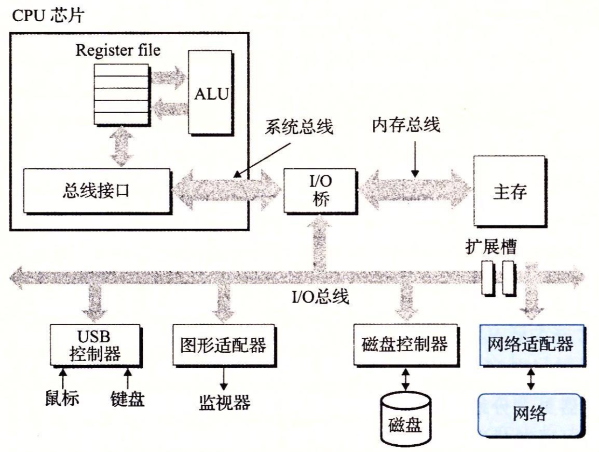
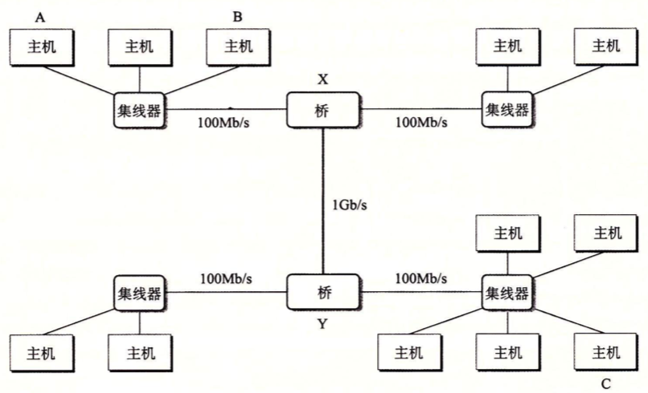
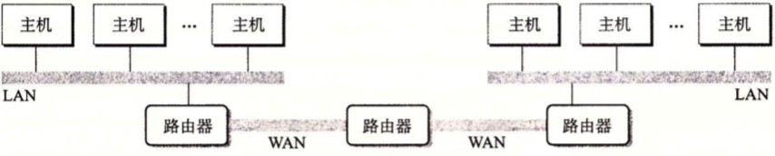
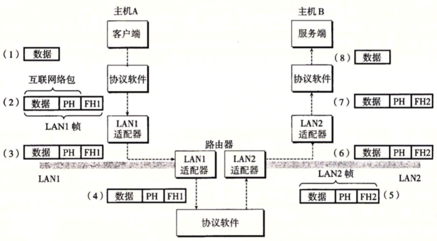

# Chp11. Network Programming

A basic programming model and generalizing apis for all web applications

## 1. The C/S Programming model

客户端-服务器模型:

- 由一个 服务器进程和 一个或多个客户端进程组成
- 服务器管理资源, 提供服务

Transaction in CS:

1. initiate transaction: client发送服务请求request
2. interpret request: 服务器解释请求, 操作资源
3. response: 服务器响应并等待下一个情趣
4. receive: 客户端收到响应并处理

<h2 style=' color: #fff; text-align: center; font-size: 20px; margin-top: 0px'>CS transaction</h2> 

客户端和服务器都只是**进程**, 不是物理主机

## 2. Networks

### 网络对主机而言只是一种**IO设备**

数据通过network adaptor提供的物理接口, 从网络收发数据, 然后通过DMA传送到main memory

<h2 style=' color: #fff; text-align: center; font-size: 20px; margin-top: 0px'>网络主机结构</h2> 

### 物理层面上, 网络由地理位置组织层级

- 最低层级 LAN (Local Area Network)

  

  
<h2 style=' color: #fff; text-align: center; font-size: 20px; margin-top: 0px'>Ethernet Segment</h2> 

  - 实现技术通常是Ethernet.
  - 一个Ethernet Segment包括电缆和一个hub.
  - 每个电缆等带宽, 连结在一个小区域内的每个主机的adaptor到hub端口
  - hub不区分端口, 将接受到的数据复制广播到其他所有端口
  - 每个主机之间通过hub实现完全图
  - 每个主机的adaptor都有全球唯一的48位地址
  - 一台主机发送frame到segment中其他的任何主机上
    - frame包括header: 识别源, 目和长度
    - payload: 实际的有效数据荷载
    - 任何host的adaptor都可见, 只有目实际读取

- 次层级 Bridged Ethernet

  

  
<h2 style=' color: #fff; text-align: center; font-size: 20px; margin-top: 0px'>Bridged Ethernet</h2> 

  - 多个Ethernet segment可以通过bridge连接为较大的局域网
  - bridge利用分配算法热更新可达的端口
  - p2p的在端口之间传送frame

- 高层级 Router Internet

  

  
<h2 style=' color: #fff; text-align: center; font-size: 20px; margin-top: 0px'> A small internet </h2> 

  - 多个不兼容的局域网通过router计算机形成互联网
  - 每个router对其每个连接上的网络都有一个adaptor(port)
  - router也能连接高速的p2p的电话连接, 即WAN(Wide-Area Network)
  - 一般地, router连接LAN和WAN来构建互联网络

### 处理不兼容网络技术--协议软件

- 消除不同网络之间的差异

  - 在host和router之间达成protocol, 控制二者协同工作传输数据

  - 协议的两种能力

    1. 命名机制 naming scheme

       指定一种一致的地址格式且保证host至少被分配一个internet address唯一标识

    2. 传送机制 delivery mechanism

       指定统一的方式封装frame

- 实例: 在不兼容的LAN之间传送数据

> 有两个LAN和一个router构成 client运行在hostA与LAN1相连 server运行在hostB与LAN2相连

<h2 style=' color: #fff; text-align: center; font-size: 20px; margin-top: 0px'>data travel in internet.   PH: internet package header; FH1: frame header for LAN1</h2> 

1. hostA运行一个syscall, 将数据从VM复制到kernel buffer

2. hostA的协议软件在数据前附加PH和FH1, 合并创建LAN1 frame. 实现两层封装

   PH用来寻址hostB, FH1用来寻址到router

   hostA传送frame到adaptor

3. LAN1 adaptor(hostA)将frame复制到全网络上

4. router上的LAN1 adaptor读取frame, 并传送到router上的协议软件

5. router从PH中解析目的地址, 并作为router table的index确定转发方向(LAN2). router剥离FH1, 添加FH2后传送到LAN2的adaptor

6. router上的LAN2 adaptor复制frame到网络

7. frame到达hostB时, adaptor读取并传送到protocol软件

8. hostB上的protocol软件剥离FH2, PH, 通过syscall从IO读取payload到VM

> 忽略变长frame, router转发算法, 网络拓扑结构变化, package丢失等问题

## 3. The Global IP Internet

