# Chp11. Network Programming

A basic programming model and generalizing apis for all web applications

## 1. The C/S Programming model


客户端-服务器模型:

- 由一个 服务器进程和 一个或多个客户端进程组成
- 服务器管理资源, 提供服务

Transaction in CS:

1. initiate transaction: client发送服务请求request
2. interpret request: 服务器解释请求, 操作资源
3. response: 服务器响应并等待下一个情趣
4. receive: 客户端收到响应并处理

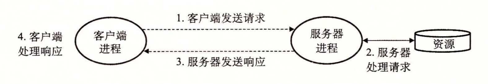

<div style='background: #579;'><h2 style=' color: #fff; text-align: center; font-size: 20px; margin-top: 0px'>CS transaction</h2> </div>

客户端和服务器都只是**进程**, 不是物理主机

## 2. Networks

### 网络对主机而言只是一种**IO设备**

数据通过network adaptor提供的物理接口, 从网络收发数据, 然后通过DMA传送到main memory

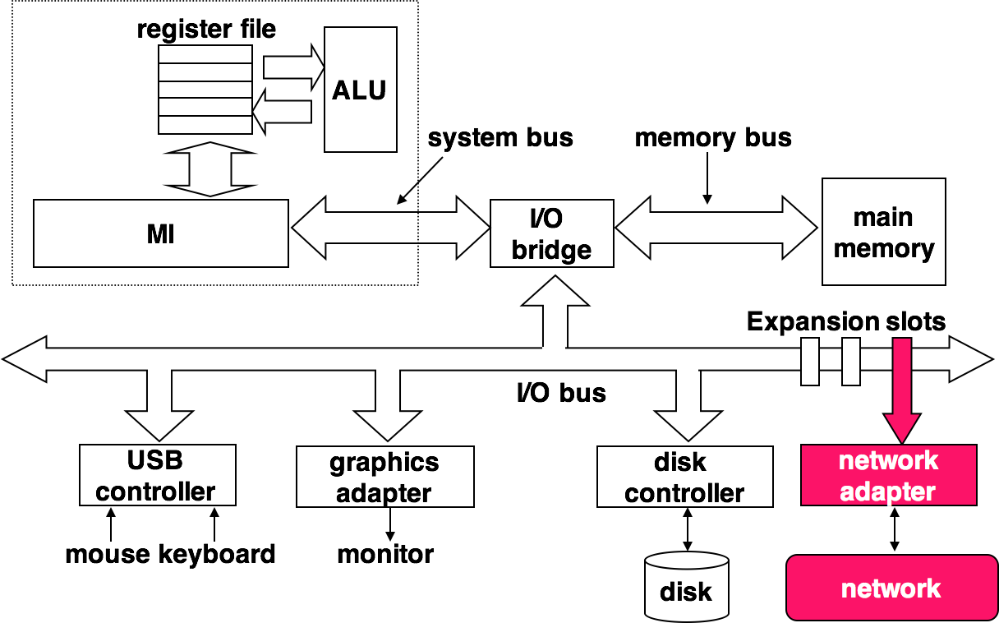

<div style='background: #579;'><h2 style=' color: #fff; text-align: center; font-size: 20px; margin-top: 0px'>网络主机结构</h2> </div>

### 物理层面上, 网络由地理位置组织层级

- 最低层级 LAN (Local Area Network)

  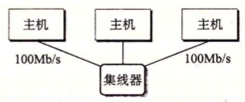

  <div style='background: #579;'><h2 style=' color: #fff; text-align: center; font-size: 20px; margin-top: 0px'>Ethernet Segment</h2> </div>

  - 实现技术通常是Ethernet.
  - 一个Ethernet Segment包括电缆和一个hub.
  - 每个电缆等带宽, 连结在一个小区域内的每个主机的adaptor到hub端口
  - hub不区分端口, 将接受到的数据复制广播到其他所有端口
  - 每个主机之间通过hub实现完全图
  - 每个主机的adaptor都有全球唯一的48位地址
  - 一台主机发送frame到segment中其他的任何主机上
    - frame包括header: 识别源, 目和长度
    - payload: 实际的有效数据荷载
    - 任何host的adaptor都可见, 只有目实际读取

- 次层级 Bridged Ethernet

  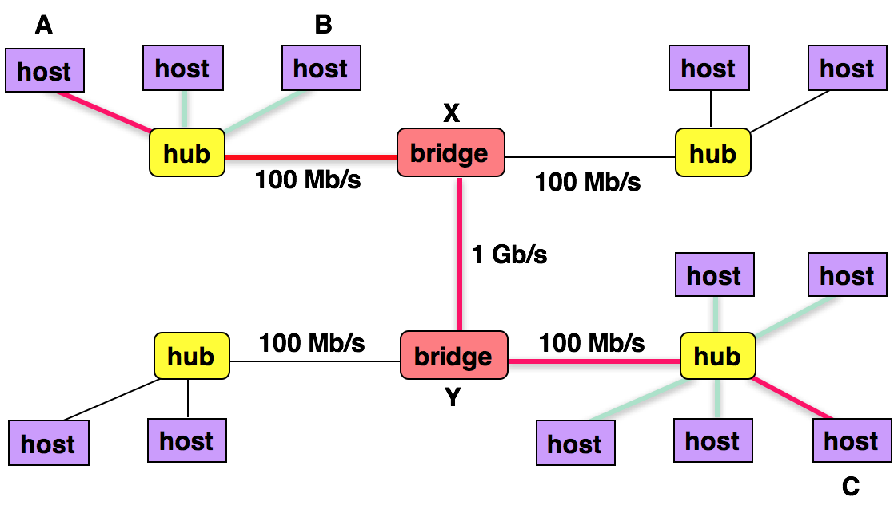

  <div style='background: #579;'><h2 style=' color: #fff; text-align: center; font-size: 20px; margin-top: 0px'>Bridged Ethernet</h2> </div>

  - 多个Ethernet segment可以通过bridge连接为较大的局域网
  - bridge利用分配算法热更新可达的端口
  - p2p的在端口之间传送frame

- 高层级 Router Internet

  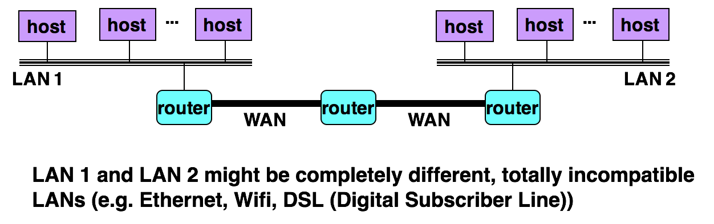

  <div style='background: #579;'><h2 style=' color: #fff; text-align: center; font-size: 20px; margin-top: 0px'> A small internet </h2> </div>

  - 多个不兼容的局域网通过router计算机形成互联网
  - 每个router对其每个连接上的网络都有一个adaptor(port)
  - router也能连接高速的p2p的电话连接, 即WAN(Wide-Area Network)
  - 一般地, router连接LAN和WAN来构建互联网络

### 处理不兼容网络技术--协议软件

- 消除不同网络之间的差异

  - 在host和router之间达成protocol, 控制二者协同工作传输数据

  - 协议的两种能力

    1. 命名机制 naming scheme

       指定一种一致的地址格式且保证host至少被分配一个internet address唯一标识

    2. 传送机制 delivery mechanism

       指定统一的方式封装frame

- 实例: 在不兼容的LAN之间传送数据

> 有两个LAN和一个router构成 client运行在hostA与LAN1相连 server运行在hostB与LAN2相连

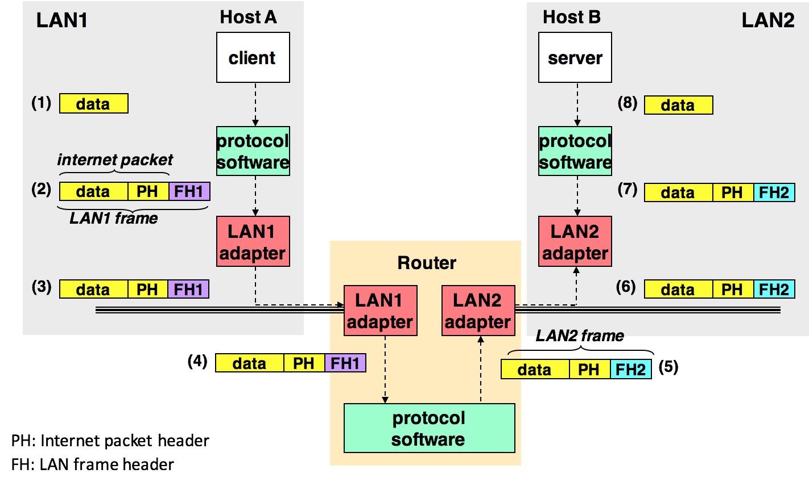

<div style='background: #579;'><h2 style=' color: #fff; text-align: center; font-size: 20px; margin-top: 0px'>data travel in internet. <br> PH: internet package header; FH1: frame header for LAN1</h2> </div>

1. hostA运行一个syscall, 将数据从VM复制到kernel buffer

2. hostA的协议软件在数据前附加PH和FH1, 合并创建LAN1 frame. 实现两层封装

   PH用来寻址hostB, FH1用来寻址到router

   hostA传送frame到adaptor

3. LAN1 adaptor(hostA)将frame复制到全网络上

4. router上的LAN1 adaptor读取frame, 并传送到router上的协议软件

5. router从PH中解析目的地址, 并作为router table的index确定转发方向(LAN2). router剥离FH1, 添加FH2后传送到LAN2的adaptor

6. router上的LAN2 adaptor复制frame到网络

7. frame到达hostB时, adaptor读取并传送到protocol软件

8. hostB上的protocol软件剥离FH2, PH, 通过syscall从IO读取payload到VM

> 忽略变长frame, router转发算法, 网络拓扑结构变化, package丢失等问题

## 3. The Global IP Internet

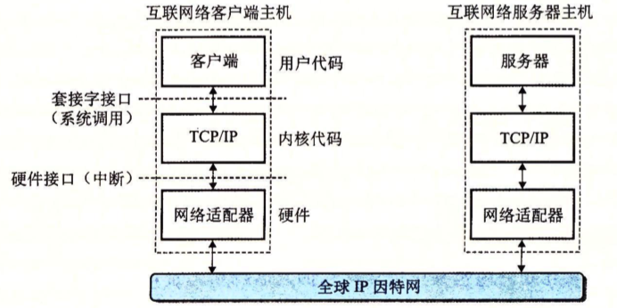

<div style='background: #579;'><h2 style=' color: #fff; text-align: center; font-size: 20px; margin-top: 0px'>internet C/S frame </div>

- 因特网(Internet) host运行TCP/IP协议
  - TCP: Transmission Control Protocol
  - IP: Internet Protocol
  
- 客户端和服务器混合使用socket接口函数和UnixIO通信
  - socket接口函数是一种syscall
  - socket接口函数进入内核后调用内核的TCP/IP函数
  
- TCP/IP是一个协议族
  
  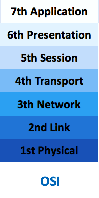
  
  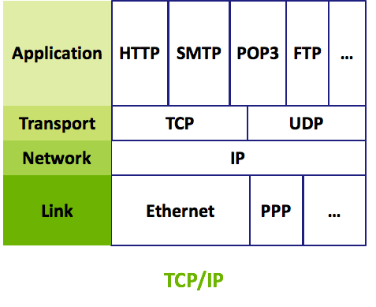
  
  - IP协议提供基本的命名个传送机制
  - 传送机制指host之间发送包, datagram
  - IP不会视图恢复丢失的包
  - UDP是扩展的IP, 使包可以在进程之间传递
  - TCP建立在IP上, 提供了进程之间的双相连接
  - TCP/IP可以视为是一个独立的整体协议
  
  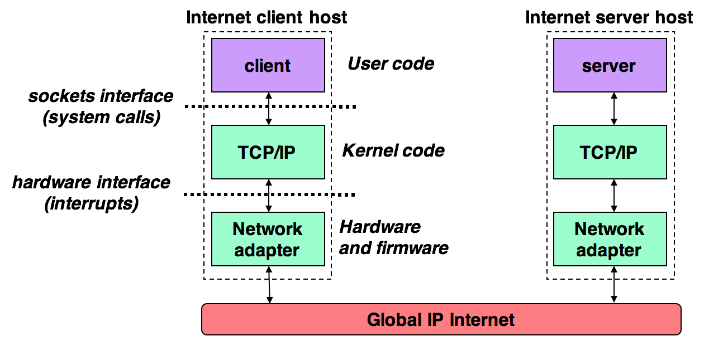
  
- Internet的特性
  - host被映射为32位IP地址
  - IP地址被映射为Internet domain name的标识符
  - Internet host的进程可以链接到其他internet host process进行通讯
  
- IPv4和IPv6
  - IP版本4: 32位
  - IP版本6: 128位

### 3.1 IP Address

#### IP: 32位无符号整数

```c
struct in_addr {
  uint32_t s_addr;
}
```

TCP/IP为整数数据定义了统一的network byte order. IP地址中总是用大端法. host若为小端法则转换

```c
#include <arpa/inet.h>

/* return value according to net */
uint32_t htonl(uint32_t hostlong);
uint16_t htons(uint16_t hostshort);
/* return value according to host */
uint32_t ntohl(uint32_t netlong);
uint16_t ntohs(uint16_t netshort);
```

- ``htonl`` host to net long: 32位整数由主机顺序转换为网络顺序
- ```ntohl``` net to host long: 32位整数由网络顺序转换为主机顺序
- ```htons``` host to net short
- ```ntohs``` net to host short
- 没有64位整数的函数

#### Dotted-decimal notion

将address的每个Byte用十进制表示, 点隔开

```128.2.194.242 == 0x8002c2f2```

IP地址与十进制的转换

```c
#include <arpa/inet.h>

int inet_pton(AF_INET, const char *src, void *dst);
// Returns:1 if OK, 0 if src is invalid dotted decimal, -1 on error

const char *inet_ntop(AF_INET, const void *src char *dst, socklen_t size);
// Returns: pointer to a dotted decimal string if OK, NULL on error
```

### 3.2 Internel Domain Names

- Domain name: 句点分割的单词

  - 域名有树结构, 每个域名编码是其中一个node
  - 子树为子域 subdomain
    1. root未命名
    2. 第一层为一级域名, 由ICANN定义. 比如com, edu, gov etc.
    3. 下一层是二级域名, 由ICANN的各个授权代理分配
    4. 得到二级域名的组织可以在子域中创建任何新域名

  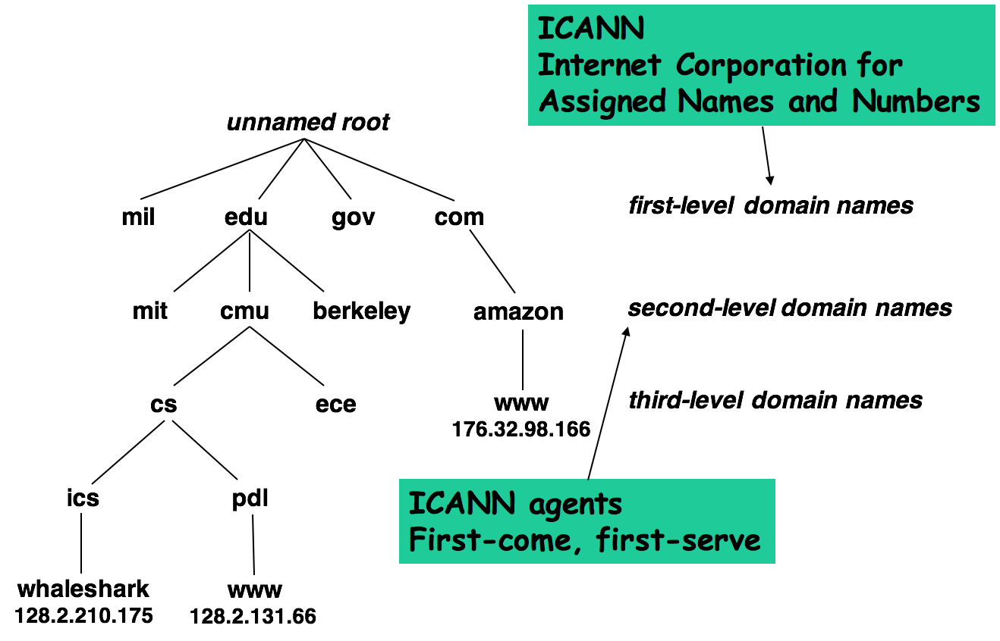

- The Internet 定义了Domain Names 和 IP Address之间的map

  - 1988年前, map通过HOSTS.TXT手工维护
  - 之后, 通过全球范围内的数据库DNS (Domain Name System)来维护
    - DNS DB由百万条host entry structures组成
    - 每个entry定义一组域名和IP地址之间的映射
  - nslookup用来查看与某个IP对应的域名
    - 1-1 一一映射: 有个IP对应一个域名
    - M-1 多对一: 多个域名对应一个IP
    - M-N 多对多: 多个域名映射到同一组多个IP
    - 1-? 某次合法域名没有映射到IP

### 3.3 Internet Connections

- P2P connection: 链接hosts上的一对进程

- full duplex: 数据双向流动

- reliable: 按序收发字节流

  ---

#### Socket

- 套接字是连接的一个端点, 有对应的socket address

  - socket address: Internet address + 16-bit integer port

    ```address : port```

- Client发送连接请求时. client socket地址中的端口由kernel自动分配, ephemeral port

- Server socket地址中的port 是well-known port, 与业务服务对应

  - well-known service name与port对应. etc/services有name与port之间的映射

- 连接由两端的套接字地址唯一确定, 这个地址叫做socket pair

  ```cliend_addr : client_port, server_addr : server_port```

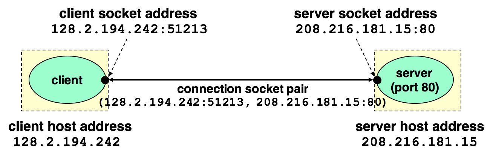

## 4. The Sockets Interface

> Sockets Interface是一组函数, 常与Unix IO结合创建网络应用

- Sockets interface集成在大多现代OS

  - 所有Unix变种OS
  - Windows
  - Macintosh

- Sockets Interface in a CS transaction

  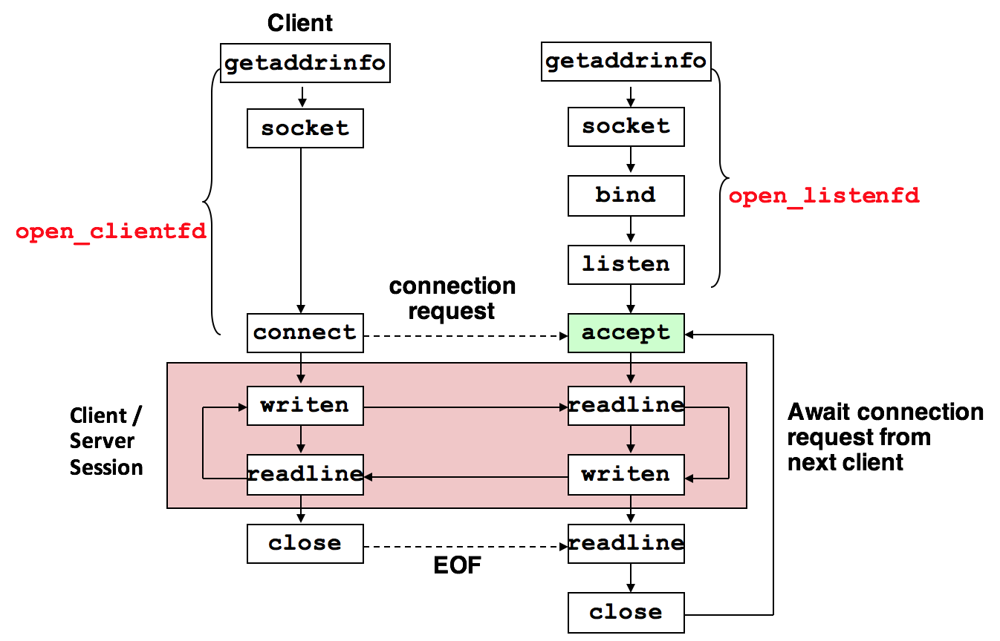

### 4.1 Socket Address Structures

- **What is a socket?**

  - From the perspective of the Linux Kernel

    an ==endpoint== for communication

  - From the perspective of a Linux program

    a ==descriptor== that lets an application read/write from/to the network

  - Key idea

    Unix uses the same ==abstraction== for both regular ==file I/O==  and ==network I/O==

    The main ==difference== between file I/O and socket I/O is how the application ==“opens"== the socket descriptors

- **Key data structures** — sockaddr_in

  Internet socket address

  ```c
  /* IP socket address structure*/
  struct sockaddr_in  {
    uint16_t sin_family; /*Address family (AF_INET) */
    uint16_t sin_port;   /*Port number*/
    struct in_addr  sin_addr;   /*IP address*/
    unsigned char sin_zero[8];   /*Pad to “sockaddr”*/
  };
  
  /* Internet address */
  struct in_addr {
    uint32_t s_addr; /* 32-bit IP address */ 
  };
  ```

  - sin_family: 成员是AF_INET
  - sin_port: 16位端口号 (Big-endding)
  - sin_addr: 32位IP地址 (Big-endding)

  ```c
  /* Generic socket address structure */
  struct sockaddr {
    uint16_t sin_family;  /*Protocol family*/
    char     sa_data[14]; /*address data*/
  };
  typedef struct sockaddr SA;
  ```

  - 泛化的SA结构
  - 用于connect, bind, accept函数取代void*
  - 应用程序将协议特定的structure转化为通用structure

### 4.2 The ```socket``` function

> Client 和 server 通过 ```socket``` 创建socket descriptor

```c
#include <sys/types.h>
#include <sys/socket.h>

int socket (int domain, int type, int protocol) ;
```

返回socket descriptor (-1则出错)

```c
clientfd = Socket(AF_INET, SOCK_STREAM, 0);
```

- AF_INET表示使用的是IPv4 32位地址
- SOCK_STREAM表示socket为连接的一个端点
- ```getaddrinfo```函数可以自动生成这些参数, 实现协议无关的低耦合代码
- 此时clientfd仅仅部分打开, 不能用于读写

### 4.3 The ``connect`` function

> Client通过``client``函数与server建立连接

```c
#include <sys/socket.h>
int connect (int clientfd, const struct sockaddr *addr, socklen_t addrlen) ;
```

- 成功返回0, 失败-1
- 与地址为addr的服务器建立internet connection
- addrlent = sizeof(socketaddr_in)
- 成功后clientfd可以准备读写
- 得到socket pair: (x:y, addr.sin_addr:addr.sin_port) xy表示客户端地址和端口
- 最好使用``getaddrinfo``提供参数

### 4.4 The ```bind``` function

> 服务器用来与client建立连接

```c
#include <sys/socket.h>
int bind(int sockfd, const struct sockaddr *addr, socklen_t addrlen) ;
```

- 成功返回0, 失败-1
- kernel将addr中的服务器socketaddr和descriptor sockfd联系起来
- addrlen = sizeof(sockaddr_in)

### 4.5 The ``listen`` function

> kernel认为socket函数创建的是主动socket, 存在于client, listen告诉内核descriptor是server使用的而不是client

```c
#include <sys/socket.h>
int listen(int sockfd, int backlog);
```

- 将sockfd从主动socket转化成监听socket
- listening socket监听客户端的连接请求
- backlog按时内核拒绝请求时请求队列的数量
- backlog针对TCP/IP

### 4.6 The ``accept`` function 

> server 调用来等待客户端的连接请求

```c
#include <sys/socket.h>
int accept(int listenfd, struct sockaddr *addr, int *addrlen);
```

- 等待到达listenedfd的请求
- 在addr中填写client的sockaddr
- 返回一个connected descriptor可被Unix IO用来与client通信

> - listenedfd 和 connected descriptor不同
>
>   前者是client连接的一个目标端点, 只被创建一次, 一直存活
>
>   后者是已经建立的连接端点, 每次接受服务时创建, 只存活于一次服务
>
> 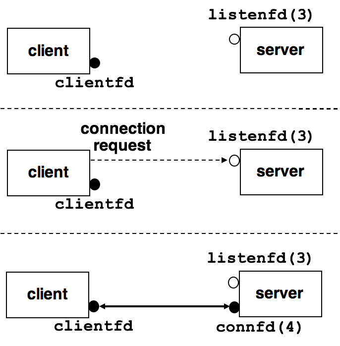
>
> 1. 服务器调用accept, 等待请求到达listenedfd
> 2. 客户端调用connect, 请求连接到listenedfd
> 3. accept函数打开新的connfd, 在connfd和clientfd之间建立连接, 返回connfd给客户端程序; 此时客户端从connect得到返回
>
> 此后客户端和服务器通过clientfd和connfd传送数据

### 4.7 Host and Service Conversion

```getaddrinfo``` 和 ```getnameinfo```实现二进制socket address structures与主机名, 主句地址, 服务名, 端口号的字符串转化.

与sockets interface一起使用可实现与网络协议解耦的编程

#### 1. getaddrinfo

将主机名, 主机地址, 服务名, 端口号的字符串转化为SA struct. 是弃用的gethostbyname和getservbyname的替代品. 是reentrant的, 适用于任何协议

```c
#include <sys/types.h>
#include <sys/socket.h>
#include <netdb.h>
int getaddrinfo(
  const char *host, 
  const char *service, 
  const struct addrinfo *hints, 
  struct addinfo **result
);
// Returns:0 if OK, nonzero error code on error

void freeaddinfo(struct addinfo *result);
// Returns:nothing 

Const char *gai_strerror(int errocde);
// Returns: error message
```

- result指向addrinfo结构的链表, 每个结构对应于一个host和service的SA

  ```c
  struct addrinfo {
  	int ai_flags;		/* Hints argument flags */
  	int ai_family; 	/* First arg to socket function */
  	int ai_socktype; 	/* Second arg to socket function */
  	int ai_protocol; 	/* Third arg to socket function */
  	char *ai_canonname; /* Canonical hostname */
  	size_t ai_addrlen; 	/* Size of ai_addr struct */
  	struct sockaddr *ai_addr; /* Ptr to socket address structure */
  	struct addrinfo *ai_next; /* Ptr to next item in linked list */
  };
  ```

  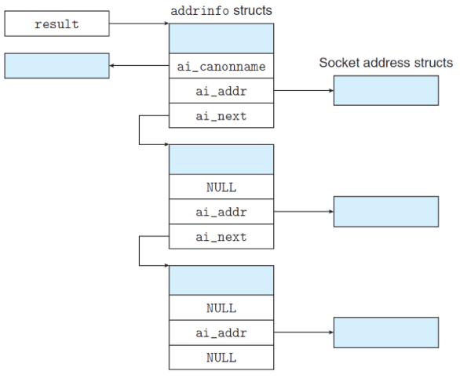

- 调用getaddrinfo

  遍历这个列表, 一次尝试每个sockaddr, 直到socket和connect成功. 建立连接.

  服务器遍历直到socket和bind成功. descriptor绑定到合法SA. 最后使用free释放链表

  - host参数可以是域名或者Dotted-Decimal, IP
  - service参数可以是可以是服务名, 端口号
  - hints对返回的SA链表有结构控制
  - 默认返回IPv4的SA, 这只ai_family为AF_INET6限制IPv6

#### 2. getnameinfo

与getaddrinfo相反, 将SA转换成host和serveice名字字符

```c
#include <sys/socket.h>
#include <netdb.h>

int getnameinfo(
  const struct sockaddr *sa,
  socklen_t salen,
  char *host,
  size_t hostlen,
  char* service,
  size_t servlen,
  int flags
);
```

- sa: 指向大小为salen的sa struct
- host: 指向大小为hostlen的char buffer
- service同上
- getnameinfo将sa转换成主机名和服务名字符串

### 4.8 Helper functions

#### 1. open_clientfd

> client调用与server链接

```c
#include "csapp.h"
int open_clientfd(char *hostname, char *port);
```

- 要求Server运行在hostname上, 并在port上listen request
- 返回一个socket descriptor, 利用Unix IO读写
- 协议无关
- 实现:
  - 调用==getaddrinfo==逐个检查SA
  - 直到调用==socket==和==connect==成功
  - connect失败则检查下一个entry, 之前关闭descriptor
  - connect成功则释放内存, 返回descriptor

realization

```c
/* $begin open_clientfd */
int open_clientfd(char *hostname, char *port) {
    int clientfd;
    struct addrinfo hints, *listp, *p;

    /* Get a list of potential server addresses */
    memset(&hints, 0, sizeof(struct addrinfo));
    hints.ai_socktype = SOCK_STREAM;  /* Open a connection */
    hints.ai_flags = AI_NUMERICSERV;  /* ... using a numeric port arg. */
    hints.ai_flags |= AI_ADDRCONFIG;  /* Recommended for connections */
    Getaddrinfo(hostname, port, &hints, &listp);
  
    /* Walk the list for one that we can successfully connect to */
    for (p = listp; p; p = p->ai_next) {

        /* Create the socket descriptor */
        if ((clientfd = socket(p->ai_family, p->ai_socktype, p->ai_protocol)) < 0) 
            continue; /* Socket failed, try the next */
        if (connect(clientfd, p->ai_addr, p->ai_addrlen) != -1) 
            break; /* Success */
        Close(clientfd); /* Connect failed, try another */
    } 

    /* Clean up */
    Freeaddrinfo(listp);
    if (!p) /* All connects failed */
        return -1;
    else    /* The last connect succeeded */
        return clientfd;
}
/* $end open_clientfd */
```


#### 2. open_listened

```c
#include 'csapp.h'
int open_listenfd (char *port);
```

- 打开并返回一个 listened descriptor
- 准备好在port上监听请求
- 实现:
  - 调用==getnameinfo==, 遍历列表
  - 直到调用==socket==和==bind==成功
  - 调用listen函数将listenedfd转变为监听descriptor并返回
  - listen失败则关闭descriptor

realization

```c
/* $begin open_listenfd */
int open_listenfd(char *port) 
{
    struct addrinfo hints, *listp, *p;
    int listenfd, optval=1;

    /* Get a list of potential server addresses */
    memset(&hints, 0, sizeof(struct addrinfo));
    hints.ai_socktype = SOCK_STREAM;  /* Accept TCP connections */
    hints.ai_flags = AI_PASSIVE;      /* ... on any IP address */
    hints.ai_flags |= AI_NUMERICSERV; /* ... using a numeric port arg. */
    hints.ai_flags |= AI_ADDRCONFIG;  /* Recommended for connections */
    Getaddrinfo(NULL, port, &hints, &listp);

    /* Walk the list for one that we can bind to */
    for (p = listp; p; p = p->ai_next) {

        /* Create a socket descriptor */
        if ((listenfd = socket(p->ai_family, p->ai_socktype, p->ai_protocol)) < 0) 
            continue;  /* Socket failed, try the next */

        /* Eliminates "Address already in use" error from bind */
        Setsockopt(listenfd, SOL_SOCKET, SO_REUSEADDR, 
                   (const void *)&optval , sizeof(int));

        /* Bind the descriptor to the address */
        if (bind(listenfd, p->ai_addr, p->ai_addrlen) == 0)
            break; /* Success */
        Close(listenfd); /* Bind failed, try the next */
    }

    /* Clean up */
    Freeaddrinfo(listp);
    if (!p) /* No address worked */
        return -1;

    /* Make it a listening socket ready to accept connection requests */
    if (listen(listenfd, LISTENQ) < 0)
	return -1;
    return listenfd;
}
/* $end open_listenfd */
```


### 4.9 echo Client and Server Demo

client

```c
#include "csapp.h"

int main(int argc, char **argv) 
{
    int clientfd;
    char *host, *port, buf[MAXLINE];
    rio_t rio;

    if (argc != 3) {
      fprintf(stderr, "usage: %s <host> <port>\n", argv[0]);
      exit(0);
    }
    host = argv[1];
    port = argv[2];

    clientfd = Open_clientfd(host, port);
    Rio_readinitb(&rio, clientfd);

    while (Fgets(buf, MAXLINE, stdin) != NULL) {
      Rio_writen(clientfd, buf, strlen(buf));
      Rio_readlineb(&rio, buf, MAXLINE);
      Fputs(buf, stdout);
    }
    Close(clientfd); //line:netp:echoclient:close
    exit(0);
}
/* $end echoclientmain */
```

server

```c
#include "csapp.h"
void echo(int connfd);

int main(int argc, char **argv) 
{
    int listenfd, connfd;
    socklen_t clientlen;
    struct sockaddr_storage clientaddr;  /* Enough space for any address */  //line:netp:echoserveri:sockaddrstorage
    char client_hostname[MAXLINE], client_port[MAXLINE];

    if (argc != 2) {
	fprintf(stderr, "usage: %s <port>\n", argv[0]);
	exit(0);
    }

    listenfd = Open_listenfd(argv[1]);
    while (1) {
	clientlen = sizeof(struct sockaddr_storage); 
	connfd = Accept(listenfd, (SA *)&clientaddr, &clientlen);
        Getnameinfo((SA *) &clientaddr, clientlen, client_hostname, MAXLINE, 
                    client_port, MAXLINE, 0);
        printf("Connected to (%s, %s)\n", client_hostname, client_port);
	echo(connfd);
	Close(connfd);
    }
    exit(0);
}
/* $end echoserverimain */
/* $begin echo */
#include "csapp.h"

void echo(int connfd) 
{
    size_t n; 
    char buf[MAXLINE]; 
    rio_t rio;

    Rio_readinitb(&rio, connfd);
    while((n = Rio_readlineb(&rio, buf, MAXLINE)) != 0) { //line:netp:echo:eof
	printf("server received %d bytes\n", (int)n);
	Rio_writen(connfd, buf, n);
    }
}
/* $end echo */
```


## 5. Web Server

### 5.1 Web Basics

- HTTP (HyperText Transfer Protocol): 

  - web客户端打开一个到服务器的internet链接
  - 请求内容
  - Server响应内容, 关闭连接
  - 浏览器读取内容并显示

- Conventional File Retrieval Service (FTP)

  web的内容可以由HTML来编写, 提供超链接服务, 是指向任何Internet host内容上的指针

### 5.2 Web Content

MIME (Multipurpose Internet  Mail Extension)

- text/html          HTML page
- text/plain          Unformatted text
- application/postscript         Postcript document
- image/gif  Binary image encoded in GIF format
- image/jpg  Binary image encoded in JPG format

Web Server提供服务内容:

- 读取磁盘文件, 并返回给Client

  磁盘文件称为static content, 返回称为serving static content

- 运行一个可执行文件, 将其输出返回Client

  产生的输出结构称为dynamic content, 返货的过程为serving dynamic content

每个web server返回的内容都与之管理的文件相关联, 这些文件拥有唯一名字URL Universal Resource Locator

- 静态文件:

  ```http://www.google.com:80/index.html```

- 动态内容

  ```http://www.cs.cmu.edu:8000/cgi-bin/adder?15000&213```

- URL不对静态动态区分, server可以用目录区分

- ``/``不代表Linux根目录. 表示请求内容的主目录

- 浏览器自动补足/, /被server解析成默认的文件

### 5.3 HTTP Transactions

利用Telnet与server会话

- HTTP请求

  ```bash
  #Client: open connection to server
  unix> telnet ipads.se.sjtu.edu.cn 80
  #Telnet prints 3 lines to the terminal
  Trying 202.120.40.88...
  Connected to ipads.se.sjtu.edu.cn.
  Escape character is '^]'.
  #Client: request line
  GET /courses/ics/index.shtml HTTP/1.1
  #Client: required HTTP/1.1 HOST header
  host: ipads.se.sjtu.edu.cn
  #Client: empty line terminates headers
       #\r\n
  ```

  - request line: method URI version
    - method: GET, POST, OPTIONS...
    - URI(Uniform Resource Identifier): URL后缀, 文件名和可选参数
    - version: HTTP版本

  - request headers: header-name : header-data

  - 空行回车(\r\n)发送请求

- HTTP响应

  ```bash
  # Server: response line
  HTTP/1.1 200 OK
  # Server: followed by five response headers
  Server: nginx/1.0.4
  Date: Thu, 29 Nov 2012 10:15:38 GMT
  # Server: expect HTML in the response body 
  Content-Type: text/html
  # Server: expect 11,560 bytes in the resp body
  Content-Length: 11560
  # Server: empty line (“\r\n”) terminates hdrs
  
  ```

  

  - response line: version status-code status-massage
    - 200 OK                  Request was handled without error
    - 301 Moved               Provide alternate URL
    - 403 Forbidden           Server lacks permission to access file
    - 404 Not found           Server couldn’t find the file
    - 501 Not Implemented           Server does not support the request  method
    - 505 HTTP version not supported    Server does not support version in request
  - response header
  - 空行回车终止header
  - response body

### 5.4 Dynamic Service Content

#### CGI (Common Gateway Interface) C/S app的实现标准

- Client在URI中传递参数

  ```bash
  GET /cgi-bin/adder?15000&213 HTTP/1.1
  ```

- Server将参数传递子进程

  ``execve``之前, 子进程设置CGI的环境变量``QUERY_STRING.``

  服务应用 (==CGI脚本==) 通过Linux ``getenv``引用参数

- Server将其他信息传递给子进程

  通过CGI其他环境变量

  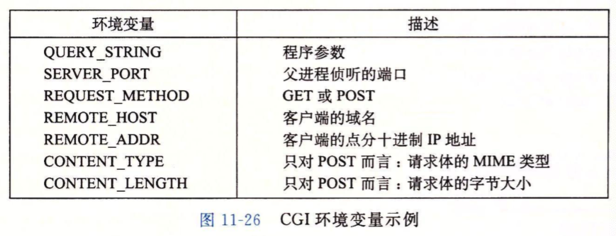

- 子进程结果输出

  - CGI脚本将结果输出到 stdout (fd = 1)
  - 子进程在``execve``CGI脚本之前, 利用Linux ``dup2``, 将stdout和Server accept的connectFD关联
  - CGI脚本直接输出到Client (父子进程共享file table)
  - CGI运行对Server父进程黑箱, 有子进程负责Content-type和Content-length生成

- CGI样例``adder``

  ```c
  /* $begin adder */
  #include "csapp.h"
  
  int main(void) {
      char *buf, *p;
      char arg1[MAXLINE], arg2[MAXLINE], content[MAXLINE];
      int n1=0, n2=0;
  
      /* Extract the two arguments */
      if ((buf = getenv("QUERY_STRING")) != NULL) {
        p = strchr(buf, '&');
        *p = '\0';
        strcpy(arg1, buf);
        strcpy(arg2, p+1);
        n1 = atoi(arg1);
        n2 = atoi(arg2);
      }
  
      /* Make the response body */
      sprintf(content, "Welcome to add.com: ");
      sprintf(content, "%sTHE Internet addition portal.\r\n<p>", content);
      sprintf(content, "%sThe answer is: %d + %d = %d\r\n<p>", 
  	    content, n1, n2, n1 + n2);
      sprintf(content, "%sThanks for visiting!\r\n", content);
    
      /* Generate the HTTP response */
      printf("Connection: close\r\n");
      printf("Content-length: %d\r\n", (int)strlen(content));
      printf("Content-type: text/html\r\n\r\n");
      printf("%s", content);
      fflush(stdout);
  
      exit(0);
  }
  /* $end adder */
  ```

## 6. Tiny Web Server

### ``main()``

```c
/* $begin tinymain */
/*
 * tiny.c - A simple, iterative HTTP/1.0 Web server that uses the 
 *     GET method to serve static and dynamic content.
 */
#include "csapp.h"

void doit(int fd);
void read_requesthdrs(rio_t *rp);
int parse_uri(char *uri, char *filename, char *cgiargs);
void serve_static(int fd, char *filename, int filesize);
void get_filetype(char *filename, char *filetype);
void serve_dynamic(int fd, char *filename, char *cgiargs);
void clienterror(int fd, char *cause, char *errnum, 
		 char *shortmsg, char *longmsg);

int main(int argc, char **argv) 
{
    int listenfd, connfd;
    char hostname[MAXLINE], port[MAXLINE];
    socklen_t clientlen;
    struct sockaddr_storage clientaddr;

    /* Check command line args */
    if (argc != 2) {
      fprintf(stderr, "usage: %s <port>\n", argv[0]);
      exit(1);
    }
  
		/* listen */
    listenfd = Open_listenfd(argv[1]);
    while (1) {
      clientlen = sizeof(clientaddr);
      /* Accept: receive reqs */
      connfd = Accept(listenfd, (SA *)&clientaddr, &clientlen); 
      Getnameinfo((SA *) &clientaddr, clientlen, hostname, 
                  MAXLINE, port, MAXLINE, 0);
      printf("Accepted connection from (%s, %s)\n", hostname, port);
      /* doit: execute transaction */
      doit(connfd);
      /* Close: close connection */
      Close(connfd);
    }
}
/* $end tinymain */
```

- ==open_listenfd==: 打开listen socket, 准备接受reqs
- ==accept==: 打开connect socket, 准备处理req
- ==doit==: 利用connect file descriptor, 处理并返回结果
- ==close==: Server主动结束会话

### ``doit(int connfd)``

```c
void doit(int fd) 
{
    int is_static;
    struct stat sbuf;
    char buf[MAXLINE], method[MAXLINE], uri[MAXLINE], version[MAXLINE];
    char filename[MAXLINE], cgiargs[MAXLINE];
    rio_t rio;

    /* Read request line and headers */
    Rio_readinitb(&rio, fd);
    if (!Rio_readlineb(&rio, buf, MAXLINE))
        return;
    printf("%s", buf);   // buf is 1st line: req line
    sscanf(buf, "%s %s %s", method, uri, version);
    if (strcasecmp(method, "GET")) {  // only method
        clienterror(fd, method, "501", "Not Implemented",
                    "Tiny does not implement this method");
        return;
    }
    read_requesthdrs(&rio);  // read headers but ignored

    /* Parse URI from GET request */
    is_static = parse_uri(uri, filename, cgiargs);
    if (stat(filename, &sbuf) < 0) {
        clienterror(fd, filename, "404", "Not found",
              			"Tiny couldn't find this file");
        return;
    }
    if (is_static) { /* Serve static content */          
        if (!(S_ISREG(sbuf.st_mode)) || !(S_IRUSR & sbuf.st_mode)) {
            clienterror(fd, filename, "403", "Forbidden",
            "Tiny couldn't read the file");
            return;
				}
				serve_static(fd, filename, sbuf.st_size);
    }
    else { /* Serve dynamic content */
        if (!(S_ISREG(sbuf.st_mode)) || !(S_IXUSR & sbuf.st_mode)) {
            clienterror(fd, filename, "403", "Forbidden",
            "Tiny couldn't run the CGI program");
            return;
				}
				serve_dynamic(fd, filename, cgiargs);
    }
}
```

### ```clienterror(...);```
```c
void clienterror(int fd, char *cause, char *errnum, 
		 char *shortmsg, char *longmsg) 
{
    char buf[MAXLINE], body[MAXBUF];

    /* Build the HTTP response body */
    sprintf(body, "<html><title>Tiny Error</title>");
    sprintf(body, "%s<body bgcolor=""ffffff"">\r\n", body);
    sprintf(body, "%s%s: %s\r\n", body, errnum, shortmsg);
    sprintf(body, "%s<p>%s: %s\r\n", body, longmsg, cause);
    sprintf(body, "%s<hr><em>The Tiny Web server</em>\r\n", body);

    /* Print the HTTP response */
    sprintf(buf, "HTTP/1.0 %s %s\r\n", errnum, shortmsg);
    Rio_writen(fd, buf, strlen(buf));
    sprintf(buf, "Content-type: text/html\r\n");
    Rio_writen(fd, buf, strlen(buf));
    sprintf(buf, "Content-length: %d\r\n\r\n", (int)strlen(body));
    Rio_writen(fd, buf, strlen(buf));
    Rio_writen(fd, body, strlen(body));
}
```

### ``read_requesthdrs(rio_t *rio)``

```c
void read_requesthdrs(rio_t *rp) 
{
    char buf[MAXLINE];

    Rio_readlineb(rp, buf, MAXLINE);
    printf("%s", buf);
    while(strcmp(buf, "\r\n")) {
        Rio_readlineb(rp, buf, MAXLINE);
        printf("%s", buf);
    }
    return;
}
```

- ==strcmp(buf, ‘\r\n’)==: 检查req-header终止

### ``parse_uri(char *uri, char *filename, char *cgiargs)``

```c
int parse_uri(char *uri, char *filename, char *cgiargs) 
{
    char *ptr;

    if (!strstr(uri, "cgi-bin")) {  /* Static content */
        strcpy(cgiargs, "");              
        strcpy(filename, ".");            
        strcat(filename, uri);            
        if (uri[strlen(uri)-1] == '/')    
            strcat(filename, "home.html"); // default file
        return 1;
    }
    else {  /* Dynamic content */
        ptr = index(uri, '?');         
        if (ptr) {
            strcpy(cgiargs, ptr+1);
            *ptr = '\0';
        }
        else 
            strcpy(cgiargs, "");       
        strcpy(filename, ".");         
        strcat(filename, uri);         
        return 0;
    }
}
```

### ``serve_static(int fd, char *filename, int filesize)``

```c
void serve_static(int fd, char *filename, int filesize) 
{
    int srcfd;
    char *srcp, filetype[MAXLINE], buf[MAXBUF];
 
    /* Send response headers to client */
    get_filetype(filename, filetype);       //line:netp:servestatic:getfiletype
    sprintf(buf, "HTTP/1.0 200 OK\r\n");    //line:netp:servestatic:beginserve
    sprintf(buf, "%sServer: Tiny Web Server\r\n", buf);
    sprintf(buf, "%sConnection: close\r\n", buf);
    sprintf(buf, "%sContent-length: %d\r\n", buf, filesize);
    sprintf(buf, "%sContent-type: %s\r\n\r\n", buf, filetype);
    Rio_writen(fd, buf, strlen(buf));       //line:netp:servestatic:endserve
    printf("Response headers:\n");
    printf("%s", buf);

    /* Send response body to client */
    srcfd = Open(filename, O_RDONLY, 0);    //line:netp:servestatic:open
    srcp = Mmap(0, filesize, PROT_READ, MAP_PRIVATE, srcfd, 0);//line:netp:servestatic:mmap
    Close(srcfd);                           //line:netp:servestatic:close
    Rio_writen(fd, srcp, filesize);         //line:netp:servestatic:write
    Munmap(srcp, filesize);                 //line:netp:servestatic:munmap
}

/*
 * get_filetype - derive file type from file name
 */
void get_filetype(char *filename, char *filetype) 
{
    if (strstr(filename, ".html"))
	strcpy(filetype, "text/html");
    else if (strstr(filename, ".gif"))
	strcpy(filetype, "image/gif");
    else if (strstr(filename, ".png"))
	strcpy(filetype, "image/png");
    else if (strstr(filename, ".jpg"))
	strcpy(filetype, "image/jpeg");
    else
	strcpy(filetype, "text/plain");
}  
```

### ``serve_dynamic(int fd, char *filename, char *cgiargs)``

```c
void serve_dynamic(int fd, char *filename, char *cgiargs) 
{
    char buf[MAXLINE], *emptylist[] = { NULL };

    /* Return first part of HTTP response */
    sprintf(buf, "HTTP/1.0 200 OK\r\n"); 
    Rio_writen(fd, buf, strlen(buf));
    sprintf(buf, "Server: Tiny Web Server\r\n");
    Rio_writen(fd, buf, strlen(buf));
  	
    if (Fork() == 0) { /* Child */ //line:netp:servedynamic:fork
      /* Real server would set all CGI vars here */
      setenv("QUERY_STRING", cgiargs, 1); //line:netp:servedynamic:setenv
      Dup2(fd, STDOUT_FILENO);         /* Redirect stdout to client */ 
      Execve(filename, emptylist, environ); /* Run CGI program */ 
    }
    Wait(NULL); /* Parent waits for and reaps child */ //line:netp:servedynamic:wait
}
```

