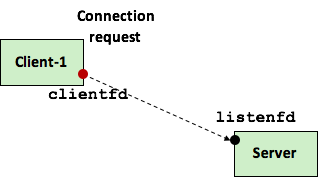
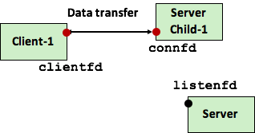
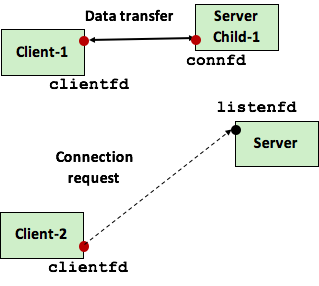
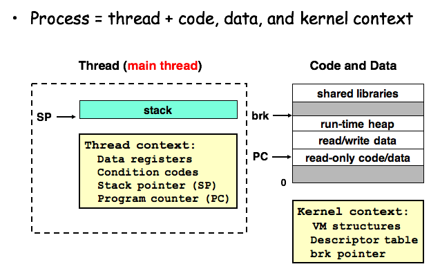
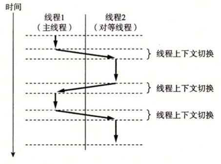
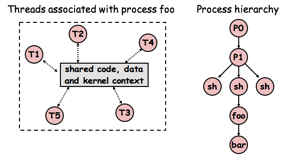
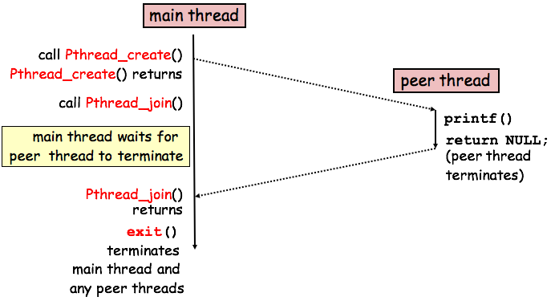

# Chp12 Concurrent Programming

concurrency并发: 很广义的概念, 任务在逻辑控制时间上重叠, 则它们是并发的. 在exception, process和Linux signal上运用

应用程序中的并发: 不仅仅局限于内核处理多个程序进程. 例如应用程序中有Linux Signal Handler运行应用异步响应Signal. 其意义有:

- 慢速I/O Access: 应用访问慢速IO时, 内核调度运行其他程序.  程序内也可以用类似的方式并行IO和其他事物
- 与人交互: 用户请求操作时, 需要创建一个独立的并发逻辑流来执行操作
- 推迟工作来降低延迟: 推迟一些操作, 并发执行它们来降低操作延迟
- 服务多个网络客户端
- 多核机器上进行并行运算

含有应用级别的并发控制流的程序为并发程序. OS提供三种方法实现:

- 进程Process: 每个逻辑控制流作为一个进城, 由系统内核来调度和维护. 其地址空间相互独立, 需要通过显示的IPC(Interprocess communication)机制
- I/O multiplexing 多路复用: 逻辑流为状态机被主进程转化, 共享文件数据和地址空间
- 现成Threads: 线程是运行在一个单一进程context的逻辑流, 有内核调度. 共享虚拟地址空间 

## 1. Concurrent Programming with Processes

以echoServer为例

利用进程构造并发服务器, 在父进程中接收client的连接请求, 再创建一个子进程来为每个client提供服务. 



1. Server端,有int connfd1 = accept(listenedfd, …, …)

   

2. Server派生一个子进程Servelet, 获得主进程全部的fd副本. 子进程关闭listenedfd, 主进程关闭connfd1, 子进程处理业务echo(connfd1);

   主进程应当关闭connfd. 服务转换后关闭由子进程完成, 主进程会造成内存泄漏

   

3. Server端接收新的client链接请求 int connfd2 = accept(listenedfd, … ,… ). 

   

4. 主进程派生另一个子进程, 利用connfd2来为客户提供业务端服务echo(connfd2). 此时Server主进程等待下一个请求, 两个子进程并发为客户端提供业务服务

### 1.1 A Concurrent Server Based on Processes

implementation

```c
int main(int argc, char **argv) 
{
   int listenfd, connfd;
   struct sockaddr_in clientaddr;
   socklen_t clientlen = sizeof(clientaddr);

   Signal(SIGCHLD, sigchld_handler);
   listenfd = Open_listenfd(argv[1]);
   while (1) {
      connfd = Accept(listenfd, (SA *) &clientaddr, &clientlen);
      if (Fork() == 0) { 
         Close(listenfd); 
         echo(connfd);    
         Close(connfd);   
         exit(0);         
      }
      Close(connfd);
   }
}

void sigchld_handler(int sig) 
{
   while (waitpid(-1, 0, WNOHANG) > 0)
	;
   return;
}
```

- void sigchld_handler(int sig)用来回收多个zombie进程, 避免长时间的server运行时间占用资源
- 主进程, 子进程必须关闭各自的connfd副本, 避免内存泄漏
- socket file table中每一项具有reference count, 直到主进程和子进程的connfd都关闭后连接client的socket才会终止

### 1.2 Pros and Cons of Processes

- 父子进程共享资源: shard file table. 
- 不共享资源: 地址空间. 独立性强, 但是共享状态信息变得困难. 必须使用IPC机制, 效率慢, 因为进程控制和IPC的开销很高

## 2. Concurrent Programming with I/O Multiplexing

响应客户端的键入, 则必须响应两个独立的I/O事件:

- 客户端的socket连接请求
- 客户端的键入命令

I/O Multiplexing: 使用select函数, 要求内核挂起进程, 在一个或多个IO事件发生后再返回控制给进程

## 3. Concurrent Programming with Threads

Thread: 运行在进程上下文中的逻辑流. 

- 一般的进程只有一个线程. 
- 不同线程之间由内核调度.
- 每个线程也有自己的thread context, 包括唯一的thread ID, tid, 栈, rsp, pc, regs和cc. 
- 所有运行在一个进程的线程共享整个该进程的虚拟地指空间



### 3.1  Thread Execution Model

主线程创建对等线程后, 二者并发运行. 控制权在二者之间交接



线程切换与进程切换不同:

- thread context 比 process context小得多, 切换更快

- 线程没有严格的父子层次, 与进程相关的线程组成一个线程池

  

- 主线程总是第一个运行的线程

- 同一个线程池中的线程可以杀死任何对等线程, 或者等待对等线程终止

- 每个对等线程都能读写相同的共享数据

### 3.2 Posix Treads

Posix Threads = Pthreads 是C中使用的一个标准接口, 在所有的Linux系统上可用.

Pthreads定义大约60个函数, 允许程序创建, 杀死, 回收线程, 与对等线程安全地共享数据, 通知对等线程状态变化

```c
/* hello.c - Pthreads "hello, world" program */
#include "csapp.h"

/* thread routine */
void *thread(void *vargp) {
  printf("Hello, world!\n"); 
  return NULL;
}

int main() {
  pthread_t tid;
  Pthread_create(&tid, NULL, thread, NULL);
  Pthread_join(tid, NULL);
  exit(0);
}
```



- 主线程通过exit回收这个进程中的所有线程
- 线程的代码和本地数据封装在thread routine里
- 线程例程接收一个通用指针作为输入, 参数被放入指针指向的地址中
- 线程例程返回通用指针作为结果

### 3.3 Creating Threads

```c
#include <pthreads.h>
typedef void *(func)(void*);
int pthead_create(pthread_t *tid,
                  pthread_attr_t *attr,
                  void *(*f)(void*),
                 	void *arg);
pthread_t pthread_self(void);
```

``pthreads_create`` 用来创建一个新的例程, 成功则返回0

- ``tid``: 存储例程ID
- ``attr``: 线程创建的默认属性, 一般用NULL
- ``f``: 线程例程指针
- ``arg``: 传入例程参数指针
- ``pthread_self(void)``: 获取线程自身tid

### 3.4 Terminating Threads

- 顶层的线程例程返回时, 线程隐式地终止
- 调用``pthread_exit``函数, 线程显示地终止
  - 主线程调用则等待所有其他线程终止, 探后再终止主线程和整个进程, 返回``thread_return``
- 对等线程内调用Linux的``exit``函数, 则终止与该进程所有相关的线程
- 对等线程以一个tid为参数, 调用``pthread_cancel``来终止线程

```c
#include <pthread.h>
void pthread_exit(void *thread_return);
int pthread_cancel(pthread_t tid);
```

### 3.5 Reaping Terminated Threads

通过``pthread_join``函数等待其他线程终止

```c
#include <pthread.h>
int pthread_join(pthread_t tid, void **thread_return);
```

- ``pthread_join``会阻塞caller, 直到tid终止.
- 线程例程返回的通用指针赋值为``thread_return``指向的位置, 回收线程占优的内存资源
- ``pthread_join``只能等待一个指定线程的终止, 与Linux的``wait``不同

### 3.6 Detaching Threads

任何时刻, 线程都是joinable或者detached的.

- joinable的线程可以被其他线程杀死或者回收. 
  - 在线程被回收之前, 其内存资源不释放
- detached线程不能被杀死和回收
  - 资源在其终止时有系统自动释放
- 默认线程是joinable的, 为了避免内存泄漏
  - 所有joinable的线程都要被其他线程显式地回收
  - 或者调用``pthread_detach``函数被分离

```c
#include <pthread.h>
int pthread_detach(pthread_t tid);
```

``pthread_detach``函数分离joinable线程tid, tid可以是从``pthread_self``获取的自身

- 当线程不需要被其他线程显式地等待回收时, 应该被分离来保证内存资源不泄露

### 3.7 Initializing Threads

- 允许初始化与线程相关的状态

```c
#include <pthread.h>
pthread_once_t once_control = PTHREAD_ONCE_INIT;
int pthread_once(pthread_once_t *once_control,
                 void (*init_routine)void);
```

- ``once_control``变量是全局或者静态的, 总被初始化为PTHRED_ONCE_INIT
- 第一次用参数``once_control``调用``pthread_once``时, 会调用``init_routine``
- ``init_routine``是一个无参数, 无返回的函数
- 接下来, ``pthread_once``不做任何事情
- 需要动态初始化多个线程共享的全局变量时可以调用

### 3.8 A Concurrent Server Based on Threads

## 4. Shared Variables in Threads Programs

## 5. Synchronizing Threads with Semaphores

## 6. Using Threads for Parallelism

## 7. Other Concurrency Issues


