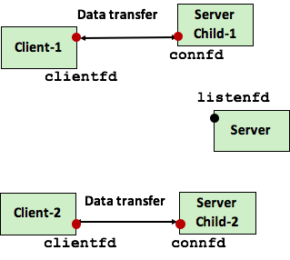

# Chp12 Concurrent Programming

concurrency并发: 很广义的概念, 任务在逻辑控制时间上重叠, 则它们是并发的. 在exception, process和Linux signal上运用

应用程序中的并发: 不仅仅局限于内核处理多个程序进程. 例如应用程序中有Linux Signal Handler运行应用异步响应Signal. 其意义有:

- 慢速I/O Access: 应用访问慢速IO时, 内核调度运行其他程序.  程序内也可以用类似的方式并行IO和其他事物
- 与人交互: 用户请求操作时, 需要创建一个独立的并发逻辑流来执行操作
- 推迟工作来降低延迟: 推迟一些操作, 并发执行它们来降低操作延迟
- 服务多个网络客户端
- 多核机器上进行并行运算

含有应用级别的并发控制流的程序为并发程序. OS提供三种方法实现:

- 进程Process: 每个逻辑控制流作为一个进城, 由系统内核来调度和维护. 其地址空间相互独立, 需要通过显示的IPC(Interprocess communication)机制
- I/O multiplexing 多路复用: 逻辑流为状态机被主进程转化, 共享文件数据和地址空间
- 现成Threads: 线程是运行在一个单一进程context的逻辑流, 有内核调度. 共享虚拟地址空间 

## 1. Concurrent Programming with Processes

以echoServer为例

利用进程构造并发服务器, 在父进程中接收client的连接请求, 再创建一个子进程来为每个client提供服务. 


1. Server端,有int connfd1 = accept(listenedfd, …, …)

   

2. Server派生一个子进程Servelet, 获得主进程全部的fd副本. 子进程关闭listenedfd, 主进程关闭connfd1, 子进程处理业务echo(connfd1);

   主进程应当关闭connfd. 服务转换后关闭由子进程完成, 主进程会造成内存泄漏

   

3. Server端接收新的client链接请求 int connfd2 = accept(listenedfd, … ,… ). 

   

4. 主进程派生另一个子进程, 利用connfd2来为客户提供业务端服务echo(connfd2). 此时Server主进程等待下一个请求, 两个子进程并发为客户端提供业务服务

### 1.1 A Concurrent Server Based on Processes

implementation

```c
int main(int argc, char **argv) 
{
   int listenfd, connfd;
   struct sockaddr_in clientaddr;
   socklen_t clientlen = sizeof(clientaddr);

   Signal(SIGCHLD, sigchld_handler);
   listenfd = Open_listenfd(argv[1]);
   while (1) {
      connfd = Accept(listenfd, (SA *) &clientaddr, &clientlen);
      if (Fork() == 0) { 
         Close(listenfd); 
         echo(connfd);    
         Close(connfd);   
         exit(0);         
      }
      Close(connfd);
   }
}

void sigchld_handler(int sig) 
{
   while (waitpid(-1, 0, WNOHANG) > 0)
	;
   return;
}
```

- void sigchld_handler(int sig)用来回收多个zombie进程, 避免长时间的server运行时间占用资源
- 主进程, 子进程必须关闭各自的connfd副本, 避免内存泄漏
- socket file table中每一项具有reference count, 直到主进程和子进程的connfd都关闭后连接client的socket才会终止

### 1.2 Pros and Cons of Processes

- 父子进程共享资源: shard file table. 
- 不共享资源: 地址空间. 独立性强, 但是共享状态信息变得困难. 必须使用IPC机制, 效率慢, 因为进程控制和IPC的开销很高

## 2. Concurrent Programming with I/O Multiplexing

响应客户端的键入, 则必须响应两个独立的I/O事件:

- 客户端的socket连接请求
- 客户端的键入命令

I/O Multiplexing: 使用select函数, 要求内核挂起进程, 在一个或多个IO事件发生后再返回控制给进程

## 3. Concurrent Programming with Threads

Thread: 运行在进程上下文中的逻辑流. 

- 一般的进程只有一个线程. 
- 不同线程之间由内核调度.
- 每个线程也有自己的thread context, 包括唯一的thread ID, tid, 栈, rsp, pc, regs和cc. 
- 所有运行在一个进程的线程共享整个该进程的虚拟地指空间


### 3.1  Thread Execution Model

主线程创建对等线程后, 二者并发运行. 控制权在二者之间交接


线程切换与进程切换不同:

- thread context 比 process context小得多, 切换更快

- 线程没有严格的父子层次, 与进程相关的线程组成一个线程池

  

- 主线程总是第一个运行的线程

- 同一个线程池中的线程可以杀死任何对等线程, 或者等待对等线程终止

- 每个对等线程都能读写相同的共享数据

### 3.2 Posix Treads

Posix Threads = Pthreads 是C中使用的一个标准接口, 在所有的Linux系统上可用.

Pthreads定义大约60个函数, 允许程序创建, 杀死, 回收线程, 与对等线程安全地共享数据, 通知对等线程状态变化

```c
/* hello.c - Pthreads "hello, world" program */
#include "csapp.h"

/* thread routine */
void *thread(void *vargp) {
  printf("Hello, world!\n"); 
  return NULL;
}

int main() {
  pthread_t tid;
  Pthread_create(&tid, NULL, thread, NULL);
  Pthread_join(tid, NULL);
  exit(0);
}
```


- 主线程通过exit回收这个进程中的所有线程
- 线程的代码和本地数据封装在thread routine里
- 线程例程接收一个通用指针作为输入, 参数被放入指针指向的地址中
- 线程例程返回通用指针作为结果

### 3.3 Creating Threads

```c
#include <pthreads.h>
typedef void *(func)(void*);
int pthead_create(pthread_t *tid,
                  pthread_attr_t *attr,
                  void *(*f)(void*),
                 	void *arg);
pthread_t pthread_self(void);
```

``pthreads_create`` 用来创建一个新的例程, 成功则返回0

- ``tid``: 存储例程ID
- ``attr``: 线程创建的默认属性, 一般用NULL
- ``f``: 线程例程指针
- ``arg``: 传入例程参数指针
- ``pthread_self(void)``: 获取线程自身tid

### 3.4 Terminating Threads

- 顶层的线程例程返回时, 线程隐式地终止
- 调用``pthread_exit``函数, 线程显示地终止
  - 主线程调用则等待所有其他线程终止, 探后再终止主线程和整个进程, 返回``thread_return``
- 对等线程内调用Linux的``exit``函数, 则终止与该进程所有相关的线程
- 对等线程以一个tid为参数, 调用``pthread_cancel``来终止线程

```c
#include <pthread.h>
void pthread_exit(void *thread_return);
int pthread_cancel(pthread_t tid);
```

### 3.5 Reaping Terminated Threads

通过``pthread_join``函数等待其他线程终止

```c
#include <pthread.h>
int pthread_join(pthread_t tid, void **thread_return);
```

- ``pthread_join``会阻塞caller, 直到tid终止.
- 线程例程返回的通用指针赋值为``thread_return``指向的位置, 回收线程占优的内存资源
- ``pthread_join``只能等待一个指定线程的终止, 与Linux的``wait``不同

### 3.6 Detaching Threads

任何时刻, 线程都是joinable或者detached的.

- joinable的线程可以被其他线程杀死或者回收. 
  - 在线程被回收之前, 其内存资源不释放
- detached线程不能被杀死和回收
  - 资源在其终止时有系统自动释放
- 默认线程是joinable的, 为了避免内存泄漏
  - 所有joinable的线程都要被其他线程显式地回收
  - 或者调用``pthread_detach``函数被分离

```c
#include <pthread.h>
int pthread_detach(pthread_t tid);
```

``pthread_detach``函数分离joinable线程tid, tid可以是从``pthread_self``获取的自身

- 当线程不需要被其他线程显式地等待回收时, 应该被分离来保证内存资源不泄露

### 3.7 Initializing Threads

- 允许初始化与线程相关的状态

```c
#include <pthread.h>
pthread_once_t once_control = PTHREAD_ONCE_INIT;
int pthread_once(pthread_once_t *once_control,
                 void (*init_routine)void);
```

- ``once_control``变量是全局或者静态的, 总被初始化为PTHRED_ONCE_INIT
- 第一次用参数``once_control``调用``pthread_once``时, 会调用``init_routine``
- ``init_routine``是一个无参数, 无返回的函数
- 接下来, ``pthread_once``不做任何事情
- 需要动态初始化多个线程共享的全局变量时可以调用

### 3.8 A Concurrent Server Based on Threads

主线程不断等待并Accept链接请求, 创建对等线程服务请求

```c
int main(int argc, char **argv){
    int listenfd, *connfdp
    socklen_t clientlen;
    struct sockaddr_in clientaddr;
    pthread_t tid;

    if (argc != 2) {
        fprintf(stderr, "usage: %s <port>\n", argv[0]);
        exit(0);
    }
    listenfd = open_listenfd(argv[1]);
    while (1) {
        clientlen = sizeof(clientaddr);
        connfdp = Malloc(sizeof(int));
        *connfdp = Accept(listenfd,
                          (SA *)&clientaddr,
                          &clientlen);
        Pthread_create(&tid, NULL, thread, connfdp);
    }
}

/* thread routine */
void *thread(void *vargp)
{
    int connfd = *((int *)vargp);

    Pthread_detach(pthread_self());
    Free(vargp);
    echo(connfd);
    Close(connfd);
    return NULL;
}
```

- 调用``pthread_create``时, 通过connfdp(malloc的堆空间)将已连接的descriptor传递给线程

  - 不能使用栈空间, 如

    ```c
    int main() {
    	...
      while(1){
    	  int connfd = Accept(listenedfd, ...);
    		Pthread_create(&tid, NULL, thread, &connfd);
        ...
      }
      ...
    }
    
    void *thread(void *vargp){
      int connfd = *((int *)vargp);
      ...
    }
    ```

    这种参数传递引起了例程中的参数赋值(line12)和主线程accept(line3)之间的竞争

    - 赋值语句在下一次accept之前完成, 例程中的connfd为正确值.
    - 赋值语句在下一次(几次)accept之后完成, 则例程中得到是那一次的connfd
      - 导致两个线程在一个descriptor输入和输出

    accept得到的descriptor要求放到属于其自己的动态分配的堆空间中.

  - 主线程没有显式回收线程, 线程例程中必须分离自身, 在终止时避免内存泄漏. ``pthread_detach(pthread_self())``

  - 例程负责释放主线程中分配的参数占用的堆内存. `` free(vargp)``

## 4. Shared Variables in Threads Programs

- 线程的基础内存模型
- 变量实例如何映射到内存
- 线程实例引用这些示例


### 4.1 Threads Memory Model

- 一组线程运行在一个进程的上下文中, 共享
  - 虚拟地址空间
  - 代码段
  - 读写数据段
  - 堆空间
  - 共享库代码
  - 打开的文件集合
- 每个线程有自己的独立线程上下文, 包括
  - 线程ID
  - 栈
  - 栈指针
  - PC
  - CC
  - regs
- 寄存器从不共享, 内存总是共享
- 线程栈的内存模型:
  - 被保存在虚拟地址的栈区域中
  - 通常由对应的线程独立访问
    - 线程栈不对其他线程设防, 可以读写其他栈的任何部分

```c
#include "csapp.h"
#define N 2
void *thread(void *vargp);

char **ptr; 
/* global variable */
int main()
{
	int i;
 	pthread_t tid;
  char *msgs[N] = {
 	  "Hello from foo",
 	  "Hello from bar"
	};

 	ptr = msgs;
 	for (i = 0; i < N; i++)
 	   Pthread_create(&tid, NULL, thread, (void *)i);
 	Pthread_exit(NULL);
}

void *thread(void *vargp)
{
 	int myid = (int)vargp;
 	static int cnt = 0;
 	printf("[%d]:%s(cnt=%d)\n", myid, ptr[myid], ++cnt);
}
```

line26表现了对等线程通过全局变量ptr简介访问了主线程栈上的内容(msgs)

### 4.2 Mapping Variables to Memory

多线程C程序根据变量的存储类型映射到虚拟内存

- 全局变量Global variables: 虚存的read/write区域只包含每个全局变量的一个实例, 任何线程都可以引用

  (如line5 ptr)

- 本地自动变量Local automic variables: 运行时, 没个线程都在自己的运行时栈上实例化本地自动变量. 多线程则多次实例化.

  如本地变量myid(line24)有两个实例: 0号对等线程和1号对等线程的栈上. 分别记为myid.p0和myid.p1

- 本地静态变量 Local static variables: 同全局变量一样, 实例化在虚存的read/write区域

  如cnt(line25)

### 4.3 Shared Variables

变量的一个实例被一个以上的线程引用

- cnt: 共享的静态变量
- msgs: 共享的本地自动变量
- myid: 不是共享变量

## 5. Synchronizing Threads with Semaphores

```c
#include "csapp.h"
#define NITERS 100000000
void *count(void *arg);

/* shared variable */
unsigned int cnt = 0;

int main()
{
 	pthread_t tid1, tid2;

 	Pthread_create(&tid1, NULL, count, NULL);
 	Pthread_create(&tid2, NULL, count, NULL);
 	Pthread_join(tid1, NULL);
 	Pthread_join(tid2, NULL);

 	if (cnt != (unsigned)NITERS*2)
 	    printf("BOOM! cnt=%d\n", cnt);
 	else
 	    printf("OK cnt=%d\n", cnt);
 	exit(0);
}

/* thread routine */
void *count(void *arg)
{
 	int i;
 	for (i=0; i<NITERS; i++)
 	    cnt++;
 	return NULL;
}
```

创建两个线程, 每个线程对共享变量cnt增加NITERS次, 线程都运行完毕后, cnt != 2×NITERS. 分析线程例程的汇编代码:


- H~i~: 循环头部的指令. 在主线程栈上读取niters到%rcx并判断; %rax置零
- L~i~: 加载共享变量```cnt```到寄存器%rdx~i~
- U~i~: 寄存器%rdx~i~数值更新, 增加1
- S~i~: 将%rdx~i~更新后的值写回共享变量cnt中
- T~i~: 循环尾部的指令. 循环检查

并发执行会按所有拓扑排序执行不同线程例程中的指令. 其中一些拓扑顺序会产生错误的结果:

- 无法保证OS执行了正确的顺序
- 当出现两个进程Load到同一个cnt并先后写回是, 导致其中一次incq无效


### 5.1 Progress Graphs

进度图: 将n个并发线程执行模型转化为一条==n维度笛卡尔空间中的轨迹线==

- 每条轴k对应于线程k的进度(执行到第几条指令)
- 每个点代表线程k已经完成了I~k~这一条指令
- 原点对应于没有线程完成任何指令的初始状态
- 指令执行模型转化为状态之间的转换transition, 为从一点到相邻点的有向边
- 合法转换只能是指向右或向上的, 不允许对角和反向

对于一个线程, 操作共享变量的指令构成一个关于该变量的临界区 ==Critical section==

- 临界区内不能和其他进程交替执行
- 确保每个线程在执行临界区中的指令时, 拥有对共享变量的互斥访问 mutual exclusion
- 两个临界区的交集形成不安全区usafe region
- 不安全区是个开区间
- 绕开不安全区的轨迹是安全轨迹
- 接触到安全区内部的轨迹是不安全轨迹
- 安全轨迹是能够正确更新共享变量的

为了保证共享数据结构的并发程序能够正确执行, 必须用一种方式来同步线程, 保证运行在一条安全轨迹上.


### 5.2 Semaphores

Semaphore: 一种特殊类型的变量. 信号量s是具有非负整数值的全局变量, 只能通过P和V两种操作处理:

- P(s)
  - s非零, P将s减一, 立即返回(不阻塞)
  - s为0, 挂起caller线程, 直到s变为非零(一个V操作会重启改线程)
  - 重启后, P将s减一并返回给caller线程
- V(s)
  - V操作将s加一
  - 如果有若干线程被P操作阻塞, 等待s变成非零的. 则V启动这些线程中的一个
  - 启动后该线程的P将s减一, 返回caller

```pseudocode
P(s): [ while (s == 0) wait(); s--; ]
V(s): [ s++; ]
```


- P中的s测试和减一操作是不可分割的. 一旦测试到s非零, 就会减一(一条指令)
- V中的s测试和加一操作也是不可分的
- V中没有定义阻塞线程的启动顺序, 这也是programmer不可预设的
- P和V的定义保证了一个运行时的程序不会进入一个负值Semaphore的状态, 称为==Semaphore invariant==

Posix标准定义的Semaphore操作函数

```c
#include <semaphore.h>
int sem_init(sem_t *sem, 0, unsigned int value);
int sem_wait(sem_t *s); /* P(s) */
int sem_post(sem_t *s); /* V(s) */
```

- ``sem_init``: 将Semaphore sem初始化为value, Semaphore在使用前必须初始化.

### 5.3 Using Semaphores for Mutual Exclusion

- 将每个共享变量和一个Semaphore(初始值为1)关联起来, 利用P和V将对共享操变量的操作包围起来, 以实现保护共享变量的读写串行化. 

- 这种Semaphore称为 binary semaphore. 一位其值总是0或1
- 以互斥为目的binary semaphore也成为互斥锁 mutex
  - P可以看做是给共享变量加上mutex
  - V可以看做是给共享变量解除mutex
- 一组可用资源的计数器Semaphore叫做counting semaphore


- 利用PV操作结合创建一组状态 — Forbidden region
  - FR内部s < 0, 有Semaphore Invariant可知没有轨迹线会接触FR
  - FR完全包含了unsafe region, 所以实际轨迹是绝对安全的
  - 任何时间点, 不可能有多个线程在都在Critical region(L.U.S.)执行, semaphore保证了C.R.访问的互斥

```c
  
```


## 6. Using Threads for Parallelism

## 7. Other Concurrency Issues


