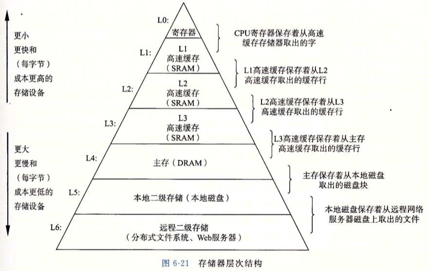
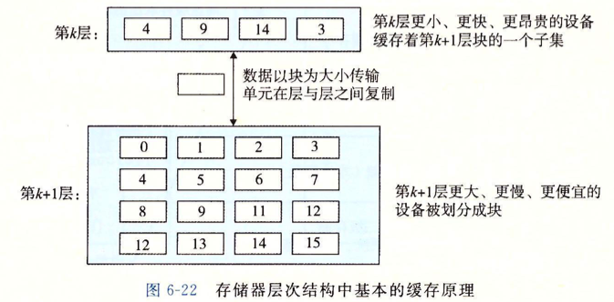
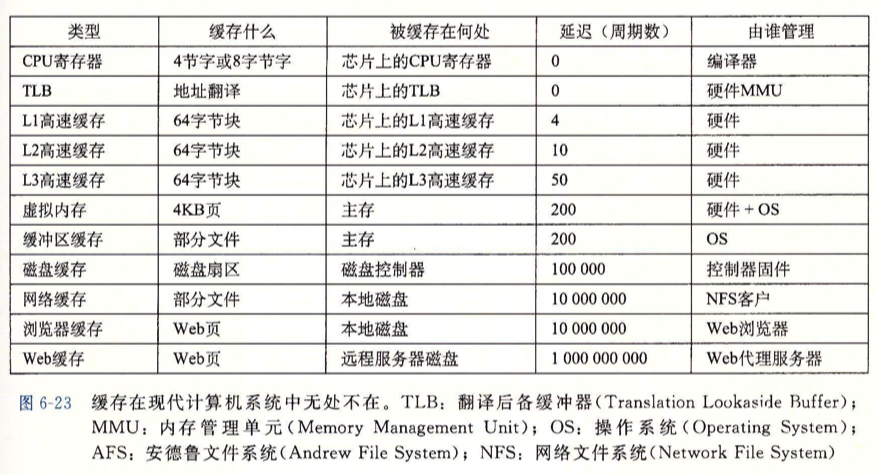
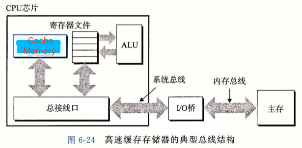
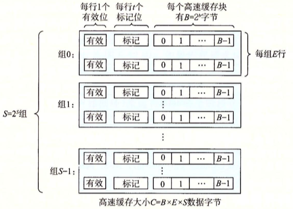
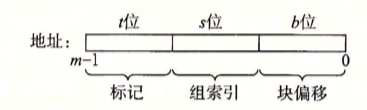
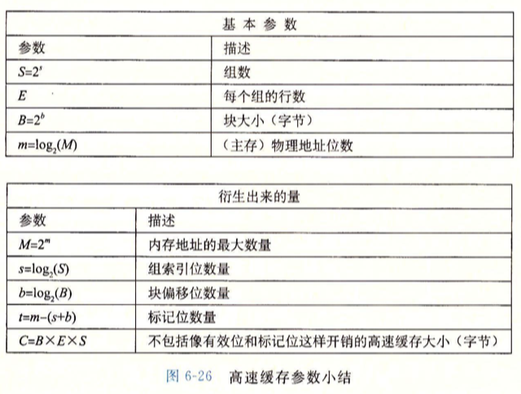
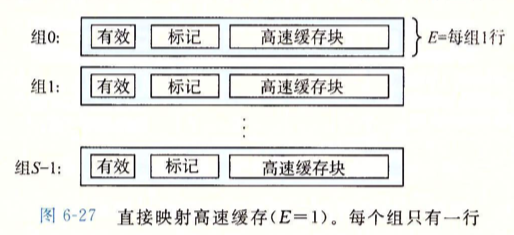
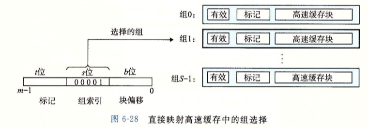

# Chp6 Memory Hierarchy

> Program Locality:
>
> 程序趋于访问相同, 或是邻近的数据项集合

## 1. Storage techs

### 1.1 RAM

- Dynamic: Cheap, Slower

  - be used as Main Memory plus 
    the frame buffer of a graphic system
  - Several hundreds of thousands of MB.
  - charging on a capacitor for each bit

- Static:  Faster, expensive

  - be used as Cache Memory

  - On and Off CPU chip

  - No more than a few MB in DesktopSys

  - Bistable (双稳态) memory cell for each  bit

    |      | Transistor /bit | Access Time | Persistent | Sensitive | Cost  | Application         |
    | ---- | --------------- | ----------- | ---------- | --------- | ----- | ------------------- |
    | S    | 6               | 1×          | ✅          | ❌         | 1000× | Cache Mem           |
    | D    | 1               | 10×         | ❌          | ✅         | 1×    | Main Mem, frame Buf |

- Conventional DRAMs

  - structure

    

  - READ

    

  - Memory Modules

    

- Enhanced DRAMs

  - FPM DRAMs (Fast Page Mode)

    faster when read SuperCells from the same line 

  - EDO DRAM (Extend Data Out DRAM)

    FPM DRAM to handle dense CAS

  - SDRAM (Synchronous DRAM)

    Faster

  - DDR SDRAM (Double Data-Rate Sychronous DRAM)

    SDRAM that can use two clocks as input signal to double the speed

    prefetch buffer (increase the effective bandwidth) size: 

    DDR (2 bits); DDR2 (4-bits); DDR3 (8 bits)

  - VRAM (Video RAM)

    Output whole line and move

    Parallel read and write

- Nonvolatile Memory

  - Volatile: SRAMs and DRAMs will lose stored info when the suply voltage is turned off
  - ROM (Read-Only Memory): 
    - PROM (Programmable ROM): can be programmed only once;
    - EPROM: erasable PROM
    - flash memory
    - firmware: program stored in ROM

- Accessing Main Memory

  

  I/O bridge: 

  - North bridge: connect to main mem
  - South bridge: connect to IO devices

  Data load

   

### 1.2 Disk

- Constructure

  2-side platter rotate 'round spindle 5400~15000 RPM

  

  disk driver = 2n * disk surface = n * track = sector+gap

- Capacity

  - Recording density (bits/inch)
  - Track density (tracks/inch)
  - Areal density (bits/sq'inch) = R_density * T_density

- Operation

  - read/write head + actuator arm

  - seek: put head in any trace; head flies at 80 km/h

  - read/write in the unit of a sector

  - seek time: Tseek_avg ≈ 3~9 ms (max to 20ms); up to tmp head position and actuator arm moving speed 

  - rotational time: Tmax_rotatino = 60s/RPM

    Tavg_rotation = 1/2 * Tmax_rotation

  - transfer time: Tavg_transfer = Tmax_rotation * (sectors ÷ num_of_sectors_in_trace)

  - (to find) the first byte is expensive

- Logic disk block

  - Disk controller: a hardware/firmware to maintain the mapping between logic block and disk sector.
  - Disk controller translate block into (surface, trace sector)
  - Formatted disk capacity: meta data in gaps, identity defective cylinders and spare cylinders

- IO devices

  - Universal Serial Bus (USB)

    Bandwidth: 3.0 625MB/s; 3.1 1250MB/s 

  - Graphics Card (adpter)

    Painting the pixels on screen on the behalf of CPU.

  - Host Bus Adapter

    interfaces: SCSI and SATA

  

- Access Disks

  > CPU send instructions by memory-mapped I/O
  >
  > Address space preserve a block of address  as IOI(port)

  

  - DMA: Deviced that can read or write bus transaction itself, without any involvement od CPU is known as Direct Memory Access or DMA transefer
  - After DMA transefer and Data in memory, Disk controller will send a interrupt signal to CPU and marking I/O is finished.

### 1.3 SSD

- based on flash memory

- plugs into a standerd disk slot on I/O bus (USB or SATA)

- Flash memory chips act as platters

- Flash translation layer (a hardware/fireware) act as disk controller

  

- Block × B; Page × P; 

  PageSize = 512B~4KB

  BlockSize = 32~128Pages

- Storage  Technology Trends

  

  总结: 不同存储技术之间的差距要求现代计算机使用基于SRAM的Cache来弥补处理器-内存的性能差距; 弥补的前提是应用程序的局部性 (locality).

## 2. Locality

> Tend to reference data items that are near other recently referenced data items or that were recently referenced themselves
>
> 倾向于引用临近于最近引用的数据项的数据项, 或者是最近引用过的数据项本身

- Temporary Locality

  对于同一个内存位置, 被某程序引用过一次, 则在和可能在不久的将来被多次引用

- Spatial Locaity

  程序趋于访问相同, 或是邻近的数据项集合

> Locality Principle应用在计算机系统的各个层次
>
> - 硬件级别中: cache memory
> - 操作系统中: main memory作为virtual memory的缓存
> - 应用程序中: web本地缓存

- 程序数据引用局部性

  - 时间局部性: 反复访问的数据项

  - 空间局部性: 访问项目相互临近 (标量不具有空间性)

  - 向量访问的步长(stride-n reference pattern):

    访问向量元素的间隔

    - stride-1 reference pattern: 顺序引用模式
    - stride增加, 空间局部性下降

- 取指令的局部性

  CPU取指的局部性. 

  循环指令具有良好的时间局部性和空间局部性

  顺序指令有良好的空间局部性

  跳转, 调用, 返回指令不具有良好的局部性

## 3. Storage Hierarchy

> Based on hardware and software 's complmentary nature.

- Caching in the memory hierachy
  - 作为低级储存设备中数据对象的是staging area

  - 层次结构中, 每一层都缓存来自较低级的数据对象

    k+1层结构会被划分成连续的block, 具有唯一的地址和名字

    k层会被划分为相同大小的但是更少的块的集合, 包含k+1层数据子集的副本

    

  - block-size transfer unit

- Cache Hits

  程序访问k+1层的数据D时, 首先会在k层的block中查找D. 如果D存在于第k层中, 则Cache Hits. 程序从k层中直接更快地读取D.

- Cache Misses

  第k层没有数据D. 同时将k+1层中包含D的block放入k层, 并有可能覆盖一个block (根据replacement-policy)

- Kinds of Cache MIsses

  空Cache为ColdCache, 此时miss为compulsory miss or cold miss

  miss发生后必须执行placement policy来确定取出的block放在哪里

  conflict miss: 由于placement policy导致的miss;

  capacity miss: 由于cache容量不足导致的miss

- Cache Management

  将Cache划分成为block, 并在层之间进行传送, 判定是否miss.

  Management Logic可以由硬件或者软件处理

  - Register File: compiler manage
  - L1, L2, L3 Cache: hardware/firmware manage
  - Main Memory: CPU manage
  - Distribute File Sys: AFS user-end

## 4. Cache Memory

> Early stage: 
>
> 1. register file in CPU 
> 2. DRAM main memory 
> 3. Disk memory

- Add SRAM L1 in Reg and main mem (×4 cycles)

- Add L2 (×10 cycles), L3 (×50 cycles)

### 4.1 Generic Cache Memory Organization

##### Generic Model

- 地址 m bits, 构成 M = 2^m 个地址空间;

- Cache分为 S = 2^s 个 Cache Set;

- 每个CacheSet包含E个Cache Line;

- 每个CacheLine是一个 B = 2^b 字节大小的数据Block

  - 包括 valid bit = 1 bit

  -  tag bits: 大小t = m - (b+s). 是内存地址的一个子集 作为block的唯一标识

    

  - 结构描述 CacheBlockData = tuple(S, E, B, m) [CacheSet, CacheLine, BlockOffset, MemoryAddress]

- Cache Capacity C = S × E × B (容载大小, 非物理大小, 不包括TagBit和ValidBit)

- Cache解析内存地址

  参数S, B划分m位地址长度为三个子段

  

  - Cache中S个CacheSet需要s个bits作为Set Index; s = log_2(S);
  - 地址中t个标记位会定位Set中的目标CacheLine
  - 在某一行的Block中, 利用地址中b位解析为BlockOffset B

  

### 4.2 Direct-Mapped Caches

> E=1的Cache 即 每个CacheSet只有一个CacheLine
>
> 在简单的三级(CPU L1 MainMemory)系统中, CPU始终从L1读取数据
>
> L1Cache确认是否命中, Miss则再由L1访问主存并更新.
>
> L1命中的返回为: Set选择; Line匹配; Word抽取

- Set Selection

  Cache从读取字节w的m位地址中抽取s位组成SetIndex, 并解析为一个unsigned int

  

- Line Matching

  检查地址中t位与唯一的一行的tag匹配, 且valid为1. 满足则Hit.

  

- Word Selection

  Line Matching之后 需要的Word w确认存在于本行的block中, 地址的b位给出w在block中的offset

- Line Replacement on Misses

  从下一层级取出请求块, 之后按引索位置存入Cache中, 同时可能会替换原位置的Line

- Conflict Misses

  局部性良好的程序会因为Replacement Policy反复加载和驱逐Cache的同一组, 发生两处不同映射地址群抖动

  改进:  调整内存位置, 充分利用Cache空间

- 地址中间位作为SetIndex

  

### 4.3 Set Associative

### 4.4 Fully Associative Caches

### 4.5 Issues with Writes

### 4.6 Anatomy of a Real Cache Hierachy

### 4.7 Performance Impact of Cache Parameters

## 5 Cache-Friendly Code

## 6 The Impact on Performance

