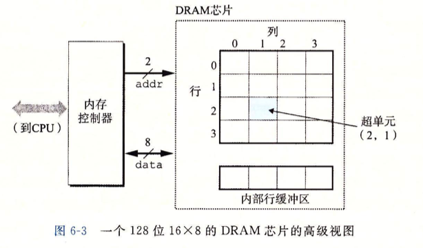
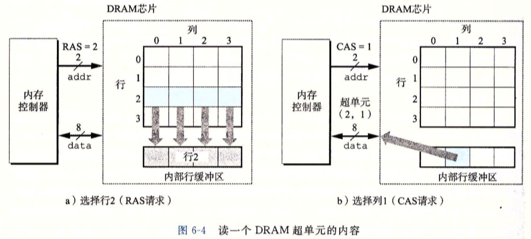
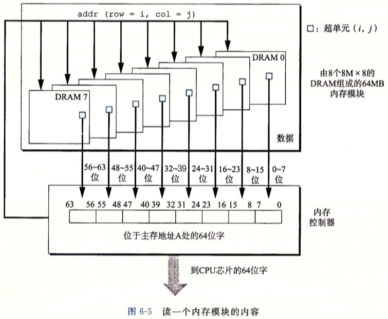
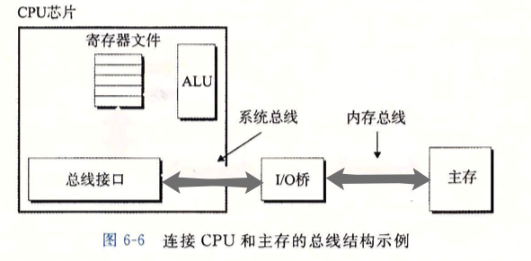
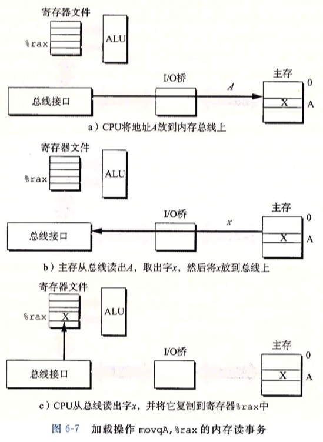
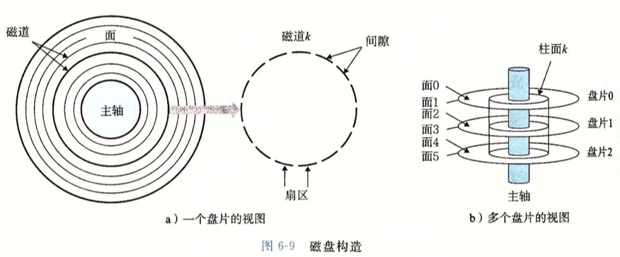
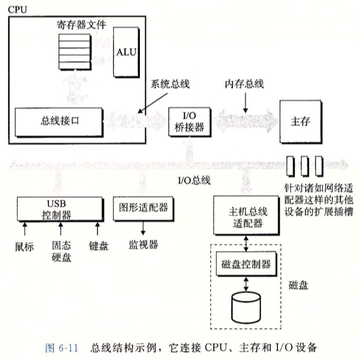
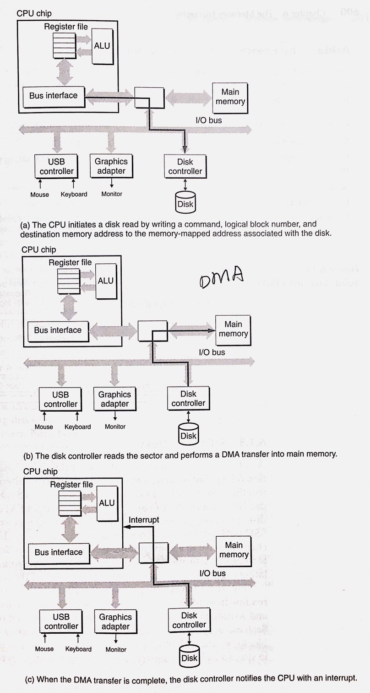
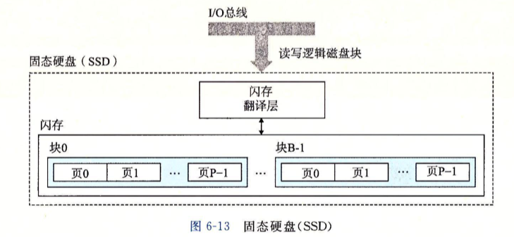
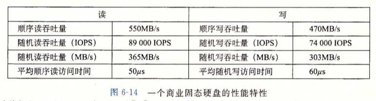

# Chp6 Memory Hierarchy

> Program Locality:
>
> 程序趋于访问相同, 或是邻近的数据项集合

## 1. Storage techs

- RAM (Random access memory)

  - Dynamic: Cheap, Slower

    - be used as Main Memory plus 
      the frame buffer of a graphic system
    - Several hundreds of thousands of MB.
    - charging on a capacitor for each bit

  - Static:  Faster, expensive

    - be used as Cache Memory

    - On and Off CPU chip

    - No more than a few MB in DesktopSys

    - Bistable (双稳态) memory cell for each  bit

      |      | Transistor /bit | Access Time | Persistent | Sensitive | Cost  | Application         |
      | ---- | --------------- | ----------- | ---------- | --------- | ----- | ------------------- |
      | S    | 6               | 1×          | ✅          | ❌         | 1000× | Cache Mem           |
      | D    | 1               | 10×         | ❌          | ✅         | 1×    | Main Mem, frame Buf |

  - Conventional DRAMs

    - structure

      

    - READ

      

    - Memory Modules

      

  - Enhanced DRAMs

    - FPM DRAMs (Fast Page Mode)

      faster when read SuperCells from the same line 

    - EDO DRAM (Extend Data Out DRAM)

      FPM DRAM to handle dense CAS

    - SDRAM (Synchronous DRAM)

      Faster

    - DDR SDRAM (Double Data-Rate Sychronous DRAM)

      SDRAM that can use two clocks as input signal to double the speed

      prefetch buffer (increase the effective bandwidth) size: 

      DDR (2 bits); DDR2 (4-bits); DDR3 (8 bits)

    - VRAM (Video RAM)

      Output whole line and move

      Parallel read and write

  - Nonvolatile Memory

    - Volatile: SRAMs and DRAMs will lose stored info when the suply voltage is turned off
    - ROM (Read-Only Memory): 
      - PROM (Programmable ROM): can be programmed only once;
      - EPROM: erasable PROM
      - flash memory
      - firmware: program stored in ROM

  - Accessing Main Memory

    

    I/O bridge: 

    - North bridge: connect to main mem
    - South bridge: connect to IO devices

    Data load

     

- Disk

  - Constructure

    2-side platter rotate 'round spindle 5400~15000 RPM

    

    disk driver = 2n * disk surface = n * track = sector+gap

  - Capacity

    - Recording density (bits/inch)
    - Track density (tracks/inch)
    - Areal density (bits/sq'inch) = R_density * T_density

  - Operation

    - read/write head + actuator arm

    - seek: put head in any trace; head flies at 80 km/h

    - read/write in the unit of a sector

    - seek time: Tseek_avg ≈ 3~9 ms (max to 20ms); up to tmp head position and actuator arm moving speed 

    - rotational time: Tmax_rotatino = 60s/RPM

      Tavg_rotation = 1/2 * Tmax_rotation

    - transfer time: Tavg_transfer = Tmax_rotation * (sectors ÷ num_of_sectors_in_trace)

    - (to find) the first byte is expensive

  - Logic disk block

    - Disk controller: a hardware/firmware to maintain the mapping between logic block and disk sector.
    - Disk controller translate block into (surface, trace sector)
    - Formatted disk capacity: meta data in gaps, identity defective cylinders and spare cylinders

  - IO devices

    - Universal Serial Bus (USB)

      Bandwidth: 3.0 625MB/s; 3.1 1250MB/s 

    - Graphics Card (adpter)

      Painting the pixels on screen on the behalf of CPU.

    - Host Bus Adapter

      interfaces: SCSI and SATA

    

  - Access Disks

    > CPU send instructions by memory-mapped I/O
    >
    > Address space preserve a block of address  as IOI(port)

    

    - DMA: Deviced that can read or write bus transaction itself, without any involvement od CPU is known as Direct Memory Access or DMA transefer
    - After DMA transefer and Data in memory, Disk controller will send a interrupt signal to CPU and marking I/O is finished.

- SSD

  - based on flash memory

  - plugs into a standerd disk slot on I/O bus (USB or SATA)

  - Flash memory chips act as platters

  - Flash translation layer (a hardware/fireware) act as disk controller

    

  - Block × B; Page × P; 

    PageSize = 512B~4KB

    BlockSize = 32~128Pages

  

- Storage  Technology Trends

  

  总结: 不同存储技术之间的差距要求现代计算机使用基于SRAM的Cache来弥补处理器-内存的性能差距; 弥补的前提是应用程序的局部性 (locality).

## 2. Locality

- Temporary Locality

  对于同一个内存位置, 被某程序引用过一次, 则在和可能在不久的将来被多次引用

- Spatial Locaity

  程序趋于访问相同, 或是邻近的数据项集合

> Locality Principle应用在计算机系统的各个层次
>
> - 硬件级别中: cache memory
> - 操作系统中: main memory作为virtual memory的缓存
> - 应用程序中: web本地缓存

- 程序数据引用局部性
- 取指令的局部性

## 3. Storage Hierarchy

## 4. Cache Memory

> Early stage: 
>
> 1. register file in CPU 
> 2. DRAM main memory 
> 3. Disk memory

- Add SRAM L1

  Between REG and Main memory

  Access in 4 cycles

- Add 