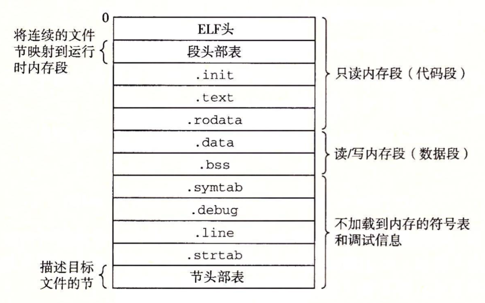
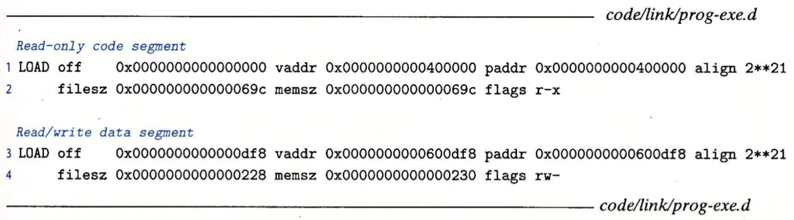
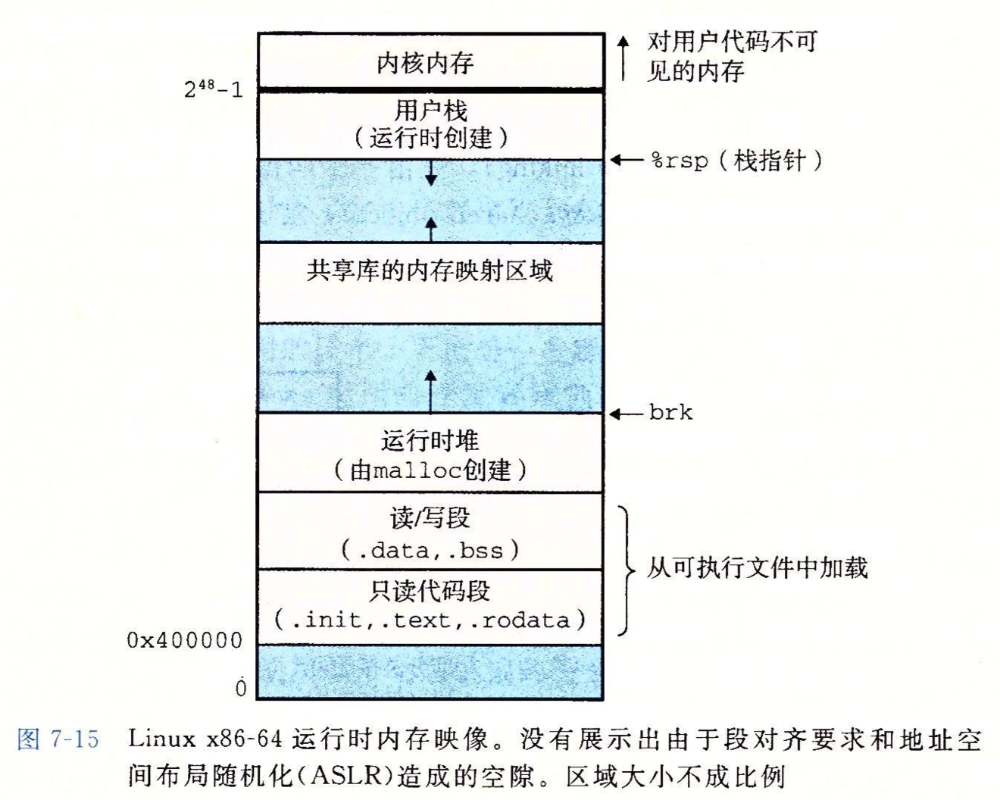
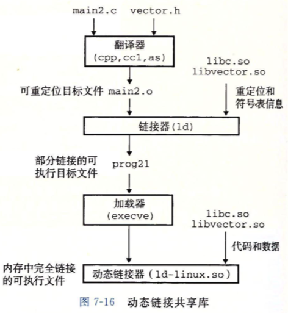
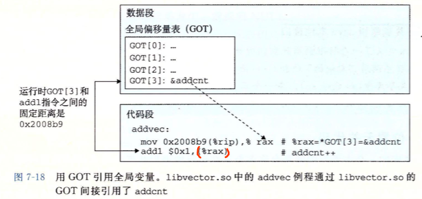
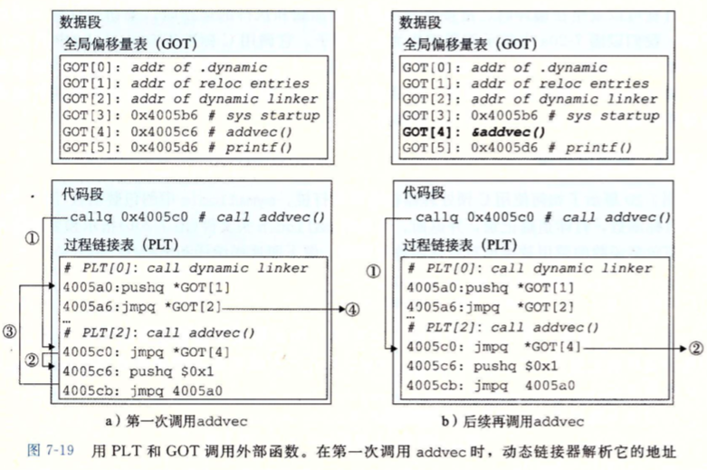

# Chp 7 Link

- Linking

  代码数据片段组合成单一可执行文件的过程, enable separate compilation

  执行时间

  - compile time
  - load time
  - run time

  连接类型

  - static link
  - dynamic link (in shared library when loading)

## 1. Compiler Driver

Compiler Driver contains

- Preprocessor [cpp]
- Compiler [cc1]
- Assembler [as]
- Linker [ld]

mian.c 
[cpp]=> main.i (ASCII intermediate file)
[cc1]=> main.s (ASCII assembly-language file)
[as]=> main.o (Binary relocatable object file)

func.c
[cpp]=> func.i
[cc1]=> func.s
[as]=> func.o

[ld main.o + func.o]=> prog

## 2. Static Linking

Static Linker Linux LD

- input: a group of **Binary relocatable object files** and cmd args

- output: fully linked, loadable and executable object file.

- massions:

  - symble resolution

    > - the symbles target file define and refered
    > - a symble represent a 
    >   - funtion
    >   - global variable
    >   - static variable
    > - to associate each symble reference with the definition

  - relocation

    > - code from compiler and assembler start in the address 0
    > - linker relocate thoes symbles with a certain memory position
    > - modify all references to thoes symbles to point at the position
    > - linker relocation's instraction is generated by assembler, called **relocation entries**

Object file:

- collections of blocks of byte
- blocks contains 
  - code
  - appication data
  - data structure that guide assembler load.
- Linker link these blocks by
  - relocate the position of blocks
  - modify positions in code data blocks
- Linker is independent to target machine, compilers and assemblers isn't.

Binary relocatable object file

- code sections
- data sections

## 3. Object File

- Relocatable object file: 

  Binary code and data. can be  associated with other relocatable object files to generate an executable object file.

  Generated by assembler.

- Executable file

  binary code and data, can be loaded into memory and execute

  Generated by linker.

- Shared object file

  a kind of special relocatable object file, can be loaded into memory and linked dynamically, at either load time or run time. 

  Generated by assembler.

- Object file format

  the format to organize object file

  First Unix: .out (the same as executable obj file)

  Windows: Protable Executable format (PE)

  MacOS-X: Mach-O

  Linux Unix: Executable and linkable Format (ELF)

## 4. Relocatable Object File


- ELF header: 

  16 bytes: 描述生成文件的系统的字大小和字节顺序 (大小端)

  Rest: 包含帮助linker解释和分析obj file的信息 

  - the size of ELF header
  - type of the obj file
  - machine type
  - offet of the section named section header table
  - the size and number of entried in the section header table

- ELF section header table:

  描述不同section的位置和大小, 每一个section中都有一个固定大小的entry

- Sections between header and section header table 

  > - .text: machine code of the compiled program
  >
  > - .rodata: read-only data. like jump table in switch, strings in printf
  >
  > - .data: 初始化的全局变量; 初始化的静态C变量 (local C variables are in stack or regs)
  >
  > - .bss: 未初始化的全局变量, 未初始化的静态变量, 所有被初始化为0的全局, 静态变量
  >
  >   obj file中这个section不占据实际空间, merely a place holder.
  >
  >   区分初始化和未初始化的var为了节省空间. 
  >
  >   未初始化的变量不用占据然和实际的存储空间, 运行时内存中分配这些变量为0
  >
  > - .symtab: symbol table. 存放程序中的函数, 全局变量的**定义和引用**信息
  >
  >   每个relocatable obj file都有. 不包含局部变量的entries
  >
  > - .rel.text: .text section中的location list. linker结合这个obj file时需要修改这些置. 调用外部函数和引用全局变量的指令都需要修改. executable obj file 中不需要重定位信息, 除非显式指明linker保留.
  >
  > - .rel.data: 模块中引用或定义的全局变量的重定位信息
  >
  >   已初始化的全局变量如果初始值是一个全局变量的地址或者外部定义函数的地址, 则需要在link时被修改
  >
  > - .debug: 调试符号表, 具有局部变量和类型定义的entries和C的源文件. -g编译时带有
  >
  > - .line: 原始C源程序行号和.text中机器指令的映射. -g编译时具有
  >
  > - .strtab: 字符串表. 包括symtab和debug中的符号表和header中的section names. 本质上是一个以null结尾的string sequence

## 5. Symbol and Symbol Tables

- Every relocatable object file (module m) has a symbol table 包含m定义和引用的符号信息, 每个symbol分为:
  - Global symbols in: 由m定义并能被其他module引用. 如非静态函数和全局变量

  - Global symbols out: 其他模块定义并被m引用的全局符号 (外部符号 extern UNDEF)如其他模块中的非静态函数和全局变量

  - Local symbols: 只被m定义和引用的局部符号. 静态C函数和全局变量, 在m中任何位置可见, 但是不能被其他模块引用

  不同于局部变量, 然而static的过程变量会在data or bss中, 并在symbol table中创建唯一名字的local linker symbol

Symbol table是汇编器产生的, 使用的是.s中的符号. 表中每一个entry的format

```c
typedef struct {
  int name;        /* Offset in strtab */
  char type: 4,    /* Function or Object */
  		 binding: 4; /* Local or Global */
  char reserved;   /* Unused */
  short section;   /* Section header table index */
  long value;      /* Section offset or abs addr */
  long size;       /* Object size in byte*/
} Elf64_Symbol
```

- name是对应的名字在strtab的offset, 指向以null结尾的string

- value是符号的名字, 对于relocatable来说是距离section header的偏移, 对于executable来说是绝对地址

- size是目标大小

- symtab除了符号entries, 还可以包含section的entries和原始源文件路径名entries

- section表示这些符号被分配到的section在section header table的引索

  pseudosections (只在relocatable带有) 在section header table中没有对应条目, 所以symbol的section会被linker特殊化解析为:

  - ABS: 不该被relocate的符号
  - UNDEF: 未定义的符号 (引用的extern外部符号, 包括函数)
  - COMMON: 还未分配位置的未初始化的数据目标 (value有对齐要求, size有最小大小)
    - COMMON section: 未初始化的全局变量
    - .bss section: 未初始化的静态变量, 初始化为0的全局或静态变量

## 6. Symbol Resolution

- Linker 通过 associate each symbol reference with a certain symbol definition (in  the input relocatable object file's symbol table) 来做 symbol resolution.

- 定义和引用在同一模块里:

  由编译器检查定义唯一, 同时编译器还保证静态局部变量(具有local linker symbol)名字唯一

- Compiler处理全局符号

  不是当前模块定义的symbol(变量名 函数名)会假设在其他模块中进行过定义

  在symtab中生成一个entry (section = UNDEF), 交给linker处理

  Linker在所有模块中都找不到的话则报错

### 6.1 Duplicate Symbol Names

- 强弱符号 (GLOBAL 不考虑static) 函数作为强符号

  - 强符号: 函数和已初始化(包括初始化为0)的全局变量 (.text .data UNDEF .bss) 
  - 弱符号: 未初始化的全局变量 (COMMON)

- 强弱规则: 

  1. 不允许多个同名强符号
  2. 若强符号和若符号同名, 选择强符号
  3. 多个弱符号同名, 选择任意
  4. 同名弱符号可进行强制的类型转换, 带来内存位覆盖的现象
  5. 强符号归类.data or .bss, 弱符号归类到COMMON将决定权交给Linker

- 静态构造必须模块内唯一, 分配到.data or .bss (不存在弱符号定义不明问题)

  多文件静态重名没有影响, 相互独立

### 6.2 Linking with Static Libraries

- Linker的工作方式

  - 读取relocatable object file, 连接后形成executable object file
  - 复制静态库到目标文件并输出executable object file
    - 静态库: 相关目标文件打包成一个单独的文件, 作为linker的输入
    - 常见的静态库: ISO C99定义的IO库

- 公共库的备选提供方式

  - 编译器集成. 如Pascal

  - 发布独立的库relocatable object file

    linux> gcc main.c /usr/lib/libc.o

    缺点在于库文件的副本太多, 运行时代码太多, 库的编译太漫长

  - 每个标准函数创建独立的relocatable object file
    linux> gcc main.c /usr/lib/printf.o ...

    缺点在于编译调用过程繁琐耗时

  - 静态库解决不同方法的缺点

    库函数为独立的模块, 在进行整体的静态库文件封装. 编译过程时指定库文件的名字来链接库中定义的函数

    linux> gcc main.c /usr/lib/libc.a

    链接时只复制被引用的目标模块,  提高空间利用率

- 静态库文件格式

  - archive 存档文件

  - 是一组链接的relocatable object file集合

  - archive文件头部描述了其包含的成员目标文件的大小和位置

  - 通过AR工具为自定义的文件创建archive

    linux> ar rcs arc_name.a reobj1.o reobj2.o

    在文件中或头文件声明过函数后就可以利用自定义的archive编译链接文件了

    linux> gcc -c main.c

    linux> gcc -static -o prog main.o ./arc_name.a

  - 链接器行为: -static表示构建一个完全链接的executable 加载时不需要再次链接

    在archive没有被源文件引用的模块不会被连接, 不会进入executable

### 6.3  Static Libraries to Resolve Reference

- Linker链接静态库采用了解析外部引用的方式(resolve external references)

  - Symbol resolution阶段: Linker从左向右扫描命令行上的relocatable object file和archive
  - Linker维护一个relocatable的集合E, E集合将会被合并为executable
  - 维护一个未解析符号集合U
  - 维护一个之前输入文件中定义过的符号集合D
  - 初始态: E, U, D都是空集

- 解析过程:

  - 扫描cmd line输入文件f, 判断是object file还是archive

  - 若为object file, 则将f放入E, 根据f的symtab填补D, U

  - 若为archive, 则尝试将U中的符号和archive中的成员匹配

    - 扫描archive中的成员文件. 
    - 若成员文件m定义了U中一个符号引用, 则添加m到E中
    - 删减U(根据符号), 扩充D(根据m). 
    - 扫描直到U, D不发生变化. 
    - 此时未进入E的archive成员文件被丢弃.
    - 继续处理下一个输入文件 

  - Linker扫描完成后, 检查U

    - U为空集: 合并和relocateE中的object file, 输出executable
    - U非空: ld输出错误, 链接失败

  - 解析过程决定了输入文件的顺序会影响link结果

    - archive文件如果早于其已用过的文件出现, 则引用将始终处于U(undefined)

    - archive文件一般放在命令行的结尾

    - 多个archive的成员函数相互独立, 则结尾的archive顺序随意

    - 若不独立, 则需要编译启动时手动重排列

      排列遵循向后定义原则: 前者外部引用的符号必须在后者定义

    - 为了满足依赖需求, cmdline上可以输入重复的库

      相互依赖型: 库x里引用了库y定义的符号, 反之亦真. foo.c 引用了二者

      linux> gcc foo.c libx.a liby.a libx.a

      (重复输入的只会是archive, obj扫描一次即可完成所有符号解析)

      或者合并libx和liby

## 7. Relcation

符号解析完成后, 每个符号的引用和其定义 (symtab中的entry)关联了起来.

此时可由symtab中得知每个symbal(全局变量和函数)的size (bytes), 开始重定位. 合并输入模块, 并为每个符号分配运行时地址

- 重定位section和符号定义

  - linker将所有同类型的section merge成为一个aggregate section. 作为输出的executable的section; 

  - linker将运行地址分配给新的aggregate sections, input modules, defined symbols. 
  - 此时每条指令和全局变量都有唯一的运行内存地址

- 重定位section中的符号引用

  - 通过relocation entries这一data structure, Linker修改.text .data中对每个符号的引用, 指向正确的运行时地址
  - 获取正确的引用地址依赖于relocatable object file中的数据结构, 即relocation entry

### 7.1 Relocation Entries

- assembler生成的二进制代码没有数据和代码的在内存的位置信息, 所以也无法得知引用的外部函数和全局变量的位置信息

- assembler遇到位置未知的引用时, 会生成relocation entry

- relocation entry的作用是告知linker在进行合并object时应该如何修改引用

- relocation entries **for CODE**被放置在obj的,rel.text section

  relocation entries **for DATA**被放置在.rel.data中

- relocation entry 结构定义

  ```c
  typedef struct {
    long offset;    //offset of the reference to relocate
    long type: 32,  //relocation type
    		 symbol: 32;//symbol table index 
    long addend;//constant part of relocation expression 
  } Elf64_Rela;
  ```

  - offset: 需要被修改的引用所在的section offset
  - type: 修改引用的类型
  - symbol: 被修改的引用应该指向的符号在symbol table中的index
  - addend: 有符号, 某些类型的relocation使用add-end对被修改的引用值做偏移调整

- ELF定义的relocation type共有32种, 其中以下两种最基本

  - R_X86_64_PC32:

    > relocation 引用目标:  32位的PC relative address
    >
    > PC relative定义可见chp3 6.3
    >
    > 注意执行某条指令时, PC当前指令的指向下一条指令 (fetch goes first)

  - R_X86_64_32

    > relocation 引用目标:  32位的absolute address
    >
    > 绝对寻址时, Linker使得CPU直接使用指令中的值作为有效地址, 不进行修改

  两种类型支持x86-64的small code model. 即假设exe obj的.text 和.data一共小于2GB, 所以通过32位寻址. GCC默认使用small code model.

  编译更大的文件需要修改relocation type和代码模型, 通过以下参数修改

  ```bash
  -mcmodel=medium
  -mcmodel=large
  ```

  

### 7.2 Relocating Symbol Reference

> 重定位算法

````pseudocode
foreach section s{
  foreach relocation entry r{
    /* ptr to reference to be relocated */
    refptr = s + r.offset; 
    /* relocate a PC-relative reference */
    if(r.type == R_X86_64_PC32){
    	/* ref's run-time address */
      refaddr = ADDR(s) + r.offset /*real pos*/  
      *refptr = (unsigned) (ADDR(r.symbol) + r.addend - refaddr) /*holder pos*/
     }
      
    /* relocate an absolute reference */
    if(r.type == R_X86_64_32) {
       *refptr = (unsigned) (ADDR(r.symbol) + r.addend)
    } 
  }
}
````

- 在每个section和section相关的relocation entry上迭代执行
- section s 假定为一个字节数组
- relocation entry r 假定为Elf64_Rela结构
- Linker为各个节和symbol选定的地址通过ADDR()得到
- ```refptr```是指向需要被重定位的引用的指针
- Compiler生成的汇编代码首先会标记全局符号的引用
- Assembler会根据每个引用产生relocation entry
- objdump会把relocation entry所见到一行, 紧跟在对应引用后

> example

```c
/* orginal main.c */
int sum(int *a, int n);
int array[2] = {1, 2};
int main(){
  int val = sum(array, 2);
  return val;
}

/* orginal sum.c */
int sum(int *a, int n){
  int i, s = 0;
  for (i = 0; i < n; i++) {
    s += a[i]
  }
  return s;
}
```

#### 1. relocation PC-relative reference

调用sum函数

```assembly
...
e: e8 00 00 00 00   callq 13<main+0x13> # sum()
          f: R_X86_64_PC32      # relocation entry
...          
```

call指令开始于section偏移0xe的位置, callq的操作码0xe8占1字节, 所以relocation entry的地址为0xf, Compiler在此提供一个占位符

assembler会相应地在.rel.text存放对应的relocation entry r, 其结构如下

- r.offset = 0xf   // 引用相对位置
- r.symbol = 'sum' // 引用符号 实为symbol table index
- r.type = R_X86_64_PC32 // 重定位类型
- r.addend = -4 

> relocation entry r 要传递给linker的信息是
>
> 需要对位于相对开始**位置0xF**处的PC相对引用重定位

> Linker执行时, 可以通过**已完成的重定位section和符号定义**确定出ADDR(s)
>
> 对于本例: 
>
> ADDR(s) = ADDR(.text) = 0x4004d0               // sum引用出现的节位置 
>
> ADDR(r.symbol) = ADDR(sum) = 0x4004e8 // sum定义的位置
>
> 由重定位算法可知
>
> ``refaddr = ADDR(s) + r.offset ``
>
> ``= 0x4004d0+ 0xf = 0x4004df``
>
> 即为sum被引用的内存位置
>
> ``*refptr = (unsigned) (ADDR(r.symbol) + r.addend - refaddr )``
>
> ``=(unsigned) (0x4004e8 + (-4) - 0x4004df) = 0x5``
>
> 即为PC和sum之间的相对位置
>
> (或者理解为ADDR(r.symbol) - tmp_PC = ADDR(r.symbol) - (refaddr + leng(ref) )  )
>
> linker修改后可得
>
> ```assembly
> 4004de: e8 05 00 00 00  callq 4004e8  sum()
> ```


#### 2. Relocating Absolute Reference

读取全局变量array

```assembly
9: bf 00 00 00 00  mov $0x0, %edi # &array   
		  a: R_X86_64_32 array
```

对于array的引用, 其relocation entry r包括

- r.offset = 9 + 1 = 0xa // bf操作符为mov
- r.symbol = array
- r.type = R_X86_64_32
- r.addend = 0

> Linker 从偏移量为0xa的位置开始绝对引用的重定位
>
> 并将这个位置直接替换为ADDR(array) + 0

```assembly
4004d9: bf 18 10 60 00 mov $0x601018, %edi
```

## 8. Executable Object File

- Generation of a program

  1. [VIM] - ASCII file > prog.c  #source code
  2. [cpp] - ACSII file > prog.i   #preprocesser
  3. [cc1] - ACSII file > prog.s   #compiler
  4. [as] - BIN OBJ file > prog.o #asembler
  5. [ld] - BIN EXE file > prog #linker   

- ELF executable object file

  

  - ElF head: 文件总体format和 entry point (运行时的首指令地址)
  - .text 同relocatable, 已经被重定位到运行时内存
  - .rodata 同relocatable, 已经被重定位到运行时内存
  - .data 同relocatable,  已经被重定位到运行时内存
  - .init: 定义了一个小函数```_ini```, 程序初始化时调用
  - executable是fully-linked, 不需要rel section

- Loading into Memory

  - continuous Chunk <—reflect into—> continuous Memory

  - 映射关系在program header table中描述

    

    - 内存段: ×2 (data-segment)

    - Read-only code: 具有 读/执行 访问权限

    - Read/write data: 具有 读/写 访问权限

    - vaddr 0x0…400000: 开始于虚拟内存0x400000处

    - align: 对齐要求

    - memz: 内存中的段大小

    - flags: 运行时访问权限

    - chuck1:

      filesz 0x0…69c: 初始化文件头0x69c字节

      包含ELF head, program head table自身, .init, .text, .rodata

    - chuck2: 

      off = 0xdf8: 从obj file第df8处开始

      filesz = 228: 0x228 byte

      包括.data中的初始化数据

      memz = 0x230 => 有8byte在.bss中初始化为0

  - Linker为section分配运行时的起始内存地址vaddr

    - 对其要求: vaddr % align = off  % align

      vaddr % align = 0x600df8 % 0x200000 = 0xdf8

      off % align = 0xdf8 % 0x200000 = 0xdf8

    - 对齐要求让loading更有效率, 因为虚存的组织方式

## 9. Loading Executable Object File

- Load

  ```shell
  linux> ./prog
  ```

  1. 调用存储器中的loader(OS代码)来运行
  2. Linux程序通过调用execve函数来调用Loader
  3. Loader将文件的代码和数据从Disk复制到Memory中
  4. 跳转(jump)到程序的第一条指令入口执行程序

  整个复制运行过程叫做Load

- 内存映像

  

  - 代码段起始位置: 0x400000 (Linux X86-64)
  - 向上紧接着数据段(填充ELF中的section)
  - 向上是runtime-heap (malloc占用空间, 向上生长)
  - 向上是为共享module保留的区域
  - 用户栈从2**48-1的地址向下生长
  - 系统内核(kernel)在2**48以上 (OS驻留内存)
  - 由于.data的对其要求, .text和.data之间有间隙
  - 分配stack, shared lib和heap时, Linker会使用ASLR (地址空间布局随机化)来随机程序运行时的地址 (Address Space Layout Randomization)

- Loader的工作方式

  - 创建内存映像

  - 在program head table指引下将objfile的chunk复制到内存的代码段和数据段

  - 跳转到程序入口(_start函数地址, 在ctrl.o中定义)

  - _start函数调用系统启动函数__libc_start_main(定义在libc.so中, 初始化运行环境, 调用用户层main函数, 处理main的返回值并与kernel交接控制权)

    > Linux系统的每个程序都具有自己的运行context和虚存空间
    >
    > shell运行一个程序时, shell会作为父进程生成一个子进程, 作为父进程的复制
    >
    > 子进程通过exeve系统函数启用loader
    >
    > loader删除子进程现有的虚存段, 创建新的代码, 数据, heap and stack section
    >
    > 新的heap和stack被初始化为0
    >
    > 通过将虚存中大小为页的空间映射到可执行文件中相同大小的片来初始化新的代码和数据段
    >
    > loader跳转到_start地址, 最终调用应用程序的main函数
    >
    > 除了header info, loader没有做过磁盘到内存的数据复制
    >
    > 当CPU寻址到一个被映射的虚拟页时才会进行复制
    >
    > 操作系统的调度机制自动将页面从磁盘传送到内存

## 10. Dynamic Linking with Shared Libraries

> - 静态库的维护和更新问题 —— 重新完成程序链接
> - 重复的代码片段重复复制进内存(不同成程序调用)

- Shared Libraries

  - 一个Object Module
  - 运行或加载时, 可以加载到任意的内存地址
  - 可以和任意一个内存中的程序链接起来——动态链接 (by dynamic linker)
  - shared library也称作shared object. Linux中以.so文件格式表示
  - MS的操作系统windows大量地使用了shared library, 并称之为DLL(Dynamic link libraries)

- 共享库的共享方式

  - 文件系统中, 一个lib只能对应一个.so文件, 所有引用库的exe可以共享so内的数据和代码, 无需复制到自身内

  - 内存中一个lib的.text section的一个副本可以被不同的进程共享

  - 编译生成共享库文件

    ```bash
    linux> gcc -shared -fpic -o libvector.so addvec.c multvec.c
    ```

    - ```-fpic```选项指示编译器生成PIC (position independent code)
    - ``-shared``选项指示编译器创建一个shared object file

  - 引用共享库文件

    

    ```bash
    linux> gcc -o prog2 main2.c ./libvertor.so
    ```

    - 创建EXE prog2
    - prog2在加载时(运行前)可以和libvector动态链接
      1. ld在静态执行一些链接
      2. 程序加载时, 动态完成链接过程
      3. ld复制了一些重定位和符号表的信息, 在运行时解析对库中代码和数据的引用
      4. exe中没有任何库中的代码或者数据
      5. Loader加载prog2时, 会发现prog2包含一个.interp section, 其中包含了动态连接器的路径名
      6. 动态链接器本身就是一个shared object (ld-linux.so)
      7. 有shared lib的情况下Loader不会把控制交给应用程序, 而是加载和运行这个动态链接器
      8. 动态链接器完成链接任务通过
         - 重定位libc.so的文本到某个内存段
         - 重定位libcvector.so的文本到另一个内存段
         - 重定位prog2中所有对libc.so和libcvector.so定义的符号的引用
      9. 动态链接器将控制递交给应用程序, 从此, 共享库的位置固定并且在执行中不会改变

## 11. Loading and Linking Shared Libraries from Applications

> 应用程序运行时要求动态链接器加载和链接某个共享库, 无需在编译时将库链接

- e.g. 

  - 分发软件: 下载新版本替代现有版本得出共享库后, 下一次运行程序会自动链接到新的共享库

  - web服务: web服务器生成动态内容

    将每个生成动态内容的函数打包到共享库中, 当web请求到来时, 服务器动态加载和链接与请求相关的函数探后调用; 而不是fork之后execve,再在子进程中运行函数. 动态链接使得函数一直缓存在内存中处理以后的请求

    无需停止运行中的服务器就可以更新已存在的函数或者添加新的函数

- Linux对运行时程序链接或加载共享库的接口

  ---

  ```c
  #include <dlfcn.h>
  void *dlopen(const char *filename, int flag);
  ```

  - 加载和链接共享库filename
  - 用RTLD_GLOBAL选项打的开库文件(全局库), 解析filename中的外部符号
  - 如果exe是带有-rdynamic选项编译的, 则其中的全局符号可用作符号解析
  - flag参数
    - RTLD_NOW: 告知ld立即解析对外部符号的引用
    - RTLD_LAZY: 告知ld推迟符号解析直到执行到filename中的代码
    - 可以和RTLD_GLOBAl取或, 标记为全局动态库
  - 成功返回指向句柄(管理内存动态库)的指针, 出错返回null

  ---

  ```c
  #include <dlfcn.h>
  void *dlsym(void *handle, char *symbol);
  ```

  - 输入一个之前打开共享库的句柄和symbol名字, 尝试解析改symbol
  - 符号存在于handle, 则返回符号地址, 否则null

  ---

  ```c
  #include <dlfcn.h>
  int dlclose(void *handle);
  ```

  - 如果没有其他共享库引用, 则卸载该共享库

  ---

  ```c
  #include <dlfcn.h>
  const char *dlerror(void);
  ```

  - 返回字符串, 描述调用dl函数时最近发生的错误信息

  ---

  - 调用实例

  ```bash
  linux> gcc -rdynamic -o prog_name dll.c -ldl
  ```

  

  ```c
  /* $begin dll */
  #include <stdio.h>
  #include <stdlib.h>
  #include <dlfcn.h>
  
  int x[2] = {1, 2};
  int y[2] = {3, 4};
  int z[2];
  
  int main() 
  {
      void *handle;
      void (*addvec)(int *, int *, int *, int);
      char *error; 
  
      /* Dynamically load the shared library that contains addvec() */
      handle = dlopen("./libvector.so", RTLD_LAZY);
      if (!handle) {
        fprintf(stderr, "%s\n", dlerror());
        exit(1);
      }
  
      /* Get a pointer to the addvec() function we just loaded */
      addvec = dlsym(handle, "addvec");
      if ((error = dlerror()) != NULL) {
        fprintf(stderr, "%s\n", error);
        exit(1);
      }
  
      /* Now we can call addvec() just like any other function */
      addvec(x, y, z, 2);
      printf("z = [%d %d]\n", z[0], z[1]);
  
      /* Unload the shared library */
      if (dlclose(handle) < 0) {
        fprintf(stderr, "%s\n", dlerror());
        exit(1);
      }
      return 0;
  }
  /* $end dll */
  ```

## 12. Position-Independent Code (PIC)

> - shared lib 的主要目的是允许多个正在运行的进程共享内存中的一份相同库代码
> - 分享机制:
>   1. 给每份库代码事先预留专用的地址空间片, 要求加载器总是在该地址上加载库代码
>      - 地址空间利用效率低, 预留空闲的空间
>      - 难以管理内存空间, 避免片的重叠
>      - 反复释放, 分配内存片给库代码, 碎片化
>   2. PIC
>      - 共享代码可以被加载到任意内存位置但无需linker修改程序代码
>      - 无限多个进程共享单一的代码段副本
> - 同一个objectfile内部的符号引用不需要PIC, 其本身用PC-relative进行寻址, 有静态linker重定位

### 12.1 PIC Data References

- 内存中的任何object module (包括shared module) 代码段和数据段的距离一定
- 运行时代码段中任何指令和数据之间的距离都是一个常量, 与其的运行时内存绝对位置无关 —— PC relative 的理论基础
- PIC在利用了PC-relative的这一特性, 在数据段的开始出创建了一张全局偏移量表(GOT)

#### Global Offset Table

- 每个被object module引用过的全局变量或者函数, 在GOT中都有一个8-byte entry

- Compiler为每个entry生成一个重定位记录

- Loading时, 动态链接器重定位GOT中的每一个entry, 使其包含正确的绝对地址

- 每个引用了全局目标的obj都有自己的GOT

  

- 使用了GOT (-fpic) 之后, 全局符号的引用变为对GOT的引用后再解引用
- 对GOT的引用利用了PC-relative(GOT位于代码段开头)

### 12.2 PIC Function Calls

- 应用程序调用了共享库代码时, 编译器无法预测库函数运行时地址 (库函数会被在加载到任意位置)

- Compiler为其生成一条重定位记录

- 动态连接器在加载程序时在解析重定位记录

- GNU的lazy-binding技术: 将地址绑定推迟到第一次调用过程时

  - 优点: 避免大型库函数内的所有项目都在被加载时被ld-linux.so重定位
  - 缺点: 第一次调用开销大, 但之后的调用只需要一条指令和一次内存引用

- lazy-binding的实现

  - 两个数据结构

    1. GOT (GLOBAL OFFSET TABLE)
    2. PLT (PROCEDURE LINKAGE TABLE)

  - 每个调用了共享库的objfile都有自己的GOT和PLT

    - GOT位于数据段
    - PLT位于代码段

  - GOT和PLT协作, 在运行时解析共享库内函数地址

    - PLT: PLT是一个数组, 每个entry是一个16byte代码;

      - 特殊的PLT[0]将跳转到ld-linux.so中
      - 每个被应用程序调用的库函数都有自己的PLT entry; 每个entry负责调用一个具体的函数
      - PLT[1]调用系统启动函数 (__libc_start_main), 初始化执行环境, 调用main函数并处理器返回值
      - PLT[2]开始调用用户代码调用的函数

    - GOT: GOT是一个数组, 每个entry是8-byte的字节地址:

      - 与PLT联合使用, GOT[0]和GOT[1]包含ld-linux.so在解析函数地址时会使用的信息
      - GOT[2]是ld-linux.so的程序入口
      - 其他的条目各对应一个被调用的函数
      - 当函数地址被解析时, 每个entry对应一个PLT entry
      - 初始时, 每个GOT都指向相同函数对应的PLT的下一条指令

    - 实例

      

      - 第一次调用addvec

        1. 程序调用直接进入PLT[2] (addvec的entry)

           ```assembly
           ## prog ##
           callq 0x4005c0 # call addvec()
           ## PLT ##
           4005c0: jmpq *GOT[4]
           ```

        2. 通过GOT[4]间接跳转到PLT[2]的下一条指令

           ```assembly
           ## GOT ##
           GOT[4]: 0x4005c6
           ```

           ```assembly
           ## PLT ##
           4005c6: pushq $0x01 # funcID
           4005cb: jmpq 4005a0 # to PLT[0]
           ```

        3. 把addvec的ID (0x01)压栈, 跳转到PLT[0]

           ```assembly
           ## PLT ##
           4005a0: pushq *GOT[1] # PçLT[0]
           4005a6: jmpq *GOT[2]
           ```

        4. PLT[0]把GOT[1]压栈, 作为ld-linux.so的参数, 跳转到GOT[2]间接跳转到ld-linux.so

           ```assembly
           ## GOT ##
           GOT[0]: addr of .dynamic
           GOT[1]: addr of reloac entry
           GOT[2]: addr of dynamic linker
           ```

        5. ld-linux.so开始执行, 通过当前stack上的ID和GOT[1]作为参数来解析函数运行时位置, 并用这个位置重写GOT[4], 完成GOT填写, 并返回PC到addvec

      - 后续调用addvec

        1. 跳转到同样的PLT[2]
        2. PLT[2]跳转到GOT[4] (对应的entry)
        3. GOT[4]直接转移PC到addvec的运行地址

## 14. Tools for Manipulating Object File

> Include GNU binutils
>
> - AR: 创建静态库, 操作库中的成员
> - STRINGS: 列出.o文件中.data(RO) section内所有可打印的string
> - STRIP: 从.o文件中删除symbol table (LInker需要)
> - NM: 列出.o文件中symbol table的所有定义的符号名
> - SIZE: 列出.o文件中sections的名称和大小
> - READELF: 显示.o文件的完整结构, 包括ELF header中的编码信息和SIZE以及NM的功能
> - OBJDUMP: 二进制解析解析工具基础, 可以显示一个.o文件的所有信息; 包括将,text中的二进制指令反汇编
> - LDD: 列出可执行文运行时需要的所有共享库
