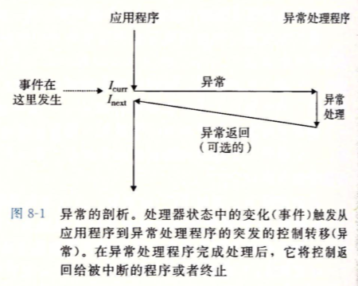
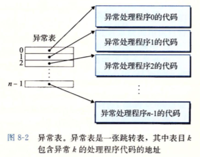
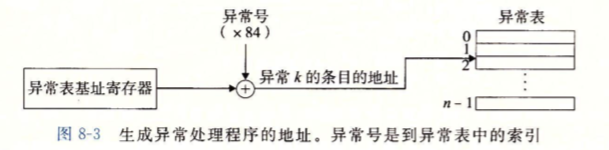
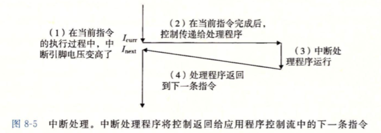
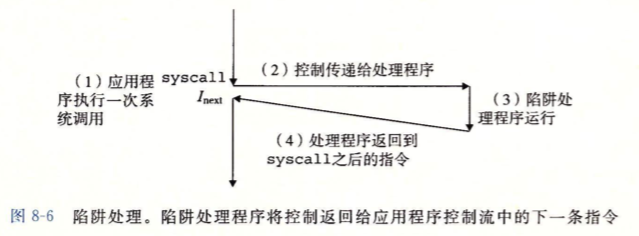
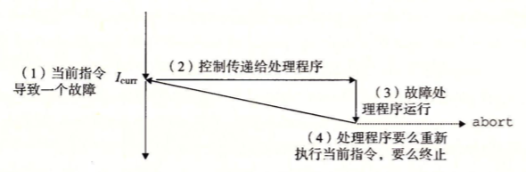
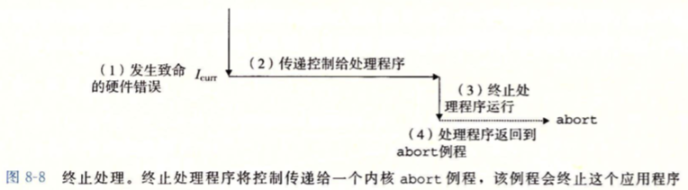
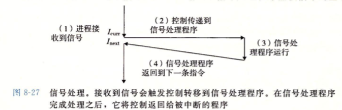

# Chp 8 Exceptions

现代系统通过使控制流突变来处理程序外部的系统状态变化

- 程序外部的状态突变: 异常控制流 —— Exception Control Flow, ECF
- ECF发生于计算机新系统各个层级: 
  - 硬件层: 硬件检测到的事件触发控制转移到ECF
  - OS: Kernel通过context switch切换控制进程
  - 应用层: 进程间的signal通讯和handler机制
- Meaning of ECF
  - ECF是OS实现I/O, 进程和VM的基本Mechanism
  - ECF实现了应用程序和OS的交互 (trap, syscall) 向OS请求服务
  - 利用ECF Mechanism编写多进程多线程的程序
  - ECF实现了软件异常处理 (try catch throw) setjump longjmp实现非本地跳转

## 1. Exception

- 一种ECF的形式, 一部分由OS实现, 另一部分由Hardware实现

  

  1. CPU state发生了重要的改变, 处理器正在执行指定I_curr

  2. 处理器中的状态被编码为不同的位和信号

  3. state change = event 可能和Icurr相关 (访问内存缺页, 算数溢出, 除零指令...)

     event可能和Icurr无关 (OS_alarm, I/O请求完成)

  4. 处理器检测到event时, 会通过exception table (本质是jump table) 进行间接过程调用(异常发生)

  5. 跳转到OS中专门让处理event的子程序exception handler. 

  6. 处理完成后, 根据异常种类发生:

     1. handler把PC返回给当前指令Icurr, 重新执行当前指令
     2. handler把PC返回给Inext, 即没有异常发生时的下一条指令
     3. handler终止被exception中断的程序

### 1.1 Exception Handling

- 处理异常需要软硬件协作

  - 计算机系统为每一种异常都分配了唯一的非负整数的标识——Exception number

    - 一些Exception number由CPU的设计者分配

      包括 除零, 缺页, 内存非法访问, 断电, 算数溢出 etc.

    - 其他由OS Kernel的设计者分配

      包括syscall, 外部I/O设备信号 etc.

  - 系统启动时OS分配和初始化Exception Table是的表目k包含异常k的处理程序地址

    

  - 运行程序时, CPU检测到event后可以确定异常号k, 随后处理器**触发异常**

    - 通过Exception Table执行间接过程调用, 转到条目k对应的处理程序''

    - 异常号作为异常表的索引, 异常表的起始地址有自己的硬件装置——Exception table base register (异常表基址寄存器, 一个位于CPU的寄存器)

      

  - 异常处理与过程调用类似, 不同有

    - 异常不遵守栈规则, 不把返回地址压栈. 根据异常种类返回
    - CPU会把额外处理器状态压栈, handler返回时, 被中断的应用程序会需要这些状态
    - 控制有用户程序转移到kernel时, 所有的项目都会被压栈到内核的栈中, 而不会用户栈
    - 异常的handler运行在系统的内核下, 对所有资源都有完全访问权限

- 硬件触发异常后, 由软件完成异常处理程序

  - handler处理完毕事件后, 通过执行特殊的"从中断风格返回指令",  可以回到被中断的程序
    - 该指令将适当的状态弹回到处理器控制和数据寄存器中
    - 异常中断如果是用户程序, 则切换为用户模式, 返回控制权给中断的程序

 ### 1.2  异常的类别

> 1. interrupt 中断
>    - 原因: 来自IO设备的信号
>    - 异步处理
>    - 返回到下一条指令
> 2. trap 自陷
>    - 有意识触发的异常
>    - 同步处理
>    - 返回到下一条指令
> 3. fault 故障
>    - 潜在的可恢复的错误
>    - 同步处理
>    - 可能会返回当前指令
> 4. abort 终止
>    - 不可恢复的错误
>    - 同步处理
>    - 不返回
>
> 同步指令统称为faulting instruction (故障指令)

#### I. Interrupts

- 异步发生, 处理来自I/O设备的信号结果

- 硬件中断没有专门的指令造成, 会等待当前指令执行完后再处理异常——异步处理

- handler称之为interrupt handler

- 实例

  1. I/O设备 (网络适配器, 磁盘控制器, 定时器芯片等)向CPU的一个一个引脚发送信号, 并将异常信号放在总线上了来触发interrupt
  2. 当前指令执行完成之后, 处理器检测到信号(引脚电压升高), 就从总线读取异常信号, 调用适当的中断处理程序 (硬件调用)
  3. 处理程序返回时, CPU把PC交还给下一条指令, 程序继续执行, 就像没有中断一样

  

#### II. Traps and System Call

- 自陷是有意触发的异常, 是由一条指令引起的结果 (同步处理)

- 自陷的handler返回控制到下一条指令

- 自陷最重要的作用是在用户程序和系统之间暴露一个像过程一样的借口 —— System Call

  - 用户程序需要向内核请求服务(读文件 read, 创建子进程 fork, 加载程序 execve, 终止当前进程 exit)

  - 为了允许应用程序对系统服务的访问, CPU提供了 'syscall n' 指令来调用服务n

  - syscall指令会导致一个到异常处理程序的自陷, handler解析syscall的参数, 调用内核进程完成服务

    

- 程序员角度的syscall和普通函数调用一样

- 普通函数(用户程序函数)调用与syscall实际非常不同

  - 普通函数只能运行在用户模式中
    - 限制了可用指令的类型
    - 只能访问函数所在的栈
  - syscall运行在内核模式中
    - 允许执行特权指令
    - 可以访问内核内定义的栈

#### III. faults

- 故障又错误引起, 可以被handler处理和修正

- 故障发生时, CPU将控制移交给handler

  - handler如果可以修正错误, 则返回到引起故障的指令重新执行
  - 否则让handler返回到内核的abort例程(routine), 终止引起故障的应用程序

  

- 实例: Page Fault 缺页异常

  指令引用一个地址, 然而地址对应的物理页不在内存中, 需要从磁盘取出

  handler从磁盘加载适当的页后返回给当前指令, 再次执行时对应物理页已经在内存中了, 指令即可正常运行

#### IV. Abort

不可恢复的指明错误导致的结果, 通常是硬件错误 (DRAM或者SRAM位被损坏是发生的奇偶错误)

handler将控制返回给abort routine, 用户程序被终止



### 1.3 Linux/x86-64系统中的异常

> 一共具有256种异常类型
>
> 0~31 由Intel构架师定义的异常, 对所有x86-64系统一致
>
> 32~255 由linux定义的中断和自陷
>
> 例如:
>  0号异常 — 除法错误 — fault
> 13号异常 — 一般保故障 — fault
> 14号异常 — 缺页 — fault
> 18号异常 — 硬件宕机 — abort
> 32~255 — 系统定义异常 — interrupt or trap 

#### I. Linux/x86-64 Faults and Aborts

- Divide error

  除零错误, 除法溢出错误. 0号硬件异常. 

  Unix没有回复措施, 直接终止应用; 

  Linux Shell报错为 "Floating Exception"

- General protection fault

  不为人知的一般性保护故障. 通常由于程序引用了未定义的VM区域, 或者写入一个只读文本

  Linux没有回复措施, 直接终止程序;

  Linux Shell报告为 "Segment Fault"

- Page fault

  会重新执行导致异常的指令, handler会修该故障

- Machine check

  指令执行中检测到硬件发生fatal错误, handler不返回, 直接终止

  fatal error指的是软件原理上无法修复的错误, 由物理结构变换引起的

#### II. Linux/x86-64 System Call

- Linux提供几百种系统调用提供给请求内核服务的应用程序使用

- 包括读文件, 写文件, 创建新进程; 每个syscall都有唯一的编号, 与内核的跳转表偏移量对应 (并非是Exception Table)

  | 编号 |  名称  |          描述          |
  | :--: | :----: | :--------------------: |
  |  0   |  read  |         读文件         |
  |  1   | write  |         写文件         |
  |  2   |  open  |        打开文件        |
  |  3   | close  |        关闭文件        |
  |  4   |  stat  |      获取文件信息      |
  |  9   |  mmap  |    将内存映射到文件    |
  |  12  |  brk   |       重置顶heap       |
  |  32  |  dup2  |      复制文件描述      |
  |  33  | pause  | 挂起进程直到signal到达 |
  |  37  | alarm  |  调度闹钟signal的送达  |
  |  39  | getpid |       获取进程ID       |
  |  57  |  fork  |        创建进程        |
  |  59  | execve |      执行一个进程      |
  |  60  | _exit  |        终止进程        |
  |  61  | wait4  |      等待进程终止      |
  | 652  |  kill  |   ; 发送signal到进程   |

- 实例: 利用syscall编写 hello world

  ```c
  int main(){
    write(1, "hello, world\n", 13);
    _exit(0);
  }
  ```

  ```write```第一个参数指将要发送给stdout(屏幕文件), 第二个参数为要写的字节序列, 第三个参数为要写的字节数;

  ```assembly
  /* $begin hello64-s 1 */
  .section .data
  string:
          .ascii "hello, world\n"
  string_end:
          .equ len, string_end - string
  .section .text
  .globl main
  main:
          # First, call write(1, "hello, world\n", 13)
          movq $1, %rax        # write is system call 1        
          movq $1, %rdi        # Arg1: stdout has descriptor 1 
          movq $string, %rsi   # Arg2: hello world string
          movq $len, %rdx      # Arg3: string length           
          syscall              # Make the system call         
  
          # Next, call _exit(0)
          movq $60, %rax       # _exit is system call 60     
          movq $0, %rdi        # Arg1: exit status is 0      
          syscall              # Make the system call        
  /* $end hello64-s 1 */
  ```

  利用寄存器保存参数后, 直接调用指令syscall调用系统服务

> 异常类型的区分会根据系而不同
>
> - ISA规范区分为 异步 => interrupt; 同步 => exception

## 2. Processes


## 5. Signal

> A kind of software exception
>
> A signal is a little message
>
> - From: SYSTEM
> - TO: APPLICATION
> - CONTENT: a kind event in sys
>
> 底层硬件异常由kernel处理, 一般用户不可见; signal可以通知用户这些异常的发生
>
> 高级的软件事件也可以发送信号

| 序号 | 名称      | 默认行为        | 事件                         |
| ---- | --------- | --------------- | ---------------------------- |
| 1    | SIGHUP    | 终止            | 终端线挂断                   |
| 2    | SIGINT    | 终止            | 键盘中断(Ctrl+c) 软件发出    |
| 3    | SIGQUIT   | 终止            | 键盘退出                     |
| 4    | SIGILL    | 终止            | 非法指令                     |
| 5    | SIGTRAP   | 终止 dump core  | 跟踪陷阱                     |
| 6    | SIGABRT   | 终止 dump core  | abort函数的终止信号          |
| 7    | SIGBUS    | 终止            | 总线错误                     |
| 8    | SIGFPE    | 终止 dump core  | 浮点异常                     |
| 9    | SIGKILL   | 终止            | 杀死进程信号 (软件发出)      |
| 10   | SIGUSR1   | 终止            | 用户定义的信号1              |
| 11   | SIGSEGV   | 终止 dump core  | 无效内存引用 (seq fault)     |
| 12   | SIGUSr2   | 终止            | 用户定义的信号2              |
| 13   | SIGPIPE   | 终止            | 写入没有读用户的pipe         |
| 14   | SIGALRM   | 终止            | 来自alarm函数的定时信号      |
| 15   | SIGTERM   | 终止            | 软件终止信号                 |
| 16   | SIGSTKFLT | 终止            | 协处理器的栈错误             |
| 17   | SIGCHLD   | 忽略            | 子进程的终止或者结束         |
| 18   | SIGCONT   | 忽略            | 继续停止的进程               |
| 19   | SIGSTOP   | 停止直到SIGCONT | 不是来自终端的终止信号       |
| 20   | SIGSTP    | 停止直到SIGCONT | 来自终端的终止信号           |
| 21   | SIGTTIN   | 停止直到SIGCONT | 后台向终端读                 |
| 22   | SIGTTOU   | 停止直到SIGCONT | 后台向终端写                 |
| 23   | SIGURG    | 忽略            | 套接字紧急情况               |
| 24   | SIGXCPU   | 终止            | CPU时间超出限制              |
| 25   | SIGXFSZ   | 终止            | 文件大小超出限制             |
| 26   | SIGVTALRM | 终止            | alarm满期                    |
| 27   | SIGPROF   | 终止            | 剖析定时器满期               |
| 28   | SIGWINCH  | 忽略            | 窗口大小变化                 |
| 29   | SIGIO     | 终止            | I/O possible on a descriptor |
| 30   | SIGPWR    | 终止            | 电源故障                     |

> core dump意为将内存内程序的数据和代码导出到磁盘上存储
>
> SIGSTOP不可被捕获和忽略

### 5.1 Terminology

- 传送一个signal到目的进程的步骤

  1. Sending a signal:

     Kernel通过更新目标进程的context的某个状态, 发送或者递交signal给子进程.

     发送的原因有:

     1. Kernel检测系统事件(/0, 子进程终止)
     2. 另一个进程调用了kill(send)函数来指定内核发送信号

  2. Receiving a signal:

     目标进程被kernel强迫对signal做出反应, 可以做出默认反应, 也可以通过signal handler的用户层函数捕获信号

     1. 进程接收到信号
     2. 进程传递到signal handler
     3. signal handler运行
     4. signal handler返回到下一条指令

     

  3. Pending signal

     发出但是没有被接收的信号. 任意时刻, 一种类型至多只能有一个pending signal. 没有列队的机制, 重复的pending signal会被丢弃

  4. 进程可以选择性的block某种signal, 当某种signal被block后, 他仍可以被发送, 但不会被接收, 除非取消block

     一个pending signal至多只会被接收一次. Kernel为每个进程在pending bits vector中维护pending signal的集合, 在blocked bits vector中维护block signal集合. k类信号对应于vector的第k位