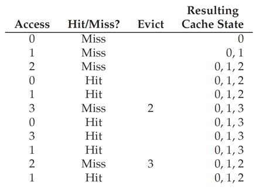
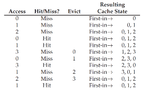
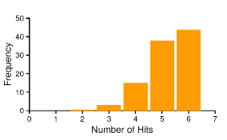
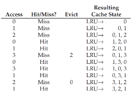
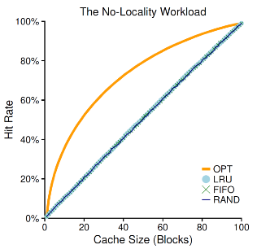
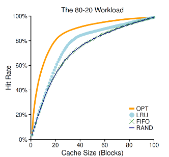
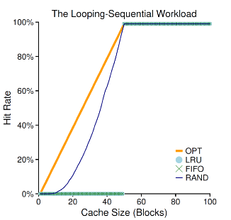
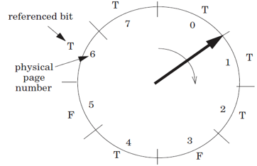
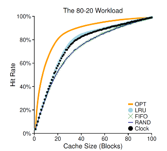

# Chp22 Page Replacement Policies

> 发生page fault的时候, OS会在free page中找出一个, 按照PTE上的磁盘位置填充PP.
>
> 然而物理内存空间不足时, OS必须选择内存中的Allocated Page进行淘汰. 本章主要讲述OS选择evict pages的相关策略. 这些策略遵循一些原则, 也要规避一些边界情况.

## 1. Cache Management

将物理内存视为是VP的Cache, evict策略需要尽量的减少cache miss, 即page fault.

衡量指标:

- AMAT: Average Memory Access Time 平均内存访问时间

  AMAT = (P~Hit~ · T~M~) + (P~Miss~ · T~D~) 

  - T~M~ : 内存访问时间, 约为100ns
  - T~D~ : 硬盘访问时间, 约为10ms
  - P~Hit~: 内存数据命中概率(访问的VP是Cached)
  - P~Miss~: 内存数据脱靶概率(访问的VP是Uncached)
  - P~Miss~ + P~Hit~ = 1.0

- T~M~与T~D~差距悬殊(10^5^).

  - 访硬盘的开销是巨大的
  - P~Miss~对AMAT的权重更大, 及时是微小的波动也会主宰AMAT
  - 降低Miss Rate会对AMAT带来很大的改善

## 2. The Optimal Replacement Policy

- 最优的替换策略 MIN — Belady 被证明会导致最小的Miss数和Miss Rate:

  替换在最远的未来会被使用的Page

- Trace

  - access: 0, 1, 2, 0, 1, 3, 0, 3, 1, 2, 1
  - MemorySize: 3 pages

  - Memory is empty initially

  

  - 前三次: cold-state miss or compulsory miss

  - 第一次evict 比对内存中现有的page: 0, 1, 2

    在已知的访问序列中

    - 0将会在下一次访问
    - 1将会在3次后访问
    - 2将会在4次后访问
    - 2符合在最远的未来被访问的page, 淘汰之, Paging in 3

  - 第二次evict, 现有序列为0, 1, 3

    - 1将会在下一次访问
    - 0, 3将在无穷远访问, 都可以淘汰
    - 选择淘汰3, paging in 2

  - 由于访问序列不可知, MIN-Belady无法实现. 但会作为Optimal与其他策略比对

## 3. FIFO

将内存视为queue, 淘汰策略为first-in, first-out. 十分容易实现

hit的page不会改变queue顺序

- P~Hit~ = 36.4%
- FIFO没有栈性质, cache size变大不会必然导致P~Hit~增加

## 4. Random

随机淘汰

## 5. LRU

Least-Frequently-Used最久远使用过: 利用历史记录来指导对未来的猜测:

- 如果一个page在最近被访问, 则有可能在不远的未来再次被访问

- 如果一个page很久都没有被访问, 则有可能他很久之后才会被访问或者不再会被访问

- 利用了时间局部性的思想

  

- 具有栈属性的淘汰算法

  小cache size储存的结果是大小cache size储存结果的子集

  大的Cache SIZE带来更高的hit rate

  - LRU, Optimal

## 6. Workload Example

### 1. Random Access

除OPT外差别不与大

### 2. 80-20 Workload

LRU更可能保持热度高的Page

### 3. “Looping Sequential” Workload

- Common in many applications such as databases
- A worst case for both LRU and FIFO
  - kick out older pages
  - these older pages are going to be accessed sooner than the pages that the policies prefer to keep in cache 
  - even with a cache of size 49, hit rate remains 0% 
- Random fares notably better
  - not quite approaching optimal, but at least achieving a non-zero hit rate
  - not having weird corner-case behaviors
  - **used as TLB replacement policy**

## 7. Implementing LRU

- Hardware should put a time stamp on each physical page whenever it is accessed
- When evicting, it should sort the pages by their time stamps
- It may be too many pages to be sorted 
  - One million pages for 4GB memory with 4KB page-size

## 8. Approximating LRU

- Clock Algorithm

  - Access bit

    - a hardware bit for each page
    - Set to true when accessed
    - Pages are organized as a clock

  - Start from a position

    - Move clockwise and checks the bit page-wise
    - If T, clear to F
    - If F, choose as the victim and stop.

    

- It doesn’t do quite as well as perfect LRU
- It does better than approaches that don’t consider history at all
- It can use dirty bit to reduce disk writing furthur

## 9. Dirty Pages

- Clock Algorithm Expand: 淘汰时检查是否是脏页
  - 脏页不淘汰, 检查下一页
  - 若不存在clean page, 强制淘汰写回一页

## 10. Other VM Policies

- When to bring pages into memory?
  - Demand paging
  - Prefetching
    - the OS could
      - guess a page is about to be used
      - and bring it in ahead of time
  - Clustering (grouping)
    - Set two numbers as low/high water mark
    - when available page number is less than the low water mark, 
    - OS begins to evict pages
    - until the number of available pages reaches the high water mark

## 11. Trashing

- admission control 
  - not to run some processes
  - hope to reduce working sets (the pages that they are using actively) to fit in memory
- out-of-memory killer
  - A daemon 
  - choose a memory intensive process and kill it
  - thus reducing memory
  - it kills the X server and thus renders any applications requiring the display unusable

