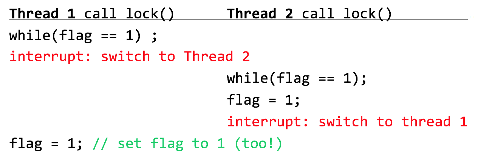
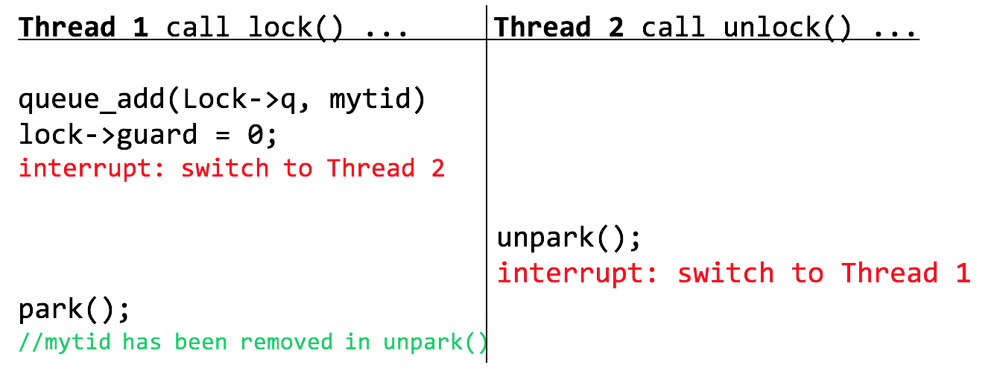

# Chp28 Locks

## 1. Basic Idea

- We have introduced how to protect a **critical section** using semaphores. Now we introduce a more basic way – lock
- Lock is type of variables 
  - Each lock variable has   
    - Two states: unlocked or locked
      - Unlocked: no thread holds the lock (also known as available or free)
      - Locked: exactly one thread holds the lock (known as acquired or held)

## 2. Pthread Locks

```c
pthread_mutex_t lock = PTHREAD_MUTEX_INITIALIZER;
/* or */ 
int rc = pthread_mutex_init(&lock, NULL);

pthread_mutex_lock(&lock);
balance = balance + 1;
pthread_mutex_unlock(&lock);

int pthread_mutex_trylock(pthread_mutex_t *mutex);
int pthread_mutex_timedlock(pthread_mutex_t *mutex, struct timespec *abs_timeout);
```

- The trylock() returns failure if the lock is already held
- the timedlock() returns after a timeout or after acquiring the lock, whichever happens first

## 3. Building A Lock
- The perspective of a programmer
  - How should we build a lock?
  - What hardware support is needed?
  - What OS support?

## 4. Evaluating locks

- Mutual exclusion
- Fairness
- Performance

## 5. Controlling Interrupts

- Disable interrupts for critical sections
  - One of the earliest solutions
  - Invented for single-processor systems
  - Very simple

```c
void lock() {
 	DisableInterrupts();
}
void unlock() {
 	EnableInterrupts();
}
```

-  Cons
  - Allow any calling thread to perform a *privileged* operation (turning interrupts on and off), and thus *trust* that this facility is not abused
  - Does not work on multiprocessors
  - Turning off interrupts for extended periods of time can lead to interrupts becoming lost which can lead to serious systems problems
  - Inefficient

- Only used in kernel when OS accesses its own shared data structures

## 6. Test and Set

First Attempt: A Simple Flag

```c
typedef struct __lock_t { int flag; } lock_t;

void init (lock_t *mutex) {
   mutex->flag = 0; // 0 -> lock is available, l -> held
}

void lock (lock_t *mutex) {
   while (mutex->flag == 1) ; // spin-wait (do nothing)
   mutex->flag = 1; // now SET it!
} 

void unlock(lock_t *mutex) { mutex->flag = 0; }
```

Two problems:

- Correctness



- Performance
  - Spin-waiting: endlessly check the value of flag
  - Waste time waiting for another thread to release a lock
  - The waste is exceptionally high on a uniprocessor 

## 7. Spin Lock: Test-and-Set

- Atomic Exchange: Test-and-set instruction
  - Read and Set Memory
  - On SPARC: ldstub
  - On x86: xchg

```c
/* Begin Atomically Perform */
int TestAndSet(int *old_ptr, int new) {
   int old = *old_ptr;  // fetch old value at old_ptr
   *old_ptr = new;      // store ‘new’ into old_ptr
   return old;          // return the old value
}
/* End Atomically Perform */
```

```c
typedef struct __lock_t { int flag; } lock_t;

void init (lock_t *lock) {
   lock->flag = 0; // 0 -> lock is available, l -> held
}

void lock (lock_t *lock) {
   while (TestAndSet(&lock->flag, 1) == 1)
      ; // spin-wait (do nothing)
} 

void unlock(lock_t *lock) { lock->flag = 0; }
```

- Correctness

  - Using the One-Writer Principle

  - Two threads on one CPU, both want to acquire the lock 

    - Case-1:

      A:   Set flag[A], Read flag[B], ------------------

      B:   ------------------, Set flag[B], Read flag[A]

    - Case-2:

      A: -------------------, Set flag[A], Read flag[B]

      B: Set flag[B],  Read flag[A], ------------------

    - Case-3:

      A:  Set flag[A], ------------------, Read flag[B]

      B:    -------, Set flag[B], Read flag[A], ---------

  - May cause live lock

  - It does not work on multiprocessor machine

## 8. Evaluating Spin Locks

- Correctness
  - A correct lock
- Fairness
  - Spin locks don’t provide any fairness guarantees
  - May lead to starvation
- Performance
  - Single CPU: quite painful
  - Multiple CPUs: reasonably well

## 9. Compare-And-Swap

```c
/* Begin Atomically Perform */
int CompareAndSwap(int *ptr, int expected, int new) {
 	int actual = *ptr;
 	if (actual == expected)
 		*ptr = new;
 	return actual;
}
/* End Atomically Perform */
```

```c
typedef struct __lock_t { int flag; } lock_t;

void init (lock_t *lock) {
   lock->flag = 0; // 0 -> lock is available, l -> held
}

void lock (lock_t *lock) {
   while (CompareAndSwap(&lock->flag, 0, 1) == 1)
      ; // spin-wait (do nothing)
} 

void unlock(lock_t *lock) { lock->flag = 0; }
```

Its behavior is identical to the previous one

## 10. Load-Linked and Store-Conditional

```c
int LoadLinked(int *ptr) {
 	return *ptr;
}

/* Begin Atomically Perform */
int StoreConditional(int *ptr, int value) {
 	if (no one has updated *ptr since the LoadLinked to this address) {
 		*ptr = value;
 		return 1; // success!
 	} else {
 		return 0; // failed to update
 	}
}
/* End Atomically Perform */
```

```c
void lock(lock_t *lock) {
 	while (1) {
 		while (LoadLinked(&lock->flag) == 1)
 			; // spin until it’s zero
 		if (StoreConditional(&lock->flag, 1) == 1)
 			return; // if set-it-to-1 was a success: all done
 		else 
      continue; // otherwise: try it all over again
 	}
}

void unlock(lock_t *lock) {
 	lock->flag = 0;
}
```

## 11. Ticket Lock

- Fetch-and-add instruction

  ```c
  /* Begin Atomically Perform */
  int FetchAndAdd(int *ptr) {
     int old = *ptr;  // fetch old value at ptr
     *ptr = old + 1;  // add 1 and store ‘new’ into ptr
     return old;      // return the old value
  }
  /* End Atomically Perform */
  ```

- Ticket Lock

  ```CQL
  typedef struct __lock_t { 
    int ticket;
    int turn;
  } lock_t;
  
  void init (lock_t *lock) {
     lock->ticket = 0;
     lock->turn   = 0;
  }
  
  void lock (lock_t *lock) {
     int myturn = FetchAndAdd(&lock->ticket);
     while (lock->turn != myturn) 
        ; // spin
  } 
  
  void unlock(lock_t *lock) { 
    lock->turn = lock->turn + 1; 
  }
  ```

- It ensures progress for all threads.

## 12. How to Avoid Spinning

OS support

## 13. A Simple Approach: Just Yield

```c
void init () { flag = 0; }

void lock () {
   while (TestAndSet(&flag, 1) == 1) 
      yield(); // give up the CPU
} 

void unlock() { flag = 0; }
```

- When you are going to spin, instead to give up the CPU to another thread
- OS primitive: yield()
  - State: Running -> Ready
- A plenty of waste from costly context switch
- Still has starvation

## 14. Using Queue

- Previous problem: leave too much chance
  - Potentially lead to waste and starvation 

- Explicitly select next thread to acquire lock 
  - Queue: keep track of waiting threads	
  - Support provided by Solaris
    - Park(): put a calling thread to sleep
    - Unpark(threadID): wake a particular thread

```c
typedef struct __lock_t { 
  int flag;
  int guard;
  queue_t *q;
} lock_t;

void lock_init (lock_t *lock) {
   lock->flag  = 0;
   lock->guard = 0;
   queue_init(lock->q);
}

void lock (lock_t *lock) {
   while (TestAndSet(&lock->guard, 1) == 1) 
      ; // acquire guard lock by spinning
   if (lock->flag == 0) {
      lock->flag = 1; // lock is acquired
      lock->guard = 0;
   } else {
      queue_add(lock->q, gettid());
      lock->guard = 0;
      park();
   }
} 

void unlock (lock_t *lock) {
   while (TestAndSet(&lock->guard, 1) == 1) 
      ; // acquire guard lock by spinning
   if (queue_empty(lock->q)) {
      // let go of lock; no one wants it
      lock->flag = 0; 
   } else {
      // hold lock (for next thread!)
      unpark(queue_remove(lock->q)); 
   }
   lock->guard = 0;
} 
```

- Wakeup/waiting Race

  

  ```c
  void lock (lock_t *lock) {
     while (TestAndSet(&lock->guard, 1) == 1) 
        ; // acquire guard lock by spinning
     if (lock->flag == 0) {
        lock->flag = 1; // lock is acquired
        lock->guard = 0;
     } else {
        queue_add(lock->q, gettid());
        setpark(); // new code
        lock->guard = 0;
        park();
     }
  } 
  ```

  - `setpark()`

    After calling it, Park will return immediately instead of sleeping if another thread just finished unpark()

## 15. Different OS, Different Support

- Linux: futex 

  - Each futex has associated with a specific physical memory local, and a per-futex in-kernel queue
  - futex_wait(address, expected) 
    - If *address == expected, puts the calling thread to sleep
    - If not, the call return immediately
  - futex_wake(address)
    - Wake one thread that is waiting on the queue

  ```c
  void mutex_lock (int *mutex) { 
     int v;
     if (atomic_bit_test_set(mutex, 31/*bits*/, 1/*value*/) == 0) 
       return;
     atomic_increment (mutex);  // add counter
     while (1) {
        if (atomic_bit_test_set(mutex, 31, 1) == 0) { 
           atomic_decrement(mutex);
           return;
        }
        v = *mutex;
        if (v >= 0) continue; // lock has released
        futex_wait(mutex, v);
      } 
  }
  ```

  

  ```c
  void mutex_unlock (int *mutex) {
     /* Adding 0x80000000 to the counter results in 0 if and
        only if there are not other interested threads */
     if (atomic_add_zero(mutex, 0x80000000))// overflow to 0
        return;
  
     /* There are other threads waiting for this mutex,
        wake one of them up. */
     futex_wake(mutex);
  }
  ```

## 16. Two-phase Locks
- Two-phase Lock (hybrid)

  - 1st phase: the locks spins for a while
  - 2nd phase: the caller is put to sleep

  ```c
  while (1) {
    /* 1st phase */
    for (int i = 0; i < SPIN_TIME; i++){
    	if (atomic_bit_test_set(mutex, 31) == 0) { 
        atomic_decrement(mutex);
        return;
      } 
    }
    /* 2nd phase */
  	v = *mutex;
    if (v >= 0) continue; // lock has released
    futex_wait(mutex, v);
  } 
  ```

