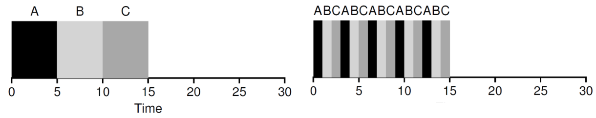

# Chp7 Scheduling

- Mechanisms
  - Low-level methods or protocols 
    - that implement a needed piece of functionality
  - Examples
    - context switch (time-sharing)
    - Paging
- Policies
  - Intelligence resides on top of the mechanisms
  - algorithms for making some kind of decision
  - Examples
    - Scheduling policy (decide to run which process)
    - Replacement policy (decide which page to be replaced)

## 1. Workload Assumptions 
1. Each job runs for the same amount of time

2. All jobs arrive at the same time

3. Once started, each job runs to completion

4. All jobs only use the CPU

   i.e., they perform no I/O

5. The run-time of each job is known

- Above assumptions are unrealistic

  Will be relaxed one by one

## 2. Turnaround Time

- Metric 

  - is just something we use to measure something

- Scheduling metrics

  - there are a number of different metrics that make sense in scheduling

- The turnaround time

  - the time at which the job completes minus the time at which the job arrived in the system

  - T~turnaround~ = T~completion~ − T~arrival~

  - Because for now T~arrival~ = 0 and hence          

    T~turnaround~ = T~completion~

## 3. First In, First Out (FIFO)
- Also known as First Come, First Served (FCFS)

- It is clearly simple and thus easy to implement

- Examples

  - Jobs A, B, C. Each runs for 10s
  - Turnaround time is (10+20+30)/3=20

  

==~~1. Each job runs for the same amount of time~~==

- Job A runs for 100s. Job B and C run for 10s

  - Turnaround time is (100+110+120)/3=110

- Convey Effect

  - a number of relatively-short potential consumers of a resource get queued behind a heavyweight resource consumer

  

## 4. Shortest Job First (SJF)

- Runs the shortest job first

  - then the next shortest, and so on
  - optimal

- Examples

  - Job A runs for 100s. Job B and C run for 10s
  - Turnaround time is (10+20+120)/3=50

  

==~~2. All jobs arrive at the same time~~==

- Assume A arrives at t = 0 and needs to run for 100 seconds, whereas B and C arrive at t = 10 and each need to run for 10 seconds

- Turnaround time (100+100+110)/3=103.33s

  

## 5. Shortest Time-to-Completion First (STCF)

==~~3. Once started, each job runs to completion~~==

STCF

- Any time a new job enters the system
- the STCF scheduler determines 
  - which of the remaining jobs (including the new job) has the least time left, and schedules that one

Preempt A when B and C arrived

- Turnaround time is (10+20+120)/3=50

## 6. Response time
- In the time sharing systems
  - Many users are interactive with computers
  - Each user does not want to wait too long
- Response time
  - the time from when the job arrives in a system to the first time it is scheduled
  - T~response~ = T~firstturn~ − T~arrival~
- Example
  - T~response~ = (0+0+10)/3=3.33

## 7. Round Rabin

Mechanism

- Run a job for a time slice 
- Switch to the next job in the run queue
- Repeat until the jobs are finished

Time slice

- scheduling quantum
- a multiple of the timer-interrupt period (10ms)

- Switching cost
  - Save and restore context
  - Flushing TLB
  - Flushing the hardware pipelines ( or out of order execution states)
- Amortization
  - Do not switch too shortly
  - May increase the response time
  - Must do some trade-off

#### Round Rabin vs. SJF

- SJF

  - Best for turnaround time	

    (5+10+15)/3=10

  - Worse for response time

    (0+5+10)/3=5 

- Round Rabin

  - Worse for turnaround time

    (13+14+15)/3=14

  - Better for response time

    (0+1+2)/3=1

- Must some trade-off 

## 7. Incorporating I/O
==~~4. All jobs only use the CPU  –i.e., they perform no I/O~~==

- Example

  - Job A and B run on CPU for 50s each

  - Job A does 4 I/O operations (10s each)

  - The poor schedule does as follows

    

- When a job initiates an I/O request 
  - A system call is invoked
  - The job is blocked (by kernel)
  - Another job is scheduled to CPU
- When a job completes an I/O request
  - An interrupt is sent to CPU
  - The job becomes ready to run
  - The schedule determines which job to be scheduled
- Overlap I/O and CPU
  - Maximize the utilization of systems

- How should the scheduler treat each job?
  - Treat each CPU burst as a job

- Example

  - Treat each 10-ms sub-job of A as an independent job

  - Doing overlap better

    

# Chp8 MLFQ

## 0. Primary Goal of the MLFQ

==~~5.The run-time of each job is known~~==

MLFQ would like to both

- optimize the turnaround time without a priori knowledge of job length
- minimize the response time

How to schedule without perfect knowledge

- The scheduler can learn the characteristics of the jobs it is running as the system runs, 
- and thus make better scheduling decisions

- Learning from History

  - Systems that learn from the past to predict the future 

    - The multi-level feedback queue
    - hardware branch predictors
    - caching algorithms

  - Such approaches work when jobs have phases of behavior and are thus predictable

  - Must be careful with such techniques

    they can easily be wrong and drive a system to make worse decisions than they would have with no knowledge at all

## 1. Basic Rules

- A number of distinct **queues**
  - each job assigned a different **priority level**
- A job that is ready to run is on a single queue
- ==**Rule 1:** If Priority(A) > Priority(B), A runs (B doesn’t)==
- ==**Rule 2:** If Priority(A) = Priority(B), A & B run in RR==

## 2. How to Change Priority

- Our workload is a mix of 
  - interactive jobs that are short-running 
    - and may frequently relinquish the CPU
  - and some longer-running “CPU-bound” jobs 
    - need a lot of CPU time 
    - response time isn’t important
- ==**Rule 3:** When a job enters the system, it is placed at the highest priority==
- ==**Rule** **4a:** If a job uses up an entire time slice while running, its priority is reduced==
- ==**Rule** **4b:** If a job gives up the CPU before the time slice is up, it stays at the same priority level.==

1. A single long running job 

   

2. Along Came A Short Job

   

3. A mixed I/O-intensive and CPU-intensive workload

   

- When a job arrives, the MLFQ 
  - first assumes it might be a short job
    - Thus giving the job high priority
- If it actually is a short job
  - it will run quickly and complete
- If it is not a short job
  - it will slowly move down the queues
  - soon prove itself to be a long-running process
- If it is an interactive job doing a lot of I/O 
  - it will relinquish the CPU before its time slice is complete 
  - simply keep it at the same level without penalizing

#### Problems

- starvation
  - If there are “too many” interactive jobs in the system, they will combine to consume all CPU time 
  - long-running jobs will never receive any CPU time 
- Gaming scheduler attack
  - before the time slice is over, issue an I/O operation and thus relinquish the CPU 
  - the job remains in the same queue, and thus gain a higher percentage of CPU time. 
  - This may lead to nearly monopolize the CPU
- programs may change its behavior over time
  -  what were CPU bound may transit to a phase of interactivity

## 3. Priority Boost

- ==**Rule 5:** After some time period S, move all the jobs in the system to the topmost queue==

- Processes are guaranteed not to starve

  - sitting in the top queue, a job will eventually receive service
  - because it shares the CPU with other high-priority jobs in a round-robin fashion

- If a CPU-bound job has become interactive

  - the scheduler treats it properly 
  - once it has received the priority boost

  

## 4. Better Accounting

==**Rule** **4:** Once a job uses up its time allotment at a given level (regardless of how many times it has given up the CPU), its priority is reduced==

- The scheduler 

  - keeps track of the percentage of the time slice a process used at a given level 
  - once a process has used its allotment, it is demoted to the next priority queue

  

## 5. Tuning MLFQ

- How to **parameterize** a MLFQ scheduler
  - how many queues should there be? 
  - How big should the time slice be per queue? 
  - How often should priority be boosted in order to avoid starvation and account for changes in behavior?
- Tuning the scheduler
  - only doing experience with typical workloads
  - will lead to a satisfactory balance

- Most MLFQ variants allow for varying time-slice length across different queues

- The high-priority queues are given short time slices

  - They are comprised of interactive jobs after all
  - Quickly alternating between them makes sense

- The low-priority queues are given longer time slices

  - They contain long-running jobs that are CPU-bound
  - Longer time slice works well

  

- Solaris MLFQ implementation
  - The Time-Sharing scheduling class(TS) 
  - Particularly easy to configure
    - provides a set of tables that determine exactly how the priority of a process is altered throughout its lifetime
      - how long each time slice is, and how often to boost the priority of a job 
      - an administrator can muck with this table in order to make the scheduler behave in different ways
  - Default values for the table are 
    - 60 queues
    - slowly increasing time-slice lengths 
      - from 20 milliseconds (highest priority) 
      - to a few hundred milliseconds (lowest) 
    - priorities boosted around every 1 second or so.

- Decay-usage
  - the FreeBSD scheduler (version 4.3) 
  - uses a formula to calculate the current priority level of a job
    - basing on how much CPU the process has used
  - usage is decayed over time
  - providing the desired priority boost in a different manner than described herein.

- Some schedulers 
  - reserve the highest priority levels for operating system work
  - typical user jobs can never obtain the highest levels of priority in the system 
- Some systems 
  - allow some user **advice** to help set priorities; 
  - for example, using the command-line utility nice 
  - you can increase or decrease the priority of a job
  - and thus increase or decrease its chances of running at any given time

#### OUSTERHOUT’S LAW

- VOO-DOO CONSTANTS
  - require some form of black magic to set them correctly
- Avoiding voo-doo constants is a good idea whenever possible
  - Unfortunately, it is often difficult
  - One could try to make the system learn a good value
    - but that too is not straightforward
- The frequent result: 
  - a configuration file filled with default parameter values 
  - a seasoned administrator can tweak when something isn’t quite working correctly
    - And is left unchanged