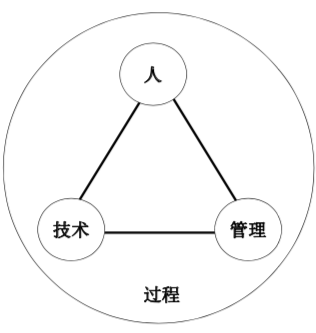
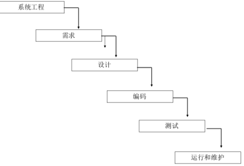
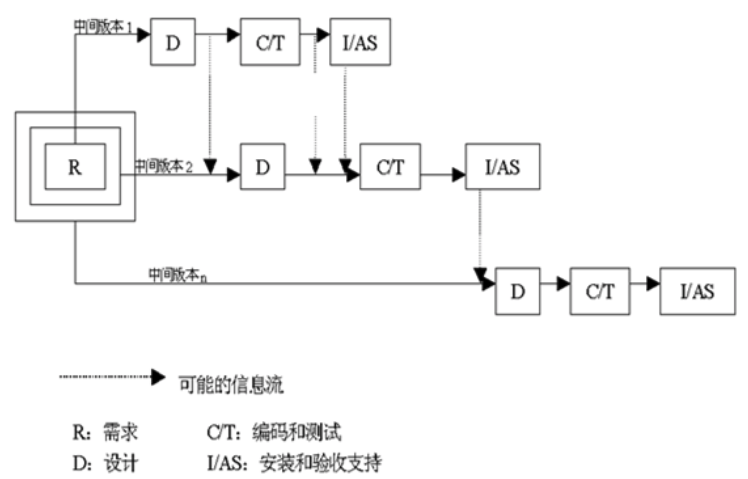
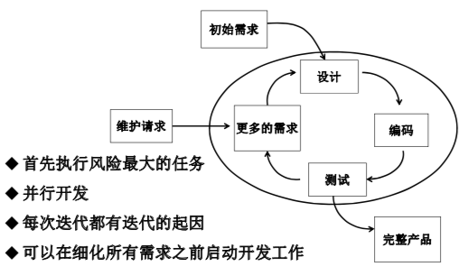
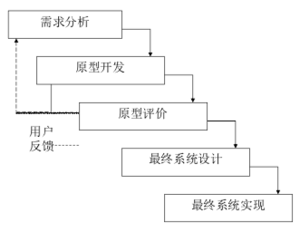
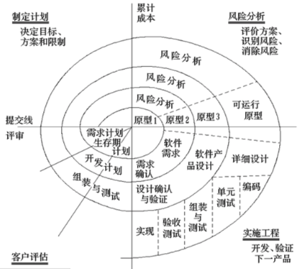
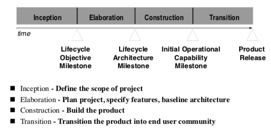

# Review

- Chp1 软件工程引论 — 2
- **Chp2 ==软件过程== — 3**
- Chp3 需求工程 — 2
- **Chp4 ==面向对象分析== — 3**
- Chp5 设计工程 — 2
- **Chp6 ==面向对象设计== — 3**
- ~~Chp7 结构化分析与设计 — 1~~
- Chp8 用户界面设计 — 2
- Chp9 编码和版本管理 — 2
- **CHP10 ==软件测试== — 3**
- Chp11 软件运维 — 2
- ~~Chp12 敏捷项目管理 — 1~~

# Chp1 绪论

- 软件定义 :

  - P3
  - 1-5

- 软件特征: 1-6

- 软件危机: 1-13

- 软件开发与工程: 1-19

- 工程定义: 1-21

-  金三角: 1-32

  

  - 人: 主体
  - 技术
  - 
    - 系统工程
    - 需求工程
    - 设计
    - 编码
    - 测试
    - 运维
  - 管理
  - 过程

# Chp2 软件过程

- 概述: Who is doing what, when, how to reach a certain goal

  - 软件生存周期过程
  - 过程是活动的集合
  - 活动是任务的集合
  - 任务是把输入加工成输出
  - 活动执行流

- 软件生命周期模型, 软件开发模型

  生命周期框架, 规定开发, 运作, 维护的过程, 活动, 任务

  - 线性顺序模型 waterfall

    - 与技术框架同构
    - 强调阶段划分和顺序性

  - 增量式 incremental

    - 构造一系列中间版本 version by version

      

    - 中间产品可用性

  - 演化 evolutionary

    

    - 子类 快速原型模型

      

      - 快速, 循环, 低成本
      - 分为演进型和抛弃型

    - 螺旋模型

      

      - 瀑布 + 快速原型 + 风险分析

- 统一软件过程RUP

  - 风险驱动, 基于UML的演化开发过程

  - 阶段

    

  - 每个阶段可以是若干迭代, 迭代策略

    - 增量式
    - 演进式
    - 增量提交
    - 单次迭代

- ==敏捷过程==

  - 自我管理
  - 定长sprint迭代: 发布增量版本
    - 计划会
    - 开发工作
      - Backlogs × 4
      - 立会
    - 审评会
    - 反思会

# 需求工程

