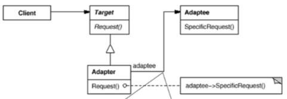
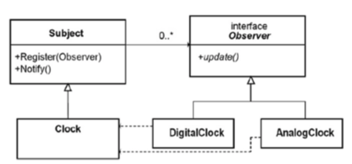
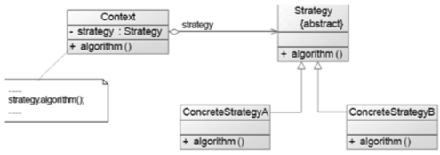

# Review

## Chp1 软件工程引论 — 2

## Chp2 ==软件过程== — 3

## Chp3 需求工程 — 2

## Chp4 ==面向对象分析== — 3

## Chp5 设计工程 — 2

## Chp6 ==面向对象设计== — 3

## ~~Chp7 结构化分析与设计~~

## Chp8 用户界面设计 — 2

## Chp9 编码和版本管理 — 2

## **CHP10 ==软件测试== — 3**

## Chp11 软件运维 — 2

## ~~Chp12 敏捷项目管理~~

# Chp1 绪论

- 软件定义 :

  - P3
  - 1-5

- 软件特征: 1-6

- 软件危机: 1-13

- 软件开发与工程: 1-19

- 工程定义: 1-21

-  金三角: 1-32

  

  - 人: 主体
  - 技术
  - 
    - 系统工程
    - 需求工程
    - 设计
    - 编码
    - 测试
    - 运维
  - 管理
  - 过程

# Chp2 软件过程

- 概述: Who is doing what, when, how to reach a certain goal

  - 软件生存周期过程
  - 过程是活动的集合
  - 活动是任务的集合
  - 任务是把输入加工成输出
  - 活动执行流

- 软件生命周期模型, 软件开发模型

  生命周期框架, 规定开发, 运作, 维护的过程, 活动, 任务

  - 线性顺序模型 waterfall

    - 与技术框架同构
    - 强调阶段划分和顺序性

  - 增量式 incremental

    - 构造一系列中间版本 version by version

      

    - 中间产品可用性

  - 演化 evolutionary

    

    - 子类 快速原型模型

      

      - 快速, 循环, 低成本
      - 分为演进型和抛弃型

    - 螺旋模型

      

      - 瀑布 + 快速原型 + 风险分析

- 统一软件过程RUP

  - 风险驱动, 基于UML的演化开发过程

  - 阶段

    

  - 每个阶段可以是若干迭代, 迭代策略

    - 增量式
    - 演进式
    - 增量提交
    - 单次迭代

- ==敏捷过程==

  - 自我管理
  - 定长sprint迭代: 发布增量版本
    - 计划会
    - 开发工作
      - Backlogs × 4
      - 立会
    - 审评会
    - 反思会

# Chp4 需求工程

- 定义: 系统必须符合的条件或能力

- 功能性需求, 非功能性需求, 补充需求 (FURPS+)

  - 功能性 — 通过需求分析描述
  - 易用性 (Usability)
  - 可靠性 (Reliability)
  - 性能 (Performance)
  - 可支持性 (Supportability)
  - 设计约束; 用于技术->设计
  - 实现需求; 用于技术->编码
  - 接口需求; 规定外部软硬件适配
  - 物理需求; 规定硬件要求

- 层次

  

- 特性

  

- 需求工程

  

  - 需求获取 — 前景文档 Vision
    - 分析问题根源, 识别解决方案
    - 识别项目干系人
    - 识别项目约束
    - 获取术语
    - 识别需求来源
    - 收集需求
    - 产品定位
    - 撰写产品特性
    - 定义质量范围
    - …… 
  - 需求分析建模 — 构建PIM
    - 用例图 
    - 活动图 
    - 类图
    - 时序图
    - 通信图
    - 状态机图 
  - 需求定义 — SRS
    - 细化, 引入分析模型
    - 设计用户界面和接口
    - 定义外在行为和属性
  - 需求验证
    - 原形确认
    - 需求评审
  - 需求管理
    - 基线
    - 版本控制
    - 需求跟踪

# Chp5+3.3 面向对象分析

- OO

  - 概念: 对象, 类, 集成, 聚合, 消息
  - 原则: 抽象 封装 模块化 层次
  - OOA: 面向问题域的对象, 得到PIM
    - 继承关系和聚合结构描述关系
    - 问题域好的映射
    - 用例建模
    - 类图概念建模
    - 分析类类图和交互
  - OOD: 得到PSM
    - 多视图设计软件构架, 选定设计模式
    - 确定子系统接口, 子系统内部设计
    - 详细类的设计和优化
  - OOM: 结构模型和行为模型

- 用例

  - 用例建模: UML用例图

    - 概况视图: 黑河描述Actors与系统交互

      希望外接做什么

    - 执行者

      -  完成事件时与系统交互的外部系统, 描述边界
      - 直接与系统交互

    - 用例

      - 系统的动作序列
      - 执行者可产生可观测的有价值结果
      - 用例粒度控制: 完整会话, 偏粗 (actor只做用例就结束)
      - 数据操作层次控制:  CRUS合并
      - 需求契约作用

    - 用例图: 执行者, 用例, 关联

    - 用例归约: 事件流, 其他字段

      - 细化:白盒归约, 描述系统内部细节
      - 细化:白盒归约, 描述系统内部细节

    - 优化: 包含, 扩展, 泛化

      - 包含: 
        - 拆分与价值结果无关的片段(基本用例)
        - 拆分多个用例的共有部分(包含用例)
      - 扩展:
        - 基本用例的条件分支
        - 基本用例独立
        - 扩展用例不独立, 依赖基本用例
      - 泛化
        - 用例继承关系 (里氏替换)
        - 子用例遵循父用例事件流
        - 子咏柳加入附加行为
        - 执行者之间也可建立, 执行同一用例

  - 概念模型 

    - 识别概念类

      - 分类
      - 名词提取过滤
      - 分析模式中套用

    - 建立概念类的联系 (类图)

      - 类
      - 继承/泛化 — is a Liskov
      - 关联(长期关系) 可以多条
        - 聚合(松散的part, 空菱形)
          - 聚合(紧密part, 实心菱形)
      - 依赖 临时非结构关系
        - 指向被依赖者
      - 接口类 需要实现类

    - 增加属性, 画状态机图

      - 描述行为特征
      - 一个类可以触发的合法状态转移

      

      - 开始于创建, 结束于释放

  - 用例分析

    - 识别用例实现

      - 对每个用例, 实现一个package UCR
      - UCR包含通讯图 时序图 类图

    - 每个UCR要求

      - 识别分析类: 用于实现UC的设计元素

        - 实体类: 
          - 系统关键抽象, 面向DB
          - 管理和存储关键信息
        - 控制类:
          - 协调其他对象实现用例功能
          - 对用例行为封装
          - 一个用例一个
        - 边界类: 
          - 内部与外部系统之间接口
          - 每个用户-用例 对 一个

      - 建立时序图, 通信图(同语义)

        - 时序图强调信息的时序

          - 展示参与信息处理的对象
          - 信息变化的顺序

        - 通信图同时序图

          

      - 画类图, 完善分析类

        - VOPC类来自时序图的分析类
        - VOPC关联来自时序图链接
        - 确定分析类的职责和属性

# Chp6+7.2 设计工程

- 设计工程面向解决域 How

- 设计原则

  - 抽象
    - 数据抽象
    - 过程抽象
    - 对象抽象
  - 分解
    - 实现模块化
  - 模块化
    - 独立完成功能的子程序
    - 外部特征: 与外部联系的接口
    - 内部特征: 局部数据处理
    - 成本\\+/=U型曲线
  - 模块独立: 
    - 功能独立
    - 接口简单
    - 低耦合 高内聚
      - 同级没有信息传递
      - 层级间交换简单变量(非数据结构)

- 步骤与方法

  - 构架设计: 定义软件蓝图

    - 逻辑构架

    - 物理构架

    - 构架风格

    - 4+1多视图

      - 部署视图 (物理)

        - BS CS
        - P2P

      - 逻辑视图 *

        - 构件协作关系

        - 考虑功能, 可维护性

        - 逻辑构架风格

          - 层次架构风格 Layered: 提取共性, 沉淀为一层中间件

            

          - MVC: 表现控制分离

            

          - 3-Tiers: 表示层-业务逻辑层-数据访问层

            

          - 管道和过滤器: 数据流式处理

            

          - 服务: 松耦合 粗粒度的服务+总控

          - 微服务: 进程服务, 轻量通讯, 集中管理

          - 仓库风格: 数据为中心 + 超链接 = 网状

          - 微内核: 少量资源, 标准接口, 模块化扩展

          - 开闭环控制: 反馈

            

        - UML在package上描述逻辑构架

          

      - 进程视图: 针对多进程, 多线程软件

        

        - 条件变量
        - 读写锁(死锁)
        - 通讯: 管道, IPC, 信号

      - 实现视图 (开发)

        - 构件图: 构建+接口+关系+端口+连接器

      - 技术视图 (开发):框架

      - 数据视图 (开发): PDM 

  - 详细设计: 定义模块内部细节

# Chp7+6.5 OOD

- 设计方法

  - 针对平台细化
  - 根据原则和模式优化
  - 模型与代码之间的双向工程

- 设计原则

  1. SRP: 单一职责原则: 一个类只有一个变更原因 — 职责

     

     rectangle违法 — 两个职责, 进行优化

     

  2. LSP 里氏替换原则: 子类替换基类

  3. DIP 依赖倒置原则: 依赖抽象, 面向接口

  4. ISP 接口隔离原则: 单独实现多个接口类

  5. OCP 开闭原则: 要扩展, 不要修改, 封装变化点

  6. CARP 组合继承复用:用聚合组合替代继承

- GOF设计模式

  - 创建型模式: 关注创建方法

    - 工厂方法 (类) : 虚函数创建

      

    - 抽象工厂 (对象): 产品族与工厂对应

      

    - 构建器 (对象): 构建和表示分离, 统一对象构建方式

      

    - 原型 (对象): 常使用的副本

      

      

    - 单例 (对象): 唯一性, 重复创建异常

      

  - 结构型: 关注组织对象

    - 适配器 (类, 对象) 继承, 关联适配对象

      

      

    - 桥接 (对象) 分离不同域的属性

      

    - 组合 (对象): 递归复用

      

    - 装饰器 (对象): 透明扩展包

      

    - 外观/门面 (对象): 为复杂系统提供简单接口

      

    - 享元 (对象): 大量创建后管理

      

    - 代理 (对象) 统一接口, 控制对象访问 placeholder

  - 行为型: 

    - 解释器  (类) : 定义特定语言

      

    - 模板方法 (类): 扩展高层策略

      

    - 职责连 (对象): 链表式调用

      

    - 命令 (对象): 封装动作

      

    - 迭代器 (对象): 封装元素游走

      

    - 中介器 (对象): 集中管理对象通讯

      

    - 备忘录 (对象): 存档恢复

      

    - 观察者 (对象) : 状态变化Trigger

      

    - 状态 (对象) : 封装变化行为 

      

    - 策略 (对象): 隔离实现算法

      

    - 访问者 (对象) : 为类层级结构动态添加操作

      

