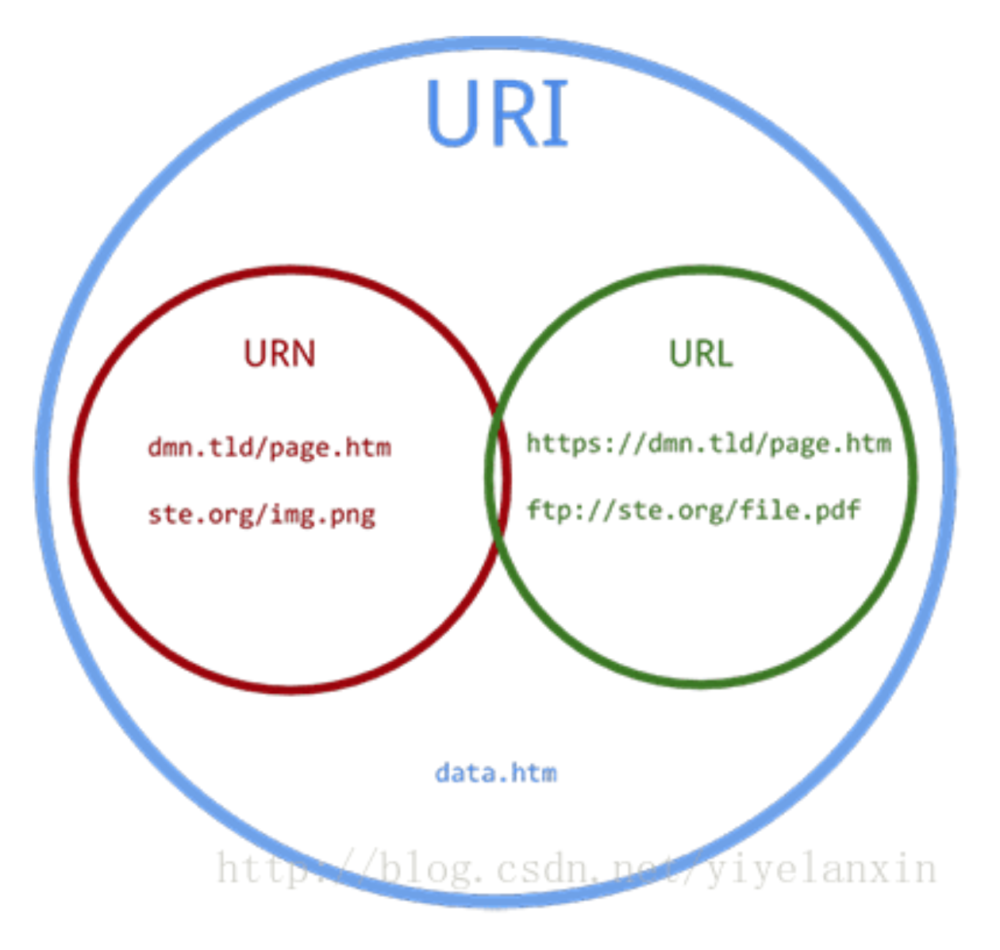
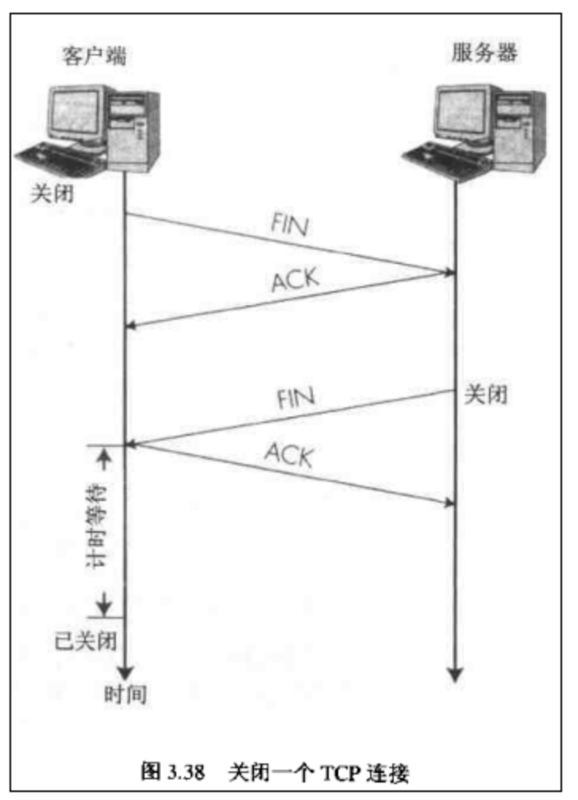

# Review 

## Apache Nginx Tomcat

HTTP服务器的本质是一种软件应用程序, 运行在服务器OS上, 绑定服务器的IP地址并且去监听tcp端口来处理HTTP请求

阿帕奇广义是一个促进软件业发展基金会, 通常指Apache HTTP Server Project

Nginx也是一款开源的网络服务软件, 只要针对HTTP, 也可用作邮件代理服务器或者通用TCP代理服务器

其中Nginx是异步非阻塞的, Apache是阻塞的

Apache静态效果不如Nginx

###  Nginx相对apache的优点

- 轻量级，同样起web 服务，比apache 占用更少的内存及资源
- 静态处理，Nginx 静态处理性能比 Apache 高 3倍以上
- 抗并发，nginx 处理请求是异步非阻塞的，而apache则是阻塞型的，在高并发下nginx 能保持低资源低消耗高性能。在- - Apache+PHP（prefork）模式下，如果PHP处理慢或者前端压力很大的情况下，很容易出现Apache进程数飙升，从而拒绝服务的现象。
- 高度模块化的设计，编写模块相对简单

### apache相对nginx的优点

- rewrite，比nginx 的rewrite 强大 
- 模块超多，基本想到的都可以找到
- 少bug，nginx的bug相对较多
- 超稳定
- Apache对PHP支持比较简单，Nginx需要配合其他后端用

Apache HTTP Server或者Nginx需要通过shell, PHP, Python等CGI脚本来实现动态内容

### Tomcat

Tomcat是Apache基金会下的另一个项目, Apache HTTP Server相比，Tomcat能够**动态**的生成资源并返回到客户端, 是一个支持运行Servlet/JSP的程序容器

- 管理Servlet程序生命周期
- URL映射到指定的Servlet处理(路由)
- 与Servlet合作处理HTTP req:
  - 根据req生成HTTPServletResponse对象, 传递给Servlet处理
  - 将Servlet中HTTPServletResponse对象的生成内容返回给浏览器
- 常见的做法是: 
  - 动静态资源分离(Nginx + Tomcat)
  - 负载均衡: Tomcat实例水平扩展, Nginx分发请求

### **Servlet的调用过程**

- 1.客户端通过发送请求给Tomcat，Tomcat发送客户端的请求页面给客户端。
- 2.用户对请求页面进行相关操作后将页面提交给Tomcat,Tomcat将其封装成一个HttpRequest对象，然后对请求进行处理,。
- 3.Tomcat截获请求，根据action属性值查询xml文件中对应的servlet-name，再根据servlet-name查询到对应的java类（**如果是第一次，Tomcat则会将servlet编译成java类文件，所以如果servlet有很多的话第一次运行的时候程序会比较慢**）。
- 4.Tomcat实例化查询到的java类，**注意该类只实例化一次**。
- 5.调用java类对象的service()方法（如果不对service()方法进行重写则根据提交的方式来决定执行doPost()方法还是doGet()方法）。
- 6.通过request对象取得客户端传过来的数据，对数据进行处理后通过response对象将处理结果写回客户端。

### **Servlet是线程安全的吗？**

从上面Servlet的调用过程可以看出，当客户端第一次请求Servlet的时候,tomcat会根据web.xml配置文件实例化servlet，

当又有一个客户端访问该servlet的时候，不会再实例化该servlet，也就是多个线程在使用这个实例。

JSP/Servlet容器默认是采用**单实例多线程(这是造成线程安全的主因)方式处理多个请求的**，这种默认以多线程方式执行的设计可大大降低对系统的资源需求，提高系统的并发量及响应时间。

Servlet本身是无状态的，**一个无状态的Servlet是绝对线程安全的，无状态对象设计也是解决线程安全问题的一种有效手段**。

所以，servlet是否线程安全是由它的实现来决定的，如果它内部的属性或方法会被多个线程改变，它就是线程不安全的，反之，就是线程安全的。

## Ajax

**A**synchronous***J***avascript***+X***ML

异步: 向服务器发送请求的时候，我们不必等待结果，而是可以同时做其他的事情，等到有了结果我们可以再来处理这个事

服务器接收到请求之后，返回一个新的页面给浏览器，这种做法浪费了很多带宽，因为我们发送请求之前和获得的新页面两者中很多的html代码是相同的. 使用Ajax技术不必刷新整个页面，只需对页面的局部进行更新，可以节省网络带宽，提高页面的加载速度，从而缩短用户等待时间，改善用户体验

包括我们的JavaScript 异步数据获取技术，就是XMLHttpRequest
以及xml以及Dom还有表现技术XHTML 和CSS. 核心是XMLHttpRequest 是支持异步请求的技术，可以发送请求给服务器，并且不阻塞用户

适配IE

## CDN

A **content delivery network** or **content distribution network** (**CDN**) is a geographically distributed network of [proxy servers](https://en.wikipedia.org/wiki/Proxy_server) and their [data centers](https://en.wikipedia.org/wiki/Data_center). The goal is to provide high availability and high performance by distributing the service spatially relative to end-users. 

## Bean

https://www.awaimai.com/2596.html

1. bean是Spring框架的对象，一个或者多个不限定

2. bean由Spring中一个的IoC管理

   程序运行时，依赖对象由【辅助程序】动态生成并注入到被依赖对象中，动态绑定两者的使用关系。

   Spring IoC容器就是这样的辅助程序，它负责对象的生成和依赖的注入，让后在交由我们使用。

   IoC就是**一个对象定义其依赖关系而不创建它们的过程**。

   Spring 启动时会把所需的类实例化成对象，如果需要依赖，则先实例化依赖，然后实例化当前类。

   **类的实例化、依赖的实例化、依赖的传入**都交由 Spring Bean 容器控制，

3. 我们的应用程序由一个个bean构成

   **Bean容器**，或称spring ioc容器，主要用来管理对象和依赖，以及依赖的注入

   bean是一个**Java对象**，根据bean规范编写出来的类，并由bean容器生成的对象就是一个bean。

   

   1. 所有属性为private
   2. 提供默认构造方法
   3. 提供getter和setter
   4. 实现serializable接口

## HTTPS

## Node in server

https://juejin.im/post/5a7d6ecc5188257a5911b9bb

Service的主进程要干什么?

一个多线程服务器，运行于Ruby on rails环境. 主进程读文件: 串行的

使用Node进程读文件: 异步的 — Node的核心就是JavaScript和事件循环。

事件循环就是一个等待事件然后在需要事件发生时去触发它们的程序。此外还有一点很重要，就是Node和JavaScript一样都是单线程的

在NodeJS中，我们需要手动定义自己的路由

## LAMP

- **L**inux，操作系统
- **A**pache，网页服务器
- **M**ariaDB或**M**ySQL，数据库管理系统
- **P**HP、**P**erl或**P**ython脚本语言

## NODE ASYN

## URI

## RESTful

Bridge: 解耦操作对象和操作方法

## OPTIONS

## TCP connect&disconnect

## Cookies

https://segmentfault.com/a/1190000004743454

security expire httponly path domain 

## Session & Redis

## JWT & Session

https://juejin.im/post/5a437441f265da43294e54c3

– Externalstylesheet
– Internalstylesheet
– Inlinestyle

## JS let var

let 函数作用域

var 全局作用域

## ES5 =>

https://juejin.im/post/5d0839b1f265da1bce3dd1f7#heading-5

– DefensiveCoding 

– CompatibilityThroughServer-SideScripts

– IgnoretheProblem

– FailGracefully 

## JS Version

## 前端框架

### React

**Step 1: Break The UI Into A Component Hierarchy**

Step 2: 父组件传递参数用prop, 不要用state (state和prop的数据特征区分)

- 被传递进来的, 不变的, 派生的 不是state
- render要用state, 不用prop

## Servlet Filter

修改req

- 在HttpServletRequest 到达Servlet 之前，拦截客户的HttpServletRequest 。
- 根据需要检查HttpServletRequest ，也可以修改HttpServletRequest 头和数据。
- 在HttpServletResponse 到达客户端之前，拦截HttpServletResponse 。
- 根据需要检查HttpServletResponse ，可以修改HttpServletResponse 头和数据。

## ORM

实体模型表现映射成为数据库关系模型 (数据库与应用抽象方式不一样, ORM将数据库数据模型映射为OO的. 减少代码负担)

– Advantages: 

 • Independent of DBMS
 • Independent of data structure 
 • OOP 

– Disadvantages: 

- Impact on performance 
- CanNOTutilizetheextrafunctionsinadditiontostandardfunctions defined in specification. 
- MappingbetweenOandRmaybecomplex. 
- CanNOTinvokestoredprocedures. 

### JDBC or ORM

是需求而定:

- 大量数据, ORM对象创建太多, 时间资源开销大, 不适合
- 高计算过程偏向于放进数据库内置的聚集函数效率高
- 底层数据库有变迁的需求, 上层代码不需要改变

## XML JSON YAML

- XML: 与JAVA联系密切, 和数据库联系密切
- JSON: 和js联系紧密, 文件小(no tags)
- YAML: 精简, 主要用为配置文件. 在网络传输不常用. 常用在运维的配置文件中. 格式简单, 用空格表示层级.

## DAO

主要是用于统一不同体系整合不同持久化实现技术的一层封装,用于统筹和转化来自不同方面的数据,一一个统一的标准和格式对外提供.

## 分布式存储的问题

## 水平, 垂直分表

水平横着, 垂直竖着

Why NoSQL

- 对于非机构化的数据, 无法动态修改表结构或者通过表结构符合所有需求. 利用NoSQL数据库可以储存数据
- 关系型数据库在分布式系统上很难进行无损分解, 关系难以保持, 分布式储存难以实现

## Bigtable

稀疏, 分布, 持久, 多维度的, 有序的分级索引映射

## MongoDB

– Document-OrientedStorage
– FullIndexSupport
– Replication&HighAvailability
– Auto-Sharding
– Querying
– FastIn-PlaceUpdates
– Map/Reduce
– GridFS
– CommercialSupport

- When the situations like this, you should probably to shard

   – You’verunoutofdiskspaceonyourcurrentmachine.
   – You want to write data faster than a single mongod can handle. 

  – Youwanttokeepalargerproportionofdatainmemorytoimprove performance 

## RMI

https://blog.csdn.net/suifeng3051/article/details/51750555

Java RMI 指的是远程方法调用 (Remote Method Invocation)。它是一种机制，能够让在某个 Java 虚拟机上的对象调用另一个 Java 虚拟机中的对象上的方法。所以，RMI相关对象必须运行在Java虚拟机中。

- 定义一个远程接口，此接口需要继承Remote，接口中的方法需要抛出一个`RemoteException`
2. 开发远程接口的实现类，这个类必须继承`UnicastRemoteObject`
3. 创建一个server并把远程对象注册到端口
4. 创建一个client查找远程对象，调用远程方法

1. **第一步**：爱丽丝给出支持SSL协议版本号，一个客户端**随机数**(Client random，请注意这是第一个随机数)，客户端支持的加密方法等信息；
2. **第二步：**鲍勃收到信息后，确认双方使用的加密方法，并返回数字证书，一个服务器生成的**随机数**(Server random，注意这是第二个随机数)等信息；
3. **第三步：**爱丽丝确认数字证书的有效性，然后生成一个新的**随机数**(Premaster secret)，然后使用数字证书中的公钥，加密这个随机数，发给鲍勃。
4. **第四步：**鲍勃使用自己的私钥，获取爱丽丝发来的**随机数**(即Premaster secret)；(第三、四步就是非对称加密的过程了)
5. **第五步：**爱丽丝和鲍勃通过约定的加密方法(通常是[AES算法](https://zh.wikipedia.org/wiki/高级加密标准))，使用前面三个随机数，生成**对话密钥**，用来加密接下来的通信内容；

## 关于跨域请求

https://www.jianshu.com/p/f880878c1398

https://segmentfault.com/a/1190000015597029

### 跨域是什么？

浏览器的同源策略如下：

Reference: https://developer.mozilla.org/zh-CN/docs/Web/Security/Same-origin_policy

### 为什么要有这个策略？

用户访问了ebook.com ，中途又去访问了A网站。A网站的脚本里面特意写了一段代码去访问ebook.com的一个接口，比如POST一下 ebook.com/buybook ，这次POST又带上了cookie，这样的话用户就在不知情的情况下买了书。这个攻击叫CSRF攻击。

### 怎么解决？

浏览器不让你发这个请求。发的话也要符合一定的基本法（有两种）。

### 基本法的要点

#### 基本法一 - CORS Header

( 摘自 https://www.jianshu.com/p/f880878c1398 )

Access-Control-Allow-Origin - 响应头部中可以携带这个头部表示服务器允许哪些域可以访问该资源

Access-Control-Allow-Methods - 该头部字段用于预检请求的响应，指明实际请求所允许使用的HTTP方法

Access-Control-Allow-Headers - 该头部字段用于预检请求的响应，指明了实际请求中允许携带的首部字段。

Access-Control-Max-Age - 该头部字段用于预检请求的响应，指定了预检请求能够被缓存多久

Access-Control-Allow-Credentials - 该字段可选，它的值是一个布尔值，表示是否允许发送Cookie。

有些请求，比如GET和POST，是简单请求，浏览器会直接发送这个请求，但如果响应头里面没有Access-Control-Allow-Origin或者Access-Control-Allow-Origin的值和发这个请求的源不一样的话浏览器就会拦截这个响应并报错。

还有些复杂请求，会先做一次预检（就是上面的预检请求），通过的话再发真正请求。

#### 基本法二 - CSRF Token

这个策略直接在请求里面加入了一个只有真正在访问 ebook.com 的用户才知道的一个token，服务端只有拿到了正确的token才会真正执行这个请求。